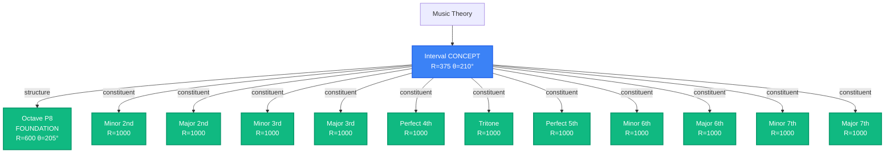
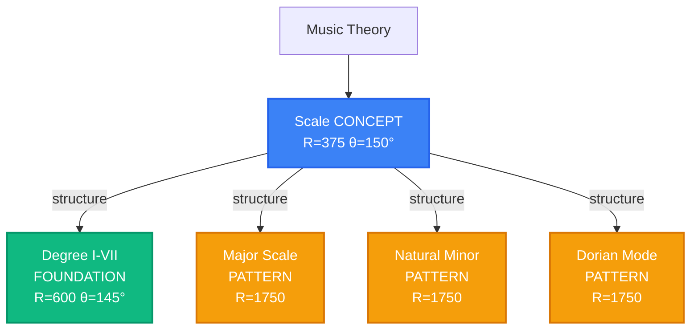
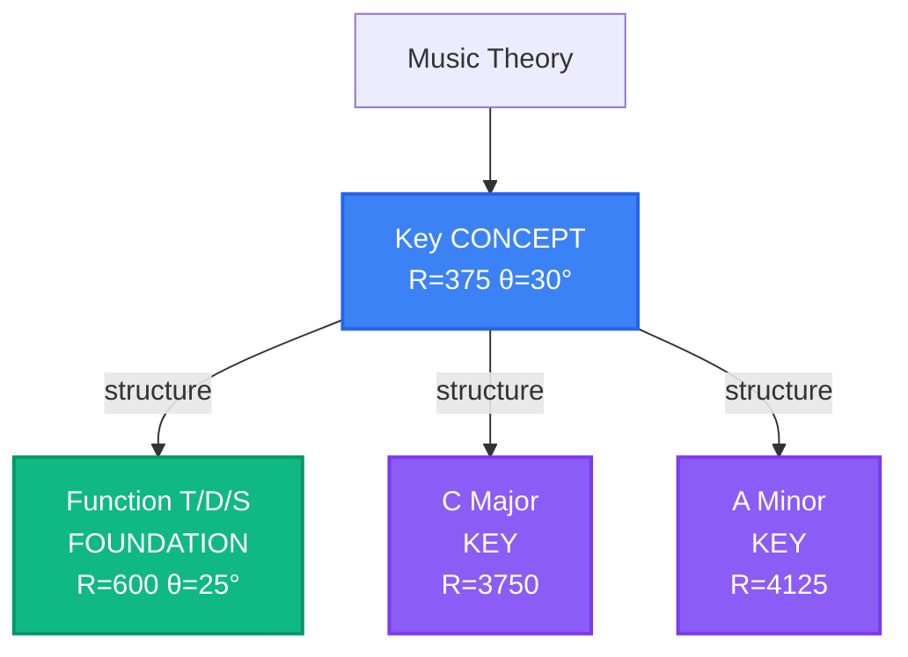

# Atlas Node 構成設計書

## 目的

Atlas 画面の Node（ノード）の詳細な構成と座標配置を定義する。
`0004.atlas.md` の仕様に基づき、音楽理論の地図として適切な配置を実現する。

---

## 1. 座標系の定義

### 1.1 ワールドサイズと中心座標

- **ワールドサイズ**: 5000 × 5000
- **中心座標**: (2500, 2500)

### 1.2 半径定義（レイヤー別）

**設計方針**: 同じ親の子ノードを近くに配置し、全体的な距離を縮小。

| レイヤー               | 半径名            | 半径値 | 割合 | 説明                       |
| :--------------------- | :---------------- | :----- | :--- | :------------------------- |
| **基底概念層**         | FOUNDATION_CENTER | 0      | 0%   | 中心点                     |
|                        | FOUNDATION_INNER  | 250    | 5%   | 概念ハブノード             |
|                        | FOUNDATION_OUTER  | 400    | 8%   | 基底理論ノード             |
| **抽象構造層**         | PATTERN_INNER     | 600    | 12%  | PitchClass, Interval       |
|                        | PATTERN_MID       | 1000   | 20%  | ScalePattern, ChordPattern |
|                        | PATTERN_OUTER     | 1500   | 30%  | -                          |
| **具体インスタンス層** | INSTANCE_INNER    | 1200   | 24%  | -                          |
|                        | INSTANCE_MID      | 1500   | 30%  | Scale/Chord Instance       |
|                        | INSTANCE_OUTER    | 1800   | 36%  | -                          |
| **特殊領域**           | KEY_CONTEXT       | 1400   | 28%  | Function ノード            |
|                        | KEY_MAJOR         | 1600   | 32%  | Major Key ノード           |
|                        | KEY_MINOR         | 1700   | 34%  | Minor Key ノード           |

### 1.3 ドメインセクター（角度範囲）

**設計方針**: 各Conceptノードの周辺（±30°）に子ノードを配置し、同じ親の子を近くにまとめる。

| Domain       | Concept角度 | セクター範囲 | 幅  | 配置方向 |
| :----------- | :---------- | :----------- | :-- | :------- |
| **Pitch**    | 90°         | 60° - 120°   | 60° | 上部     |
| **Scale**    | 150°        | 120° - 180°  | 60° | 左上     |
| **Interval** | 210°        | 180° - 240°  | 60° | 左下     |
| **Chord**    | 300°        | 270° - 330°  | 60° | 右下     |
| **Key**      | 30°         | 0° - 60°     | 60° | 右上     |

### 1.4 座標計算の方式

#### 極座標→デカルト座標変換

- 角度は度数法（0° = 東、反時計回り）
- SVG座標系（y軸は下向き）に対応
- 変換式: `x = CENTER + radius × cos(θ)`, `y = CENTER - radius × sin(θ)`

#### セクター内均等配置

- **基本方針**: 同じ親の子ノードを親Conceptの周辺セクター内に配置
- セクター範囲を `(要素数 + 1)` で分割し、両端に余白を持たせる
- 計算式: `angle = sectorStart + (sectorRange / (count + 1)) × (index + 1)`
- **例**: Pitch Domain (60°-120°) に 12 PitchClass を配置
  - 各ノードは約5°間隔で均等配置
  - PitchClass[0] ≈ 65°, PitchClass[1] ≈ 70°, ..., PitchClass[11] ≈ 115°

---

## 2. Node 構成（4層構造）

### 2.1 Layer 0: ルートノード

| ID            | Type       | DataType | Label        | Position         | 説明             |
| :------------ | :--------- | :------- | :----------- | :--------------- | :--------------- |
| `root-theory` | foundation | function | Music Theory | (CENTER, CENTER) | 全ての概念の起点 |

### 2.2 Layer 1: 基底概念（Foundation Concepts）

#### 2.2.1 概念ハブノード

Root から放射状に配置される主要概念。

| ID                 | Label    | Angle | Radius                   | 説明                     |
| :----------------- | :------- | :---- | :----------------------- | :----------------------- |
| `concept-pitch`    | Pitch    | 90°   | R.FOUNDATION_INNER (375) | 音名・ピッチクラスの概念 |
| `concept-interval` | Interval | 210°  | R.FOUNDATION_INNER (375) | 音程の概念               |
| `concept-scale`    | Scale    | 150°  | R.FOUNDATION_INNER (375) | スケールの概念           |
| `concept-chord`    | Chord    | 330°  | R.FOUNDATION_INNER (375) | 和音の概念               |
| `concept-key`      | Key      | 30°   | R.FOUNDATION_INNER (375) | 調性の概念               |

#### 2.2.2 基底理論ノード

より抽象的な理論概念。音楽理論的に適切な親概念の下に配置。

| ID                      | Label      | Parent               | Radius | Angle | 説明                                  |
| :---------------------- | :--------- | :------------------- | :----- | :---- | :------------------------------------ |
| `foundation-degree`     | Degree     | **concept-scale**    | 600    | 145°  | ディグリーネーム概念（I, II, III...） |
| `foundation-enharmonic` | Enharmonic | **concept-pitch**    | 600    | 95°   | 異名同音の概念（C♯ = D♭）             |
| `foundation-octave`     | Octave     | **concept-interval** | 600    | 205°  | オクターブの概念（完全8度）           |
| `foundation-function`   | Function   | **concept-key**      | 600    | 25°   | 機能和声の概念（T, D, S）             |

#### 2.2.3 Pitch Class ノード（12音）

Pitch Domain セクター内（60°-120°）に均等配置（半径 600、PATTERN_INNER）。親ノードは `concept-pitch`。

**配置方針**: 五度圏ではなく、クロマチック順（C, C♯, D, ...）で配置し、concept-pitch の周辺にまとめる。

| Index | PitchClass | 配置角度（概算） |
| :---- | :--------- | :--------------- |
| 0     | C          | 65°              |
| 1     | C♯/D♭      | 70°              |
| 2     | D          | 75°              |
| 3     | D♯/E♭      | 80°              |
| 4     | E          | 85°              |
| 5     | F          | 90°              |
| 6     | F♯/G♭      | 95°              |
| 7     | G          | 100°             |
| 8     | G♯/A♭      | 105°             |
| 9     | A          | 110°             |
| 10    | A♯/B♭      | 115°             |
| 11    | B          | 120°             |

※ 実際の角度はセクター均等配置により自動計算

#### 2.2.4 Interval ノード（主要音程）

Interval Domain セクター内（180°-240°）に均等配置。親ノードは `concept-interval`。

**配置**: 半径 600（PATTERN_INNER）でセクター内に均等配置。

| ID            | Label       | 半音数 | 説明        |
| :------------ | :---------- | :----- | :---------- |
| `interval-m2` | Minor 2nd   | 1      | 短2度       |
| `interval-M2` | Major 2nd   | 2      | 長2度       |
| `interval-m3` | Minor 3rd   | 3      | 短3度       |
| `interval-M3` | Major 3rd   | 4      | 長3度       |
| `interval-P4` | Perfect 4th | 5      | 完全4度     |
| `interval-TT` | Tritone     | 6      | 増4度/減5度 |
| `interval-P5` | Perfect 5th | 7      | 完全5度     |
| `interval-m6` | Minor 6th   | 8      | 短6度       |
| `interval-M6` | Major 6th   | 9      | 長6度       |
| `interval-m7` | Minor 7th   | 10     | 短7度       |
| `interval-M7` | Major 7th   | 11     | 長7度       |
| `interval-P8` | Octave      | 12     | 完全8度     |

※ 角度はセクター内で自動均等配置

### 2.3 Layer 2: 抽象構造（Pattern Nodes）

#### 2.3.1 Scale Pattern ノード

Scale Domain セクター内（120°-180°）に半径 1000（PATTERN_MID）で均等配置。親ノードは `concept-scale`。

| ID                             | Label           | 説明                             |
| :----------------------------- | :-------------- | :------------------------------- |
| `pattern-scale-major`          | Major Scale     | メジャースケール                 |
| `pattern-scale-natural-minor`  | Natural Minor   | ナチュラルマイナー（エオリアン） |
| `pattern-scale-dorian`         | Dorian Mode     | ドリアンモード                   |
| `pattern-scale-phrygian`       | Phrygian Mode   | フリジアンモード                 |
| `pattern-scale-lydian`         | Lydian Mode     | リディアンモード                 |
| `pattern-scale-mixolydian`     | Mixolydian Mode | ミクソリディアンモード           |
| `pattern-scale-locrian`        | Locrian Mode    | ロクリアンモード                 |
| `pattern-scale-harmonic-minor` | Harmonic Minor  | ハーモニックマイナー             |

#### 2.3.2 Chord Pattern ノード

Chord Domain セクター内（270°-330°）に半径 1000（PATTERN_MID）で均等配置。親ノードは `concept-chord`。

| ID                           | Label        | 説明                     |
| :--------------------------- | :----------- | :----------------------- |
| `pattern-chord-major-triad`  | Major Triad  | メジャートライアド       |
| `pattern-chord-minor-triad`  | Minor Triad  | マイナートライアド       |
| `pattern-chord-diminished`   | Diminished   | ディミニッシュトライアド |
| `pattern-chord-major-7th`    | Major 7th    | メジャーセブンス         |
| `pattern-chord-dominant-7th` | Dominant 7th | ドミナントセブンス       |
| `pattern-chord-minor-7th`    | Minor 7th    | マイナーセブンス         |

### 2.4 Layer 3: 具体インスタンス（Instance Nodes）

**重要**: 具体インスタンスは情報過多を防ぐため、**初期状態では非表示**（`visible: false`）とする。
ユーザーがパターンノードを選択したときに、関連するインスタンスのみを表示する。

#### 2.4.1 Scale Instance ノード

各 PitchClass に対して各 ScalePattern の具体的スケールを生成。

**配置方式**:

- Scale Domain セクター内（120°-180°）で均等配置
- 半径: 1500（INSTANCE_MID）
- 親ノード: 対応する ScalePattern ノード

**例**:

- C Major Scale, D Major Scale, ... （12個 × 各パターン）
- 全パターンで約 96 インスタンス（8パターン × 12音）

**命名規則**: `scale-{pattern-name}-{pitch-index}`
例: `scale-major-0` (C Major), `scale-dorian-2` (D Dorian)

#### 2.4.2 Chord Instance ノード

各 PitchClass に対して各 ChordPattern の具体的コードを生成。

**配置方式**:

- Chord Domain セクター内（270°-330°）で均等配置
- 半径: 1800（INSTANCE_OUTER）
- 親ノード: 対応する ChordPattern ノード

**例**:

- Cmaj7, Gmaj7, Dm7, Em7, ...
- 全パターンで約 72 インスタンス（6パターン × 12音）

**命名規則**: `chord-{pattern-name}-{pitch-index}`
例: `chord-major-7th-0` (Cmaj7), `chord-minor-7th-2` (Dm7)

### 2.5 Layer 4: 文脈付き概念（Context Nodes）

#### 2.5.1 Key ノード（24キー）

Key Domain セクター内（0°-60°）に配置。親ノードは `concept-key`。

**配置方針**: 五度圏ではなく、セクター内で Major と Minor を交互に配置。

**Major Keys（12個）**:

- 半径: 1600（KEY_MAJOR）
- セクター内で均等配置
- 命名規則: `key-major-{pitch-index}`
- 例: `key-major-0` (C Major), `key-major-1` (C♯ Major)

**Minor Keys（12個）**:

- 半径: 1700（KEY_MINOR）
- セクター内で均等配置（Major より外側）
- 命名規則: `key-minor-{pitch-index}`
- 例: `key-minor-0` (C Minor), `key-minor-1` (C♯ Minor)

**配置**: クロマチック順（C, C♯, D, ...）で24キーをセクター内に配置

#### 2.5.2 Function ノード（機能和声）

Tonic, Dominant, Subdominant の概念ノード。Key Domain セクター内に配置。

| ID                     | Label            | Angle | Radius             | 説明               |
| :--------------------- | :--------------- | :---- | :----------------- | :----------------- |
| `function-tonic`       | Tonic (I)        | 20°   | 1400 (KEY_CONTEXT) | トニック機能       |
| `function-dominant`    | Dominant (V)     | 35°   | 1400 (KEY_CONTEXT) | ドミナント機能     |
| `function-subdominant` | Subdominant (IV) | 50°   | 1400 (KEY_CONTEXT) | サブドミナント機能 |

---

## 3. Edge（関係線）の設計

### 3.1 Edge タイプ定義

| Type          | 説明           | 視覚表現 | 例                           |
| :------------ | :------------- | :------- | :--------------------------- |
| `constituent` | 構成要素       | 細い実線 | Scale → PitchClass           |
| `structure`   | 構造           | 中太実線 | ScaleInstance → ScalePattern |
| `diatonic`    | ダイアトニック | 破線     | Key → DiatonicChord          |
| `relative`    | 平行調         | 点線     | C Major ⟷ A Minor            |
| `parallel`    | 同主調         | 二重線   | C Major ⟷ C Minor            |
| `dominant`    | ドミナント     | 太矢印   | I → V7                       |
| `subdominant` | サブドミナント | 太矢印   | I → IV                       |

### 3.2 主要な Edge

#### 3.2.1 概念階層 Edge

**Root → Concept（structure）**

- Root から5つの主要概念（Pitch, Interval, Scale, Chord, Key）への接続
- 音楽理論全体の構造を示す基本的な関係

**Concept → Foundation（structure）**

- 各概念から基底理論ノードへの接続
  - Scale → Degree
  - Pitch → Enharmonic
  - Interval → Octave
  - Key → Function

**Concept → PitchClass/Interval（constituent）**

- Pitch から 12 PitchClass への接続
- Interval から 12 Interval ノードへの接続
- 概念を構成する基本要素を示す

#### 3.2.2 Pattern → Instance Edge

**ScalePattern → ScaleInstance（structure）**

- 各 ScalePattern から 12個の具体的スケールインスタンスへの接続
- 例: Major Scale Pattern → C Major, D Major, E Major, ...

**ChordPattern → ChordInstance（structure）**

- 各 ChordPattern から具体的コードインスタンスへの接続
- 例: Major Triad Pattern → C, F, G の MajorTriad インスタンス

#### 3.2.3 Key 関連 Edge

**Key → Tonic PitchClass（constituent）**

- 各 Key からそのトニック音への接続
- 例: C Major → C, G Major → G, A Minor → A

#### 3.2.4 平行調 Edge

**平行調（Relative Key）接続（relative）**

- Major Key と その平行短調（相対マイナー）を接続
- 計算式: `relativeMinorIndex = (majorIndex + 9) % 12`
- 例: C Major (index 0) ⟷ A Minor (index 9)

**同主調（Parallel Key）接続（parallel）**（将来実装）

- 同じトニックを持つ Major/Minor を接続
- 例: C Major ⟷ C Minor

---

## 4. 実装上の注意点

### 4.1 初期表示の制御

- **表示**: foundation, pattern, context の全ノード
- **非表示**: instance ノード（ユーザーが pattern を選択時に表示）
- 各ノードは `visible` フラグ（オプショナル、デフォルト true）で表示制御
- Instance ノードは `visible: false` で初期化

### 4.2 ズームレベルによる表示制御

| Zoom Level       | 表示内容                       |
| :--------------- | :----------------------------- |
| Level 1 (全体)   | Root + Concept のみ            |
| Level 2 (Domain) | + Foundation + Pattern         |
| Level 3 (詳細)   | + Instance（選択中のもののみ） |

### 4.3 パフォーマンス考慮

- **総ノード数見積もり**:
  - Foundation: 約30
  - Pattern: 約20
  - Instance: 約200（非表示）
  - Context: 約30
  - **合計**: 約280ノード
- **表示ノード数**: 初期状態で約80ノード（instance非表示のため）

---

## 5. Node 関係図（Mermaid）

### 5.1 全体構造図

```mermaid
graph TB
    Root[Music Theory<br/>ROOT]

    %% Concept Nodes
    CPitch[Pitch<br/>CONCEPT<br/>R=375 θ=90°]
    CInterval[Interval<br/>CONCEPT<br/>R=375 θ=210°]
    CScale[Scale<br/>CONCEPT<br/>R=375 θ=150°]
    CChord[Chord<br/>CONCEPT<br/>R=375 θ=330°]
    CKey[Key<br/>CONCEPT<br/>R=375 θ=30°]

    %% Root → Concept
    Root -->|structure| CPitch
    Root -->|structure| CInterval
    Root -->|structure| CScale
    Root -->|structure| CChord
    Root -->|structure| CKey

    %% Foundation Nodes
    FDegree[Degree<br/>FOUNDATION<br/>R=600 θ=145°]
    FEnharmonic[Enharmonic<br/>FOUNDATION<br/>R=600 θ=95°]
    FOctave[Octave<br/>FOUNDATION<br/>R=600 θ=205°]
    FFunction[Function<br/>FOUNDATION<br/>R=600 θ=25°]

    %% Concept → Foundation (音楽理論的に適切な親子関係)
    CScale -->|structure| FDegree
    CPitch -->|structure| FEnharmonic
    CInterval -->|structure| FOctave
    CKey -->|structure| FFunction

    %% PitchClass Nodes (12音)
    PC0[C<br/>PITCH<br/>R=1000 θ=90°]
    PC1[G<br/>PITCH<br/>R=1000 θ=60°]
    PC2[D<br/>PITCH<br/>R=1000 θ=30°]
    PCetc[... 9 more pitches ...]

    CPitch -->|constituent| PC0
    CPitch -->|constituent| PC1
    CPitch -->|constituent| PC2
    CPitch -.->|constituent| PCetc

    %% Interval Nodes (12音程)
    Im2[Minor 2nd<br/>INTERVAL<br/>R=1000]
    IM2[Major 2nd<br/>INTERVAL<br/>R=1000]
    Ietc[... 10 more intervals ...]

    CInterval -->|constituent| Im2
    CInterval -->|constituent| IM2
    CInterval -.->|constituent| Ietc

    %% ScalePattern Nodes
    SPMajor[Major Scale<br/>PATTERN<br/>R=1750]
    SPMinor[Natural Minor<br/>PATTERN<br/>R=1750]
    SPetc[... 6 more patterns ...]

    CScale -->|structure| SPMajor
    CScale -->|structure| SPMinor
    CScale -.->|structure| SPetc

    %% ChordPattern Nodes
    CPMajor[Major Triad<br/>PATTERN<br/>R=1750]
    CPMinor[Minor Triad<br/>PATTERN<br/>R=1750]
    CPetc[... 4 more patterns ...]

    CChord -->|structure| CPMajor
    CChord -->|structure| CPMinor
    CChord -.->|structure| CPetc

    %% Key Nodes (24キー)
    KCMaj[C Major<br/>KEY<br/>R=3750 θ=90°]
    KAMin[A Minor<br/>KEY<br/>R=4125 θ=90°]
    Ketc[... 22 more keys ...]

    CKey -->|structure| KCMaj
    CKey -->|structure| KAMin
    CKey -.->|structure| Ketc

    %% Key → Pitch (Tonic)
    KCMaj -->|constituent| PC0

    %% Relative Keys
    KCMaj -.->|relative| KAMin

    %% Function Nodes
    FTonic[Tonic I<br/>FUNCTION<br/>R=3500 θ=0°]
    FDominant[Dominant V<br/>FUNCTION<br/>R=3500 θ=15°]
    FSubdom[Subdominant IV<br/>FUNCTION<br/>R=3500 θ=345°]

    CKey -->|structure| FTonic
    CKey -->|structure| FDominant
    CKey -->|structure| FSubdom

    %% Styling
    classDef rootStyle fill:#9333ea,stroke:#7e22ce,stroke-width:3px,color:#fff
    classDef conceptStyle fill:#3b82f6,stroke:#2563eb,stroke-width:2px,color:#fff
    classDef foundationStyle fill:#10b981,stroke:#059669,stroke-width:2px,color:#fff
    classDef patternStyle fill:#f59e0b,stroke:#d97706,stroke-width:2px,color:#fff
    classDef instanceStyle fill:#ef4444,stroke:#dc2626,stroke-width:2px,color:#fff
    classDef contextStyle fill:#8b5cf6,stroke:#7c3aed,stroke-width:2px,color:#fff

    class Root rootStyle
    class CPitch,CInterval,CScale,CChord,CKey conceptStyle
    class FDegree,FEnharmonic,FOctave,FFunction,PC0,PC1,PC2,PCetc,Im2,IM2,Ietc foundationStyle
    class SPMajor,SPMinor,SPetc,CPMajor,CPMinor,CPetc patternStyle
    class KCMaj,KAMin,Ketc,FTonic,FDominant,FSubdom contextStyle
```

### 5.2 詳細：各 Domain の階層構造

#### Pitch Domain

```mermaid
graph TB
    Root[Music Theory]

    CPitch[Pitch CONCEPT<br/>R=375 θ=90°]

    %% Foundation Node (Enharmonic のみ)
    FEnharmonic[Enharmonic<br/>R=600 θ=95°]

    %% 12 PitchClass
    PC0[C<br/>R=1000 θ=90°]
    PC1[G<br/>R=1000 θ=60°]
    PC2[D<br/>R=1000 θ=30°]
    PC3[A<br/>R=1000 θ=0°]
    PC4[E<br/>R=1000 θ=330°]
    PC5[B<br/>R=1000 θ=300°]
    PC6[F#<br/>R=1000 θ=270°]
    PC7[C#<br/>R=1000 θ=240°]
    PC8[G#<br/>R=1000 θ=210°]
    PC9[Eb<br/>R=1000 θ=180°]
    PC10[Bb<br/>R=1000 θ=150°]
    PC11[F<br/>R=1000 θ=120°]

    Root --> CPitch
    CPitch -->|structure| FEnharmonic

    CPitch -->|constituent| PC0
    CPitch -->|constituent| PC1
    CPitch -->|constituent| PC2
    CPitch -->|constituent| PC3
    CPitch -->|constituent| PC4
    CPitch -->|constituent| PC5
    CPitch -->|constituent| PC6
    CPitch -->|constituent| PC7
    CPitch -->|constituent| PC8
    CPitch -->|constituent| PC9
    CPitch -->|constituent| PC10
    CPitch -->|constituent| PC11

    classDef conceptStyle fill:#3b82f6,stroke:#2563eb,stroke-width:2px,color:#fff
    classDef foundationStyle fill:#10b981,stroke:#059669,stroke-width:2px,color:#fff

    class CPitch conceptStyle
    class FEnharmonic,PC0,PC1,PC2,PC3,PC4,PC5,PC6,PC7,PC8,PC9,PC10,PC11 foundationStyle
```

#### Interval Domain

#### Scale Domain

#### Key Domain

### 5.3 Edge タイプ凡例

| Edge Type     | 線の種類   | 色       | 意味           | 例                  |
| :------------ | :--------- | :------- | :------------- | :------------------ |
| `structure`   | 実線（太） | 青       | 構造・階層関係 | Concept → Pattern   |
| `constituent` | 実線（中） | 緑       | 構成要素       | Scale → PitchClass  |
| `relative`    | 破線       | 紫       | 平行調         | C Major ⟷ A Minor   |
| `parallel`    | 二重線     | オレンジ | 同主調         | C Major ⟷ C Minor   |
| `dominant`    | 太矢印     | 赤       | ドミナント     | I → V               |
| `subdominant` | 太矢印     | 黄       | サブドミナント | I → IV              |
| `diatonic`    | 点線       | 灰       | ダイアトニック | Key → DiatonicChord |

### 5.4 座標配置サマリー

| Layer          | 半径 (R)  | 割合      | 主な要素                             | 角度範囲         | 親ノード                    |
| :------------- | :-------- | :-------- | :----------------------------------- | :--------------- | :-------------------------- |
| **Root**       | 0         | 0%        | Music Theory                         | -                | -                           |
| **Concept**    | 375       | 7.5%      | Pitch, Interval, Scale, Chord, Key   | 全方位           | Root                        |
| **Foundation** | 600       | 12%       | Enharmonic, Octave, Degree, Function | 親の近く (±5°)   | Pitch, Interval, Scale, Key |
| **PitchClass** | 1000      | 20%       | 12 PitchClass (C, G, D...)           | 五度圏 (C=90°)   | Pitch                       |
| **Interval**   | 1000      | 20%       | 12 Intervals (m2-M7)                 | Sector 195°-255° | Interval                    |
| **Pattern**    | 1750      | 35%       | ScalePattern, ChordPattern           | Sector配置       | Scale, Chord                |
| **Instance**   | 3250      | 65%       | Scale/Chord Instance (非表示)        | 親Patternの近く  | Pattern                     |
| **Key**        | 3750/4125 | 75%/82.5% | Major/Minor Keys                     | 五度圏           | Key                         |
| **Function**   | 3500      | 70%       | Tonic, Dominant, Subdominant         | Key近辺          | Key                         |

#### Foundation ノードの親子関係（音楽理論的に適切）

| Foundation ノード | 親 Concept   | 理由                                |
| :---------------- | :----------- | :---------------------------------- |
| `Enharmonic`      | **Pitch**    | PitchClass 間の関係性（C♯ = D♭）    |
| `Octave`          | **Interval** | 完全8度 = 音程の一種                |
| `Degree`          | **Scale**    | スケール内での位置（I, II, III...） |
| `Function`        | **Key**      | 調性の文脈での機能（T, D, S）       |

---

## 6. 実装状況

### 6.1 完了項目

- ✅ 座標系ユーティリティ (`CoordinateSystem.ts`)
- ✅ Node Builder パターン (`AtlasNodeBuilder.ts`)
- ✅ Data Generator クラス (`AtlasDataGenerator.ts`)
- ✅ Interval Domain 実装
- ✅ 基底概念ノード (Degree, Enharmonic, Function, Octave)
- ✅ Function ノード (Tonic, Dominant, Subdominant)
- ✅ 7種類の Edge 実装
- ✅ `visible` フラグ追加

### 6.2 今後の拡張

- 🔄 Scale Instance ノード（約140個・初期非表示）
- 🔄 Chord Instance ノード（約60個・初期非表示）
- 🔄 表示制御ロジック（ズームレベル対応）

---

## 7. 次のステップ

1. ✅ この設計書を `docs/00.project/screenDesigns/0004-1.atlas-node-design.md` として保存
2. ✅ クラスベースの拡張可能な実装
3. ✅ Interval Domain の追加実装
4. ✅ Edge の追加実装（平行調、ドミナント関係など）
5. 🔄 具体インスタンス（Scale/Chord Instance）の生成ロジック実装
6. 🔄 表示制御ロジックの実装（visible フラグ、ズームレベル対応）

---

**以上**
