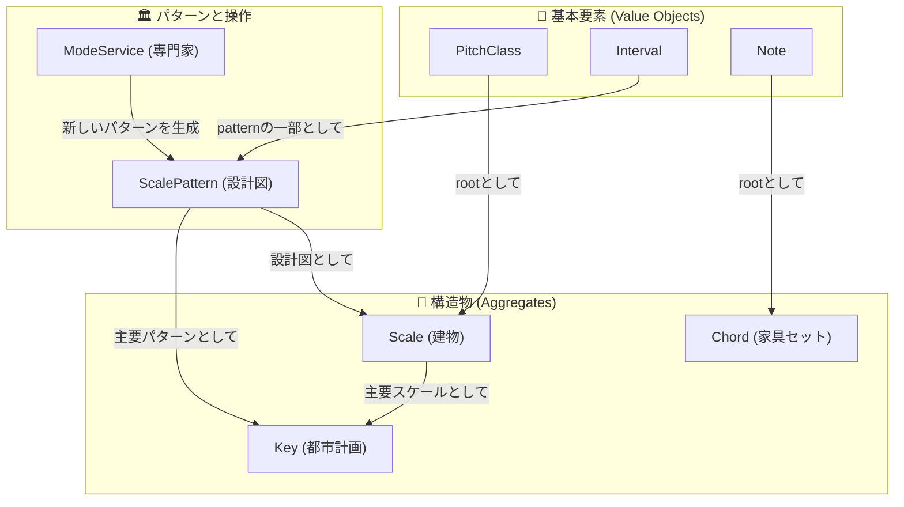

このモデルの核心は、音を単なるデータとしてではなく、**音楽理論の持つ「関係性」「構造」「文脈」そのものをコードで表現する**ことにあります。

---

## 💎 基本要素：値オブジェクト（Value Objects）

これらはドメインの不変の語彙であり、システムの安定性の礎となる「原子」です。

| 概念             | 役割              | 責務                                                           | 例え                               |
| :--------------- | :---------------- | :------------------------------------------------------------- | :--------------------------------- |
| **`PitchClass`** | 音名 (C, C\#...)  | オクターブに依存しない12の音名を表現する。                     | 色の名前（赤、青）                 |
| **`Interval`**   | 音程 (長3度など)  | 2音間の距離という「関係性」を定義する。移調の単位。            | 定規                               |
| **`Note`**       | 絶対音高 (C4など) | `PitchClass`とオクターブを組み合わせ、具体的な高さを表現する。 | 特定の絵の具（パレット上のC4の音） |

---

## 🏛️ パターンと操作：設計図と専門家

これらは、具体的な構造物を作るための「設計図」と、それを操作する「専門家」です。

### `ScalePattern` (値オブジェクト)

- **役割:** あらゆる音階の\*\*純粋な「設計図（パターン）」\*\*です。
- **責務:** 名前（"Major", "Harmonic Minor"）と、構造を定義するインターバルの配列を保持します。メジャーもマイナーもモードも、全てが平等の「パターン」としてここに定義されます。
- **例え:** **建築様式のカタログ**（モダン様式、ゴシック様式など）

<!-- end list -->

```typescript
// 設計図
class ScalePattern {
  constructor(
    public readonly name: string,
    public readonly intervals: readonly Interval[]
  ) {}
}
```

### `ModeService` (ドメインサービス)

- **役割:** ある`ScalePattern`から新しい`ScalePattern`を\*\*導出するための「操作」\*\*です。
- **責務:** 「メジャーパターンの2番目から始めるとドリアンパターンが生まれる」という、**音楽理論のルール**をカプセル化します。
- **例え:** **建築様式を考案する建築家**

---

## 🧱 構造物：集約（Aggregates）

これらは、基本要素とパターンから組み立てられる、アイデンティティを持つ具体的な「構造物」です。

### `Scale` (集約)

- **役割:** **具体的な音階**。
- **構築方法:** `root: PitchClass` と `pattern: ScalePattern` から生成されます。
- **責務:** 具体的な音の集合を管理し、「この音階の5番目の音は？」といった問いに答えます。
- **例え:** **特定の土地に、特定の様式で建てられた具体的な建物**

<!-- end list -->

```typescript
// 具体的な建物
class Scale {
  constructor(
    public readonly root: PitchClass,
    public readonly pattern: ScalePattern
  ) {}
}
```

### `Chord` (集約)

- **役割:** **和音**。
- **構築方法:** `root: Note` と、和音の品質を定義する`Interval`のパターン（例: [長3度, 完全5度]）から生成されます。
- **責務:** 構成音や転回形を管理します。
- **例え:** **家具のセット**（テーブルと椅子の組み合わせ）

### `Key` (集約)

- **役割:** **調性**。音楽全体の「文脈」や「重力場」を定義します。
- **構築方法:** 主音となる`tonic: PitchClass` と、長調/短調などを定義する主要な`ScalePattern`から生成されます。
- **責務:** 和声機能（トニック、ドミナント等）を管理し、「この調のIV度の和音は？」といった問いに答えます。場面に応じて使う`ScalePattern`を判断する司令塔の役割も担います。
- **例え:** **街全体の都市計画**

---

## ✨ 概念の関連図



---

## 📖 総括表

| 概念               | DDDの役割          | 中心的な責務（一言で）                   | 建築の例え       |
| :----------------- | :----------------- | :--------------------------------------- | :--------------- |
| `PitchClass`       | 値オブジェクト     | オクターブから独立した音名を表現する     | 色の名前         |
| `Interval`         | 値オブジェクト     | 2音間の関係性（距離）を定義する          | 定規             |
| `Note`             | 値オブジェクト     | 具体的な音高を表現する                   | 特定の絵の具     |
| **`ScalePattern`** | **値オブジェクト** | **音階の「設計図・パターン」を定義する** | **建築様式**     |
| `ModeService`      | ドメインサービス   | パターンから新しいパターンを導出する     | 建築家           |
| **`Scale`**        | **集約**           | **具体的な音の集合を管理する**           | **具体的な建物** |
| `Chord`            | 集約               | 同時に鳴る音の集合（和音）を管理する     | 家具のセット     |
| **`Key`**          | **集約**           | **和声的な機能と文脈を管理する**         | **都市計画**     |

## ディレクトリ構成

```
src/
└── domain/
    ├── services/               # ドメイン横断的な操作や計算を担当するサービス群
    │   ├── ModeService.ts      # あるScalePatternから新しいScalePatternを導出する責務
    │   └── AudioEngine.ts      # リアル音源対応の音響エンジン
    │
    ├── common/                 # 複数の集約で共通して使われる基本要素（値オブジェクト）
    │   ├── PitchClass.ts       # 音名を表現。半音階/五度圏インデックスを保持し、それらから自身を生成する責務を持つ
    │   ├── Interval.ts         # 2音間の距離（関係性）を表現する責務
    │   ├── Note.ts             # 絶対音高（オクターブを含む音）を表現する責務
    │   └── ScalePattern.ts     # 音階の設計図（インターバルパターン）を表現する責務
    │
    ├── scale/                  # ■ Scale集約: 具体的な音階に関する関心事
    │   └── index.ts            # Scale集約ルート。ルート音とパターンに基づき、具体的な音の集合を管理する責務を持つ
    │
    ├── chord/                  # ■ Chord集約: 和音に関する関心事
    │   └── index.ts            # Chord集約ルート。和音の構成音を管理し、インデックス等から自身を生成する責務を持つ
    │
    └── key/                    # ■ Key集約: 調性に関する関心事
        └── index.ts            # Key集約ルート。和声機能（トニック等）を管理し、インデックス等から自身を生成する責務を持つ
```
