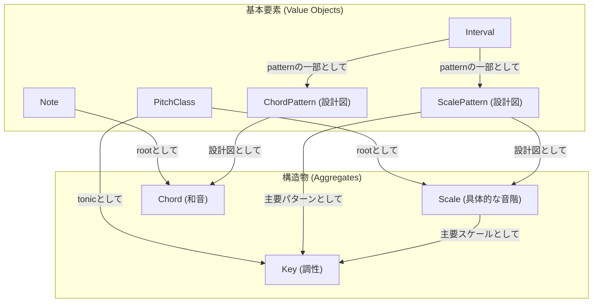

# 音楽理論ドメイン設計書

## 1. はじめに

### 1.1. 設計思想

本ドキュメントは、音楽理論のドメインモデルを定義するものである。この設計の核心は、音を単なる数値データとして扱うのではなく、音楽理論が内包する**「関係性」「構造」「文脈」といった抽象的な概念そのものをコードで表現する**ことにある。これにより、堅牢で拡張性が高く、かつドメインの本質を反映したソフトウェアの構築を目指す。

### 1.2. 対象ドメイン

本設計書は、音楽理論の中でも特に**和声（Harmony）**に関連するコンテキストを対象とする。

---

## 2. ドメインモデルの構成要素

本ドメインモデルは、不変の値を表現する「値オブジェクト」と、状態とライフサイクルを持つ「集約」によって構成される。

### 2.1. 値オブジェクト (Value Objects)

値オブジェクトは、ドメインにおける不変の語彙であり、システムの安定性の礎となる。その値によって一意に識別され、状態を変更することはない。

| オブジェクト名     | 役割             | 責務                                                                                                                                                              | たとえ       |
| :----------------- | :--------------- | :---------------------------------------------------------------------------------------------------------------------------------------------------------------- | :----------- |
| **`PitchClass`**   | 音名             | オクターブに依存しない12の音名（C, C#など）を表現する。半音階および五度圏における自身のインデックス情報を保持し、それらの値からインスタンスを生成する責務も持つ。 | 色の名前     |
| **`Interval`**     | 音程             | 2音間の相対的な距離（関係性）を定義する。移調計算の基本単位となる。                                                                                               | 定規         |
| **`Note`**         | 絶対音高         | `PitchClass`とオクターブ情報を組み合わせ、具体的な音の高さ（C4など）を表現する。                                                                                  | 特定の絵の具 |
| **`ScalePattern`** | スケールパターン | あらゆる音階の構造を定義する「設計図」。名前とインターバルの配列を保持し、自身のパターンから新しいモード（旋法）のパターンを導出する責務を持つ。                  | 建築様式     |
| **`ChordPattern`** | コードパターン   | あらゆる和音の構造を定義する「設計図」。名前接尾辞とインターバルの配列を保持し、コードの基本的な性質を判定する責務を持つ。                                        | 楽器設計図   |

### 2.2. 集約 (Aggregates)

集約は、値オブジェクトや他のエンティティをカプセル化し、一貫した単位として扱われるオブジェクトである。明確なアイデンティティとライフサイクルを持ち、ドメインのルールを維持する責任を負う。

| オブジェクト名 | 役割         | 責務                                                                                                                                                                     | たとえ       |
| :------------- | :----------- | :----------------------------------------------------------------------------------------------------------------------------------------------------------------------- | :----------- |
| **`Scale`**    | 具体的な音階 | `PitchClass`（ルート音）と`ScalePattern`（設計図）に基づき生成される、具体的な音の集合を管理する。                                                                       | 具体的な建物 |
| **`Chord`**    | 和音         | `Note`（ルート音）と`ChardPattern`（設計図）（メジャー/マイナーなど）に基づき生成される、同時に鳴る音の集合を管理する。                                                  | 家具のセット |
| **`Key`**      | 調性         | 音楽全体の「文脈」と「重力場」を定義する。主音と主要な`ScalePattern`から構成され、和声機能（トニック、ドミナント等）を管理し、ダイアトニックコードを生成する責務を持つ。 | 都市計画     |

---

## 3. ドメインモデル関連図

各ドメインオブジェクトの関係性を以下に示す。



---

## 4. ディレクトリ構成

本ドメインモデルを実装するためのディレクトリ構成は、ドメインの関心事に基づき、以下のように定義する。

```plaintext
src/
└── domain/
    ├── services/                 # ドメイン横断的な操作や計算を担当するサービス群
    │   └── harmonic-analysis.service.ts # 和声進行の分析など、複数の集約を扱う責務
    │
    ├── common/                 # 複数の集約で共通して使われる基本要素（値オブジェクト）
    │   ├── chord-pattern.ts    # ChordPattern: コードの設計図と品質判定ロジックを管理
    │   ├── interval.ts         # Interval: 音程を管理
    │   ├── note.ts             # Note: 絶対音高を管理
    │   ├── pitch-class.ts      # PitchClass: 音名と関連インデックスを管理
    │   └── scale-pattern.ts    # ScalePattern: スケールの設計図とモード導出ロジックを管理
    │
    ├── scale/                  # ■ Scale集約: 具体的な音階に関する関心事
    │   └── index.ts            # Scale集約ルート
    │
    ├── chord/                  # ■ Chord集約: 和音に関する関心事
    │   └── index.ts            # Chord集約ルート
    │
    └── key/                    # ■ Key集約: 調性に関する関心事
        └── index.ts            # Key集約ルート
```
