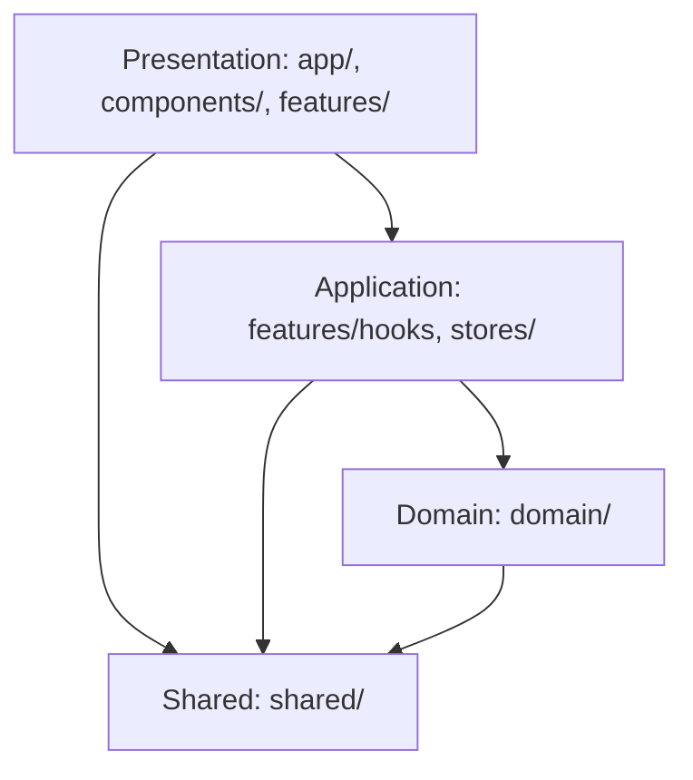

# アーキテクチャ設計

本プロジェクトは**クリーンアーキテクチャ**を採用し、**DDD（ドメイン駆動設計）の戦術的パターン**と**Feature Sliced Design**を組み合わせた構成。

核心は「Domain層の完全な独立性」と「依存の方向が常に内側（Domain）へ向かう」こと。



## 核心ルール

1. **Domain層は他に依存しない**: 音楽理論ロジックはUI/フレームワークから完全に独立
2. **featuresは他のfeaturesに依存しない**: 各機能は独立したモジュール
3. **featuresはindex.tsで公開APIを定義**: 内部実装への直接アクセス禁止

## ディレクトリ構造

```
music-theory-app/
├── src/
│   ├── app/                      # Next.js App Router: ページとルーティング
│   ├── components/               # 共通UIコンポーネント
│   │   ├── ui/                   # shadcn/ui由来のプリミティブコンポーネント
│   │   └── layouts/              # レイアウトコンポーネント
│   ├── features/                 # 機能単位のモジュール
│   │   ├── circle-of-fifths/     # 五度圏表示機能
│   │   ├── chromatic-circle/     # クロマチックサークル機能
│   │   ├── key-controller/       # キー選択コントローラー
│   │   ├── layer-controller/     # レイヤー制御機能
│   │   ├── information-panel/    # 情報パネル
│   │   └── view-controller/      # ビュー切り替え機能
│   ├── domain/                   # ドメイン層: 音楽理論ロジック
│   │   ├── common/               # 値オブジェクト (PitchClass, Note, Interval等)
│   │   ├── scale/                # Scale集約
│   │   ├── chord/                # Chord集約
│   │   ├── key/                  # Key集約
│   │   ├── modal-context/        # ModalContext集約
│   │   └── services/             # ドメインサービス (AudioEngine, ChordAnalyzer等)
│   ├── shared/                   # 共通ユーティリティ・型定義
│   └── stores/                   # グローバル状態管理
├── docs/                         # プロジェクトドキュメント
│   ├── 00.project/               # プロジェクト基本情報・要件定義
│   ├── 10.domain/                # ドメイン知識・音楽理論ガイド
│   ├── 20.development/           # 開発ガイドライン・設計原則
│   ├── 30.quality/               # 品質管理・テスト戦略
│   ├── 70.knowledge/             # ナレッジベース
│   └── 80.dailyReport/           # 開発日報
├── .storybook/                   # Storybook設定
├── .github/                      # GitHub設定（Issue/PRテンプレート）
├── package.json                  # 依存関係とスクリプト
└── CLAUDE.md                     # AIアシスタント向けプロジェクトガイド
```

## インポート規約

```typescript
// ✅ 推奨: 各機能のindex.tsから公開されたAPIのみを使用
import { CircleOfFifths } from '@/features/circle-of-fifths';

// ❌ 禁止: 機能内部のコンポーネントやフックに直接アクセス
import { SomeComponent } from '@/features/circle-of-fifths/components/SomeComponent';
```
