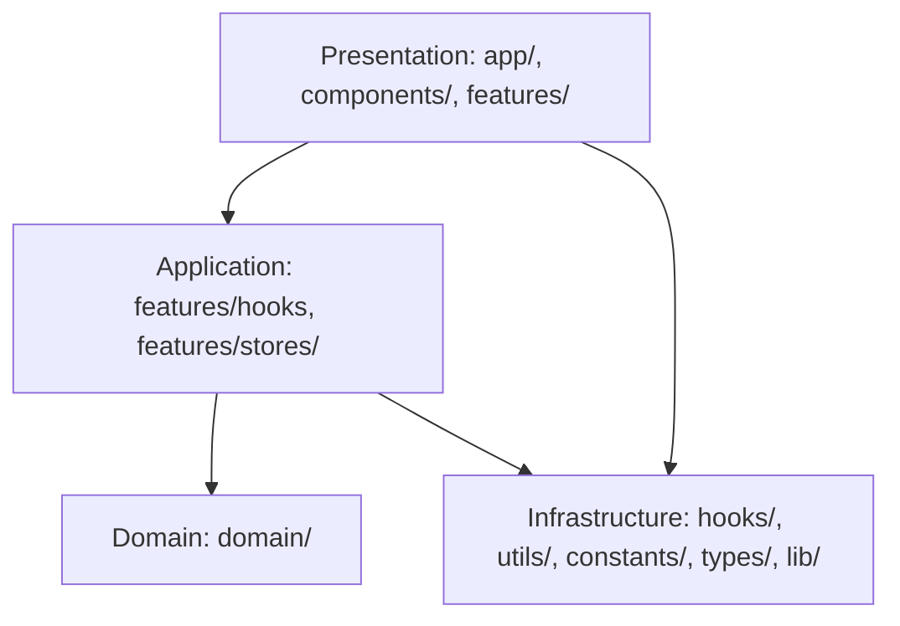

# アーキテクチャ設計

本プロジェクトは**クリーンアーキテクチャ**を採用し、**DDD（ドメイン駆動設計）の戦術的パターン**と**Co-located Feature-Sliced Design**を組み合わせた構成。

核心は「Domain層の完全な独立性」と「依存の方向が常に内側（Domain）へ向かう」こと、そして「機能に閉じた状態管理（Colocation）」。



## 核心ルール

1. **Domain層は他に依存しない**: 音楽理論ロジックはUI/フレームワークから完全に独立
2. **featuresは他のfeaturesに依存しない**: 各機能は独立したモジュール
3. **featuresはindex.tsで公開APIを定義**: 内部実装への直接アクセス禁止
4. **機能に閉じた状態は各feature内に配置（Colocation）**: グローバルstoresは複数feature横断のみ

## Presentation階層の境界: components vs features

- `components/` は **プロジェクト横断の汎用UI**。音楽理論ドメインに依存しないプリミティブやレイアウトを置く。ビジネスロジックやfeature固有のストアへ依存しない。
- `features/` は **ドメイン知識を含む垂直スライス**。各機能のUI・hooks・stores・utilsを閉じ込め、index.tsで外部公開する。
- 迷ったら「他featureでもそのまま使えるか」で判定し、使えるならcomponents、機能固有ならfeaturesに置く。
- UIを再利用したいがドメイン依存がある場合は、features側で薄いアダプターを作り、componentsはドメイン非依存のPropsを受け取るようにする。

## ディレクトリ構造

```
harmonic-orbit/
├── src/
│   ├── app/                      # Next.js App Router: ページとルーティング
│   ├── components/               # 共通UIコンポーネント
│   │   ├── ui/                   # shadcn/ui由来のプリミティブコンポーネント
│   │   ├── common/               # 汎用共通コンポーネント (Divider, icons等)
│   │   └── layouts/              # レイアウトコンポーネント
│   ├── features/                 # 機能単位のモジュール（各々がstores/を持つ）
│   │   ├── circle-of-fifths/     # 五度圏表示機能
│   │   │   └── stores/           # circleOfFifthsStore, rippleStore, animationStore
│   │   ├── chromatic-circle/     # クロマチックサークル機能
│   │   │   └── stores/           # chromaticCircleStore
│   │   ├── key-controller/       # キー選択コントローラー
│   │   ├── layer-controller/     # レイヤー制御機能
│   │   │   └── stores/           # layerStore
│   │   ├── information-panel/    # 情報パネル
│   │   ├── view-controller/      # ビュー切り替え機能
│   │   │   └── stores/           # hubStore
│   │   └── atlas/                # Atlas機能
│   ├── domain/                   # ドメイン層: 音楽理論ロジック
│   │   ├── common/               # 値オブジェクト (PitchClass, Note, Interval等)
│   │   ├── scale/                # Scale集約
│   │   ├── chord/                # Chord集約
│   │   ├── key/                  # Key集約
│   │   ├── modal-context/        # ModalContext集約
│   │   └── services/             # ドメインサービス (AudioEngine, ChordAnalyzer等)
│   ├── hooks/                    # 汎用カスタムフック
│   ├── utils/                    # 汎用ユーティリティ関数
│   ├── constants/                # アプリ全体の定数
│   ├── types/                    # 全体で共有する型定義
│   ├── lib/                      # 外部ライブラリ設定 (Shadcn utils等)
│   └── stores/                   # グローバル状態管理（複数feature横断のみ: currentKeyStore）
├── docs/                         # プロジェクトドキュメント
│   ├── 00.project/               # プロジェクト基本情報・要件定義
│   ├── 10.domain/                # ドメイン知識・音楽理論ガイド
│   ├── 20.development/           # 開発ガイドライン・設計原則
│   ├── 30.quality/               # 品質管理・テスト戦略
│   ├── 70.knowledge/             # ナレッジベース
│   └── 80.dailyReport/           # 開発日報
├── .storybook/                   # Storybook設定
├── .github/                      # GitHub設定（Issue/PRテンプレート）
├── package.json                  # 依存関係とスクリプト
└── CLAUDE.md                     # AIアシスタント向けプロジェクトガイド
```

## Store配置のルール

| Store種別                         | 配置場所             | 例                                        |
| --------------------------------- | -------------------- | ----------------------------------------- |
| **機能専用**                      | `features/*/stores/` | circleOfFifthsStore, layerStore, hubStore |
| **グローバル（複数feature横断）** | `stores/`            | currentKeyStore                           |

## インポート規約

```typescript
// ✅ 推奨: 各機能のindex.tsから公開されたAPIのみを使用
import { CircleOfFifths, useCircleOfFifthsStore } from '@/features/circle-of-fifths';

// ✅ 推奨: グローバルストアは stores/ から
import { useCurrentKeyStore } from '@/stores/currentKeyStore';

// ✅ 推奨: 汎用フック/ユーティリティは直接
import { useBodyScrollLock } from '@/hooks/useBodyScrollLock';
import { calculateAngle } from '@/utils/geometry';

// ❌ 禁止: 機能内部のコンポーネントやフックに直接アクセス
import { SomeComponent } from '@/features/circle-of-fifths/components/SomeComponent';
```
