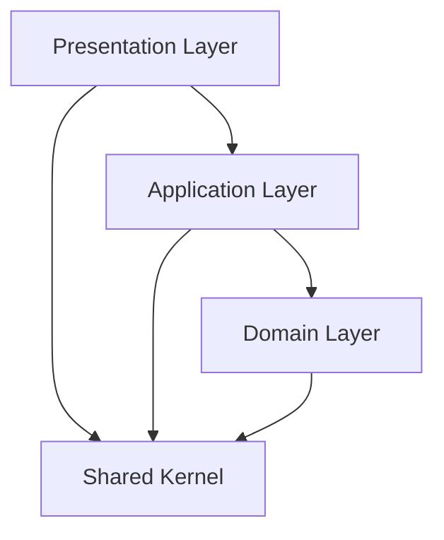

# アーキテクチャ設計

本ドキュメントは、アプリケーション全体の構造、思想、そしてデータフローを定義する。保守性と拡張性を最大化するための最も重要な原則がここに記されている。

## 1\. 全体像：レイヤーと依存関係の原則

本プロジェクトのアーキテクチャは、関心事を明確に分離する**レイヤードアーキテクチャ**と、機能的なまとまりを意識した\*\*機能分割（Feature Sliced Design）\*\*を組み合わせた構成を採用する。

最大の原則は **「依存性の方向を常に一方向に保つこと」** である。



- **Presentation Layer (UI層)**: ユーザーとのインターフェースを担当。Next.jsの`app/`, `components/`, `features/`が該当する。
- **Application Layer (応用層)**: UIからの要求を受け、ドメインロジックを調整し、結果をUIに返す。`features/`内のhooksやstoresがこの役割を担う。
- **Domain Layer (ドメイン層)**: アプリケーションの核となる音楽理論のビジネスロジック。フレームワークやUIから完全に独立している。`domain/`が該当する。
- **Shared Kernel (共有層)**: 全レイヤーから参照される共通のユーティリティや型定義。`shared/`が該当する。

**鉄則:**
**Domain層は、他のどのレイヤーにも依存してはならない。** 音楽理論のロジックは、UIがReactであろうとVueであろうと、あるいはCLIアプリケーションであろうと、独立して動作可能でなければならない。

---

## 2\. ディレクトリ構造と各レイヤーの責務

上記のレイヤードアーキテクチャ思想に基づき、ディレクトリを以下のように配置し、それぞれの責務を定義する。

```
src/
├── app/                  # Presentation Layer: ルーティングとページ構成
├── components/           # Presentation Layer: 共通UI部品
│   ├── layouts/          # 汎用的なページレイアウトコンポーネント
│   └── ui/               # shadcn/ui に由来する、状態を持たない最小単位のUI部品
├── features/             # Presentation / Application Layer: 機能単位のモジュール
├── domain/               # Domain Layer: アプリケーションのコアロジック
├── shared/               # Shared Kernel: 全レイヤーで共有される要素
└── stores/               # Application Layer: グローバルな状態管理
```

### 2.1. `domain/` - アプリケーションの心臓部

- **責務**: 純粋な音楽理論のルール、データ構造、ビジネスロジックを実装する。
- **内容**:
  - `common/`: 値オブジェクト（PitchClass, Note, Intervalなど）。
  - `scale/`, `chord/`, `key/`: 集約（EntityとValue Objectのまとまり）。
  - `services/`: 特定の集約に属さないドメイン固有のロジック。
- **ルール**:
  - このディレクトリ内のコードは、Reactのフックや外部ライブラリ（UI関連）に依存してはならない。
  - フレームワークから完全に独立し、純粋なTypeScriptで記述される。

### 2.2. `features/` - ユーザーに価値を届ける機能単位

- **責務**: 特定の機能（例：五度圏、クロマチックサークル）を実現するためのUIとロジックをカプセル化する。
- **内容**:
  - `components/`: その機能でのみ使用されるUIコンポーネント。
  - `hooks/`: UIの状態管理や、Domain層との連携を行うカスタムフック（Application Layerの役割）。
  - `store/`: 機能ローカルな状態管理（Zustandなど）。
  - `index.ts`: 外部に公開するAPI（コンポーネントやフック）を定義するファサード。
- **ルール**:
  - `features`は他の`features`に直接依存してはならない。
  - `features`は`domain/`と`shared/`、そして`components/ui`に依存することができる。

### 2.3. `components/` - 再利用可能なUI部品

- **責務**: アプリケーション全体で再利用可能な、純粋なUI部品を提供する。
- **内容**:
  - `ui/`: ボタン、ダイアログなど、shadcn/uiによって生成されたアトミックなコンポーネント。これらは原則として状態を持たない。
  - `layouts/`: ページの骨格を定義する、より大きなレイアウト用コンポーネント。
- **ルール**:
  - `components`は特定の機能に関する知識を持ってはならない。
  - `components`は`features/`や`app/`から利用される。

### 2.4. `app/` - ルーティングとページの組み立て

- **責務**: Next.jsのApp Routerに基づき、ルーティングを定義し、各ページを構成する。
- **内容**:
  - `page.tsx`, `layout.tsx` など。
- **ルール**:
  - `app/`ディレクトリは、主に`features/`や`components/`のコンポーネントを組み合わせてページを構築する責務を持つ。
  - ここに複雑なビジネスロジックや状態管理を記述するべきではない。

### 2.5. `shared/` と `stores/`

- `shared/`: 複数のレイヤーや機能をまたいで使用される、真に汎用的なコード（型定義、定数、ユーティリティ関数など）を配置する。
- `stores/`: 複数の`features`で共有されるグローバルな状態（例：現在のキー、スケールなど）を管理する。

---

## 3\. インポート・エクスポート規約（機能のカプセル化）

機能の独立性を保ち、意図しない依存を防ぐため、インポート・エクスポートには厳格なルールを設ける。

- **原則**: `features`の内部実装に直接アクセスすることを禁止する。

<!-- end list -->

```typescript
// ✅ 推奨: 各機能のindex.tsから公開されたAPIのみを使用する
import { CircleOfFifths } from '@/features/circle-of-fifths';

// ❌ 禁止: 機能内部のコンポーネントやフックに直接アクセスしない
import { SomeInternalComponent } from '@/features/circle-of-fifths/components/SomeInternalComponent';
```

各`features/`ディレクトリの`index.ts`は、その機能が外部に提供する「公開API」としての役割を担う。これにより、将来的なリファクタリングを機能内部に閉じ込めることが可能になる。
