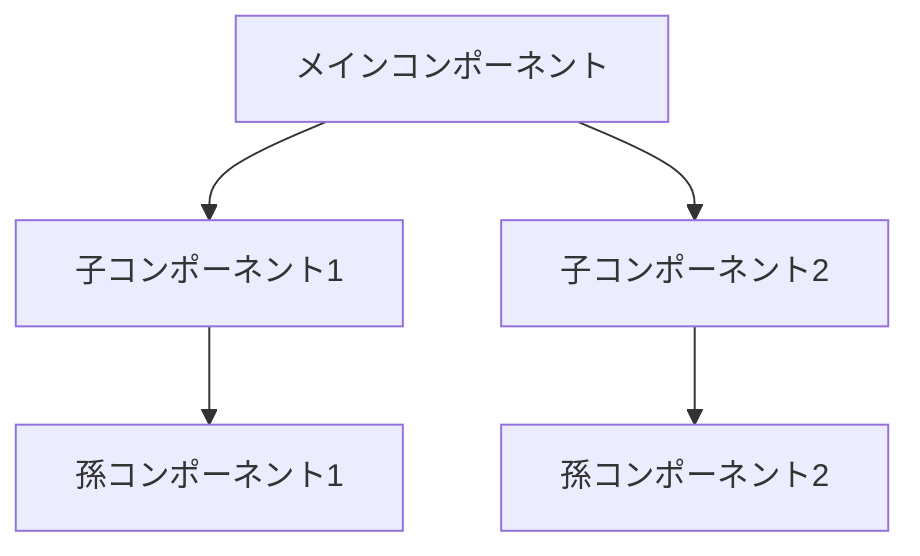
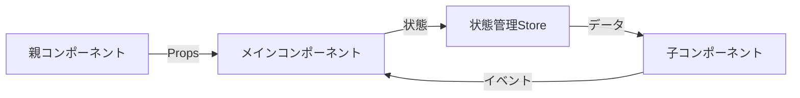

# [コンポーネント名] 設計書

> **作成日**: [YYYY-MM-DD]  
> **更新日**: [YYYY-MM-DD]  
> **バージョン**: [x.x.x]  
> **作成者**: [作成者名]

[<< 画面設計書に戻る](../screenDesigns/[関連画面].md)

[コンポーネントの概要説明]

## 📋 目次

- [概要](#概要)
- [アーキテクチャ](#アーキテクチャ)
- [技術仕様](#技術仕様)
- [使用方法](#使用方法)
- [機能詳細](#機能詳細)
- [設計思想](#設計思想)

## 概要

### 目的・役割

[このコンポーネントが果たす役割と存在理由を記述]

### 主要機能

- **機能1**: 機能の説明
- **機能2**: 機能の説明
- **機能3**: 機能の説明

## アーキテクチャ

### コンポーネント構成

[メイン・子コンポーネントの概要・役割を記述]

### コンポーネント構成図



### データフロー図



### ファイル構造

```
src/components/[ComponentName]/
├── README.md                    # このファイル
├── [ComponentName].tsx          # メインコンポーネント
├── components/                  # 子コンポーネント
│   ├── [SubComponent1].tsx     # 子コンポーネント1
│   ├── [SubComponent2].tsx     # 子コンポーネント2
│   └── [SubComponent3].tsx     # 子コンポーネント3
├── hooks/                       # カスタムフック
│   ├── use[ComponentName].ts   # メインフック
│   └── use[Feature].ts         # 機能別フック
├── utils/                       # ユーティリティ関数
│   └── index.ts                # エクスポート用ファイル
├── constants/                   # 定数定義
│   └── index.ts                # 定数ファイル
├── types/                       # コンポーネント固有型定義
│   └── index.ts                # 型定義ファイル
└── __tests__/                   # テストファイル
    ├── [ComponentName].test.tsx
    └── [SubComponent].test.tsx
```

### 依存関係

#### 内部依存

- `@/components/[依存コンポーネント]` - [依存理由]
- `@/hooks/[依存フック]` - [依存理由]
- `@/utils/[依存ユーティリティ]` - [依存理由]

#### 外部依存

- `react` - Reactフレームワーク
- `next` - Next.jsフレームワーク
- `motion` - アニメーションライブラリ
- `clsx` - クラス名結合ユーティリティ
- `tailwind-merge` - Tailwindクラス最適化

## 技術仕様

### Props仕様

#### メインコンポーネント

```typescript
interface [ComponentName]Props {
  /** 必須プロパティの説明 */
  requiredProp: string;

  /** オプショナルプロパティの説明 */
  optionalProp?: number;

  /** カスタムクラス名 */
  className?: string;

  /** イベントハンドラー */
  onEvent?: (value: string) => void;
}
```

#### 子コンポーネント

```typescript
interface [SubComponent]Props {
  /** 子コンポーネントのプロパティ */
  childProp: boolean;
}
```

### 状態管理

#### ローカル状態

```typescript
// useState使用例
const [localState, setLocalState] = useState<StateType>(initialValue);
```

#### グローバル状態 (Zustand)

```typescript
interface [ComponentName]Store {
  // 状態プロパティ
  state: StateType;

  // アクション
  setState: (state: StateType) => void;
  resetState: () => void;
}
```

### API仕様

#### 公開メソッド

| メソッド名 | 引数          | 戻り値       | 説明           |
| ---------- | ------------- | ------------ | -------------- |
| `method1`  | `param: Type` | `ReturnType` | メソッドの説明 |
| `method2`  | `param: Type` | `void`       | メソッドの説明 |

#### イベント

| イベント名 | ペイロード          | 説明           |
| ---------- | ------------------- | -------------- |
| `onEvent1` | `{ data: Type }`    | イベントの説明 |
| `onEvent2` | `{ value: string }` | イベントの説明 |

## 使用方法

[使用上の注意点や特記事項があれば記述]

```tsx
import { [ComponentName] } from '@/features/[feature-name]';

function Example() {
  return (
    <[ComponentName]
      // 必要なpropsを記述
    />
  );
}
```

## 機能詳細

[このコンポーネントの具体的な機能や動作について記述する。
状態変更によるUI変化、ユーザー操作による効果、他コンポーネントへの影響などを含める。]

### 機能の動作

- **初期状態**: [初期状態での動作や表示]
- **操作時**: [ユーザー操作時の動作や表示変化]
- **影響範囲**: [他のコンポーネントや要素への影響]

## 設計思想

[このコンポーネントの設計で重視したポイントや考慮事項について記述する。
例：単一責任の原則、再利用性、保守性、パフォーマンス、アクセシビリティなど]

## 関連ドキュメント

- [要件定義書](../01.requirements.md)
- [画面設計書](../screenDesigns/[関連画面].md)
- [開発規約](../03.developmentAgreement.md)
- [API仕様書](./api-specification.md)
- [Storybook](http://localhost:6006/?path=/story/[component-name])

## 用語集

| 用語  | 定義  |
| ----- | ----- |
| 用語1 | 定義1 |
| 用語2 | 定義2 |

---

> 📝 **Note**: この設計書は [開発規約](../03.developmentAgreement.md) に従って作成されています。  
> 🔄 **Update**: 機能追加・変更時はこの設計書も合わせて更新してください。  
> 🤝 **Collaboration**: 不明な点があれば開発チームまでお問い合わせください。
