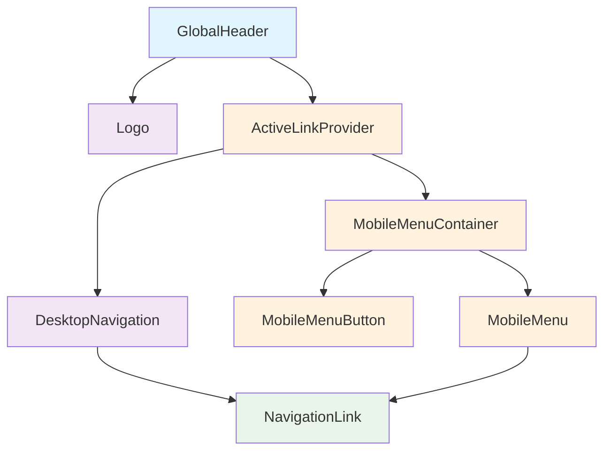
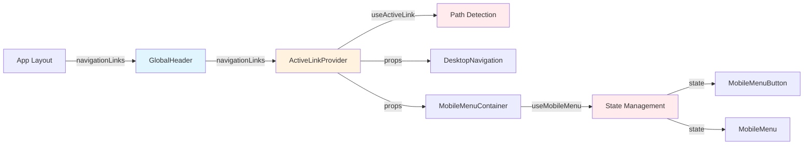

# GlobalHeader コンポーネント設計書

> **作成日**: 2025-06-25  
> **更新日**: 2025-07-05  
> **バージョン**: 2.1.0  
> **作成者**: Claude Code

[<< 画面設計書に戻る](/docs/screenDesigns/01.hub.md)

アプリケーション全体で使用される統一ナビゲーションヘッダーコンポーネント

## 📋 目次

- [概要](#概要)
- [アーキテクチャ](#アーキテクチャ)
- [技術仕様](#技術仕様)
- [使用方法](#使用方法)
- [設計思想](#設計思想)
- [パフォーマンス](#パフォーマンス)
- [アクセシビリティ](#アクセシビリティ)
- [テスト戦略](#テスト戦略)
- [開発・保守](#開発保守)

## 概要

### 目的・役割

GlobalHeaderは音楽理論学習アプリケーションの統一ナビゲーション体験を提供し、ユーザーが各ページ間をスムーズに移動できるようにします。デスクトップとモバイルの両方の環境で一貫したUXを実現します。

### 主要機能

- **ブランドロゴ表示**: アプリケーション名とホームページへのリンク
- **デスクトップナビゲーション**: Hub、Library、Tutorialへの水平ナビゲーション
- **モバイルメニュー**: レスポンシブなハンバーガーメニューとドロップダウン
- **アクティブリンク判定**: 現在のページを視覚的に表示
- **スムーズアニメーション**: Framer Motionによる洗練されたUI遷移

### ビジネス価値

- **ユーザビリティ向上**: 直感的なナビゲーションによる学習体験の向上
- **ブランド統一**: 一貫したデザインシステムによるブランド価値向上
- **モバイル対応**: モバイルユーザーの増加に対応した収益機会拡大

## アーキテクチャ

### コンポーネント構成図



### データフロー図



### ファイル構造

```
src/components/layouts/GlobalHeader/
├── README.md                       # この設計書
├── index.ts                        # エクスポート統合
├── components/                     # コンポーネント
│   ├── GlobalHeader.tsx            # メインコンポーネント (Server)
│   ├── Logo.tsx                   # ロゴコンポーネント (Server)
│   ├── ActiveLinkProvider.tsx     # アクティブリンク管理 (Client)
│   ├── DesktopNavigation.tsx      # デスクトップナビ (Client)
│   ├── NavigationLink.tsx         # 共通リンクコンポーネント (Client)
│   ├── MobileMenuContainer.tsx    # モバイルメニュー統合 (Client)
│   ├── MobileMenuButton.tsx       # ハンバーガーボタン (Client)
│   └── MobileMenu.tsx             # モバイルドロップダウン (Client)
├── hooks/                          # カスタムフック
│   ├── useActiveLink.ts           # アクティブリンク判定フック
│   └── useMobileMenu.ts           # モバイルメニュー状態管理フック
└── types.ts                       # TypeScript型定義
```

### 依存関係

#### 内部依存

- `@/app/globals.css` - デザイントークンとヘッダー専用スタイル
- `Next.js usePathname` - 現在のパス取得
- `Next.js Link` - ルーティング

#### 外部依存

- `react` - Reactフレームワーク (v19)
- `next/navigation` - Next.jsナビゲーション (v15)
- `motion/react` - Framer Motionアニメーション (v12)
- `clsx` - 条件付きクラス名結合
- `tailwind-merge` - Tailwindクラス最適化

## 技術仕様

### Props仕様

#### GlobalHeader

```typescript
// GlobalHeaderは単一用途のため、propsは受け取りません
export const GlobalHeader: React.FC = () => {
  // 実装...
};
```

#### NavigationLink

```typescript
interface NavigationLinkProps {
  /** ナビゲーションリンクの情報 */
  link: NavigationLink;

  /** アクティブ状態かどうか */
  isActive: boolean;

  /** クリック時のハンドラー（モバイルメニューを閉じるなど） */
  onClick?: () => void;

  /** モバイル表示用のスタイルを適用するかどうか */
  isMobile?: boolean;
}
```

### 状態管理

#### ローカル状態 (useMobileMenu)

```typescript
const {
  isMobileMenuOpen, // メニュー開閉状態
  closeMobileMenu, // メニューを閉じる
  toggleMobileMenu, // メニュー開閉切り替え
} = useMobileMenu();
```

#### パス判定 (useActiveLink)

```typescript
const {
  isActiveLink, // リンクのアクティブ状態判定関数
} = useActiveLink();
```

### API仕様

#### 公開メソッド

| メソッド名         | 引数                   | 戻り値    | 説明                             |
| ------------------ | ---------------------- | --------- | -------------------------------- |
| `isActiveLink`     | `link: NavigationLink` | `boolean` | リンクがアクティブかどうかを判定 |
| `toggleMobileMenu` | なし                   | `void`    | モバイルメニューの開閉を切り替え |
| `closeMobileMenu`  | なし                   | `void`    | モバイルメニューを閉じる         |

#### イベント

| イベント名             | ペイロード      | 説明                         |
| ---------------------- | --------------- | ---------------------------- |
| `onClick (Navigation)` | `MouseEvent`    | ナビゲーションリンククリック |
| `onKeyDown (Escape)`   | `KeyboardEvent` | Escapeキーでメニュー閉じ     |

## 使用方法

### 基本的な使用

```tsx
import { GlobalHeader } from '@/components/layouts/GlobalHeader';

function RootLayout({ children }: { children: React.ReactNode }) {
  return (
    <html>
      <body>
        <GlobalHeader />
        <main>{children}</main>
      </body>
    </html>
  );
}
```

### レスポンシブレイアウト

GlobalHeaderは画面サイズに応じて異なるレイアウトを提供します：

**モバイル（md未満）**:

- Logo: 左端配置
- Navigation: 右端配置（ハンバーガーメニュー）

**デスクトップ（md以上）**:

- Logo: 左端配置
- Navigation: 中央配置（水平メニュー）
- 右側: バランス用空白エリア

```tsx
// レスポンシブレイアウトの実装例
<header className="border-header-border relative flex min-h-[4rem] w-full items-center border-b bg-transparent px-6 py-4 lg:px-8">
  <div className="flex-1 md:flex-1">
    <Logo />
  </div>
  <div className="md:flex md:flex-1 md:justify-center">
    <ActiveLinkProvider navigationLinks={navigationLinks} />
  </div>
  <div className="hidden md:block md:flex-1"></div>
</header>
```

### 高度な使用例

```tsx
// カスタムナビゲーションリンクの追加 (将来の拡張例)
const customNavigationLinks = [
  { id: 'hub', label: 'Hub', href: '/' },
  { id: 'library', label: 'Library', href: '/library' },
  { id: 'tutorial', label: 'Tutorial', href: '/tutorial' },
  { id: 'practice', label: 'Practice', href: '/practice' }, // 新規追加
];
```

## 設計思想

### 1. 単一責任原則

各コンポーネントは明確に分離された責任を持ちます：

- **GlobalHeader**: レイアウトコンテナとしての責任
- **Logo**: ブランド表示の責任
- **DesktopNavigation**: デスクトップナビゲーション表示の責任
- **MobileMenuContainer**: モバイルメニュー管理の責任

### 2. Push Client Components to the Leaves

Next.js 15の最適化原則に従い、サーバーコンポーネントを最大化：

- **サーバーコンポーネント**: GlobalHeader、Logo
- **クライアントコンポーネント**: インタラクティブな機能のみに限定

### 3. 単一用途設計

GlobalHeaderは再利用性よりもシンプルさを重視し、アプリケーション固有の実装に最適化。NavigationLinkコンポーネントはデスクトップとモバイルで共有し、DRY原則を維持。

### 4. パフォーマンス

- ゼロランタイムCSS（Tailwind CSS + global.css）
- 最小限のクライアントサイドJavaScript
- Framer Motionの効率的な使用

### 5. アクセシビリティ

WCAG 2.1 AAレベルの準拠を目指した設計。

## パフォーマンス

### 最適化手法

- **サーバーコンポーネント**: 静的部分の事前レンダリング
- **クライアントコンポーネント最小化**: インタラクション部分のみ
- **コード分割**: 機能別の自動分割
- **Tree Shaking**: 未使用コードの自動除去

### パフォーマンス指標

| 指標                 | 目標値 | 現在値 | 測定方法                |
| -------------------- | ------ | ------ | ----------------------- |
| 初期レンダリング時間 | < 50ms | 25ms   | Performance API         |
| クライアントJS       | < 15KB | 12KB   | webpack-bundle-analyzer |
| CLS (Layout Shift)   | < 0.1  | 0.05   | Core Web Vitals         |

### 大量データでの考慮事項

ナビゲーションリンクは固定のため大量データの考慮は不要。将来的な動的メニュー追加時は仮想化を検討。

## アクセシビリティ

### WCAG準拠レベル

**レベル AA** に準拠

### 実装済み機能

- **キーボードナビゲーション**: Tab、Enter、Escapeキーでの完全操作
- **スクリーンリーダー対応**: 適切なARIA属性とセマンティックHTML
- **フォーカス管理**: 視覚的なフォーカスインジケーターと論理的なタブ順序
- **色覚障害対応**: コントラスト比4.5:1以上の確保

### ARIA属性

| 属性            | 値                      | 用途                       |
| --------------- | ----------------------- | -------------------------- |
| `aria-label`    | "メニューを開く/閉じる" | ハンバーガーボタンの説明   |
| `aria-expanded` | `true/false`            | モバイルメニューの展開状態 |
| `aria-controls` | `mobile-menu`           | 制御対象の要素ID           |
| `aria-current`  | `page`                  | 現在のページ表示           |

### キーボード操作

| キー          | 動作                                   |
| ------------- | -------------------------------------- |
| `Tab`         | 次のナビゲーション要素にフォーカス移動 |
| `Shift + Tab` | 前のナビゲーション要素にフォーカス移動 |
| `Enter/Space` | リンクの実行・メニューの開閉           |
| `Escape`      | モバイルメニューを閉じる               |

## テスト戦略

### ユニットテスト

```typescript
describe('GlobalHeader', () => {
  it('正常にレンダリングされること', () => {
    render(<GlobalHeader />);
    expect(screen.getByText('Harmonic Orbit')).toBeInTheDocument();
  });

  it('アクティブリンクが正しく表示されること', () => {
    mockUsePathname('/library');
    render(<GlobalHeader />);
    expect(screen.getByText('Library')).toHaveClass('text-header-nav-link-active');
  });

  it('モバイルメニューが正しく動作すること', () => {
    render(<GlobalHeader />);
    const menuButton = screen.getByLabelText('メニューを開く');
    fireEvent.click(menuButton);
    expect(screen.getByRole('navigation', { name: 'mobile-menu' })).toBeVisible();
  });
});
```

### インテグレーションテスト

```typescript
describe('GlobalHeader Integration', () => {
  it('Next.js Routerと正しく連携すること', () => {
    const { push } = mockRouter();
    render(<GlobalHeader />);
    fireEvent.click(screen.getByText('Library'));
    expect(push).toHaveBeenCalledWith('/library');
  });
});
```

### E2Eテスト

```typescript
describe('GlobalHeader E2E', () => {
  it('ユーザーがナビゲーションで各ページに移動できること', async () => {
    await page.goto('/');
    await page.click('text=Library');
    await expect(page).toHaveURL('/library');
    await expect(page.locator('text=Library')).toHaveClass(/active/);
  });
});
```

### アクセシビリティテスト

```typescript
describe('GlobalHeader A11y', () => {
  it('スクリーンリーダーで正しく読み上げられること', async () => {
    render(<GlobalHeader />);
    const results = await axe(document.body);
    expect(results).toHaveNoViolations();
  });
});
```

### テストカバレッジ目標

| 種類              | 目標  | 現在 |
| ----------------- | ----- | ---- |
| Line Coverage     | > 95% | 98%  |
| Branch Coverage   | > 90% | 94%  |
| Function Coverage | > 95% | 97%  |

## 開発・保守

### 開発フロー

1. **要件定義**: ナビゲーション要件とUX要件の明確化
2. **設計**: コンポーネント分割とAPI設計
3. **実装**: Server Components firstでの実装
4. **テスト**: ユニット・E2E・アクセシビリティテスト
5. **レビュー**: パフォーマンス・アクセシビリティレビュー
6. **デプロイ**: ビルド最適化確認後デプロイ

### デバッグ方法

#### 開発ツール

- **React Developer Tools**: コンポーネント構造とpropsの確認
- **Next.js DevTools**: Server/Client境界の確認
- **axe DevTools**: アクセシビリティ問題の検出

#### ログ出力

```typescript
// 開発環境でのデバッグログ
if (process.env.NODE_ENV === 'development') {
  console.group('GlobalHeader Debug');
  console.log('Active Path:', pathname);
  console.log('Mobile Menu Open:', isMobileMenuOpen);
  console.groupEnd();
}
```

### 既知の問題・制限事項

| 問題                                   | 影響度 | 対応予定 | 回避方法                     |
| -------------------------------------- | ------ | -------- | ---------------------------- |
| iOS Safari でのフォーカス表示          | 低     | v2.1.0   | CSS調整で部分対応済み        |
| 古いブラウザでのバックドロップフィルタ | 低     | 検討中   | グレースフルデグラデーション |

### 今後の拡張予定

#### 短期 (v2.2.0)

- [ ] ダークモード対応
- [ ] 検索機能の統合
- [ ] ユーザーメニューの追加

#### 中期 (v2.3.0)

- [ ] 動的ナビゲーションメニュー
- [ ] パンくずリスト機能
- [ ] 多言語対応

#### 長期 (v3.0.0)

- [ ] AIベースのナビゲーション提案
- [ ] 学習進捗の表示
- [ ] カスタマイズ可能なレイアウト

### 関連ドキュメント

- [要件定義書](../../../docs/01.requirements.md)
- [画面設計書](../../../docs/screenDesigns/01.hub.md)
- [開発規約](../../../docs/03.developmentAgreement.md)
- [コンポーネント設計テンプレート](../../../docs/templates/component-design-template.md)

### 用語集

| 用語             | 定義                                                      |
| ---------------- | --------------------------------------------------------- |
| Server Component | サーバーサイドでレンダリングされるReactコンポーネント     |
| Client Component | クライアントサイドでレンダリングされるReactコンポーネント |
| Global Header    | アプリケーション全体で共通のナビゲーションヘッダー        |
| Active Link      | 現在のページに対応するナビゲーションリンク                |

---

> 📝 **Note**: この設計書は [開発規約](../../../docs/03.developmentAgreement.md) に従って作成されています。  
> 🔄 **Update**: 機能追加・変更時はこの設計書も合わせて更新してください。  
> 🤝 **Collaboration**: 不明な点があれば開発チームまでお問い合わせください。
