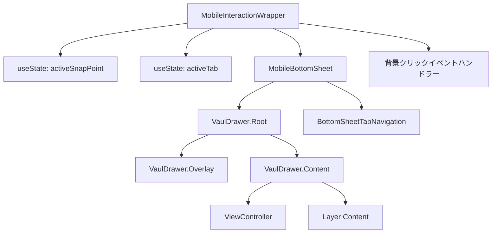
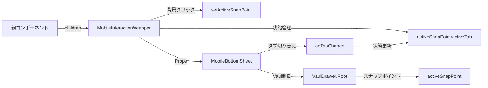

# MobileBottomSheet 設計書

> **作成日**: 2024-07-14  
> **更新日**: 2024-07-21  
> **バージョン**: 1.1.0  
> **作成者**: Claude Code

[<< 画面設計書に戻る](../../../docs/screenDesigns/)

モバイル環境における画面下部からのスライドアップ式UIコンテナコンポーネント。Vaulライブラリベースでスナップポイント機能による3段階の高さ調整と、背景インタラクション両立機能を提供します。

## 📋 目次

- [概要](#概要)
- [アーキテクチャ](#アーキテクチャ)
- [技術仕様](#技術仕様)
- [使用方法](#使用方法)
- [設計思想](#設計思想)
- [パフォーマンス](#パフォーマンス)
- [アクセシビリティ](#アクセシビリティ)
- [開発・保守](#開発保守)

## 概要

### 目的・役割

MobileBottomSheetは、モバイル端末での画面下部からスライドアップするUIコンテナを提供するコンポーネントです。限られたモバイル画面スペースを効率的に活用し、ユーザーが直感的に操作できるボトムシートインターフェースを実現します。

### 主要機能

- **3段階のスナップポイント**: LOWEST（6%）/ HALF（50%）/ EXPANDED（90%）状態への切り替え
- **ドラッグ操作**: Vaulライブラリによる滑らかなドラッグ＆スナップ操作
- **背景インタラクション両立**: `modal={false}` + `dismissible={false}`で背景クリック可能
- **状態管理の外部化**: MobileInteractionWrapperでの集約的状態管理
- **タブナビゲーション**: View/Layer切り替えUIの内蔵
- **アクセシビリティ**: ARIA属性とキーボード操作サポート

## アーキテクチャ

### コンポーネント構成

- **MobileInteractionWrapper**: 状態管理とインタラクション制御のメインコンテナ
- **MobileBottomSheet**: VaulDrawer.Rootをラップしたプレゼンテーショナルコンポーネント
- **BottomSheetTabNavigation**: View/Layerタブ切り替えUIコンポーネント
- **VaulDrawer.Overlay**: 背景オーバーレイ（pointer-events-none設定）
- **VaulDrawer.Content**: ドロワーのメインコンテンツエリア
- **HandleIcon/CloseIcon**: ドラッグハンドルと閉じるボタンのアイコン

### コンポーネント構成図



### データフロー図



### ファイル構造

```
src/components/layouts/MobileBottomSheet/
├── README.md                              # このファイル
├── index.ts                               # エクスポート統合
├── components/
│   ├── MobileInteractionWrapper.tsx      # 状態管理ラッパー
│   ├── MobileBottomSheet.tsx              # Vaulドロワーラッパー
│   └── BottomSheetTabNavigation.tsx      # タブナビゲーション
├── constants/
│   └── index.ts                           # SNAP_POINTS, TABS定義
├── types/
│   └── index.ts                           # 型定義
└── __stories__/
    └── MobileBottomSheet.stories.tsx      # Storybookテスト
```

### 依存関係

#### 内部依存

- `@/features/view-controller` - Viewタブコンテンツ
- `@/shared/components/icons` - HandleIcon, CloseIcon
- `@/shared/types` - 共通型定義 (ClassNameProps)
- `@/lib/utils` - cn関数 (tailwind-merge)

#### 外部依存

- `react` - Reactフレームワーク
- `vaul` - Drawer/BottomSheetライブラリ
- `tailwind-merge` - Tailwindクラス最適化

## 技術仕様

### Props仕様

#### MobileBottomSheet

```typescript
interface MobileBottomSheetProps extends ClassNameProps {
  /** カスタムクラス名 */
  className?: string;
}
```

#### BottomSheetHeader

```typescript
interface BottomSheetHeaderProps {
  /** トグル操作のハンドラー */
  onToggle: () => void;

  /** 閉じる操作のハンドラー */
  onClose: () => void;
}
```

#### BottomSheetContent

```typescript
interface BottomSheetContentProps {
  /** コンテンツの表示状態 */
  contentVisible: boolean;

  /** 全開状態フラグ */
  isExpanded: boolean;

  /** ヘッダーエリアの高さ */
  headerHeight: number;
}
```

### 状態管理

#### BottomSheetState型

```typescript
type BottomSheetState = 'collapsed' | 'half' | 'expanded';
```

#### useBottomSheetフック

```typescript
interface UseBottomSheetReturn {
  // 状態プロパティ
  sheetRef: RefObject<HTMLDivElement>;
  bottomSheetState: BottomSheetState;
  isExpanded: boolean;
  isHalf: boolean;
  isCollapsed: boolean;
  y: number;
  sheetHeight: number;
  dragConstraints: { top: number; bottom: number };

  // アクション
  toggleBottomSheet: () => void;
  collapseBottomSheet: () => void;
  handleDragStart: (event: MouseEvent | TouchEvent | PointerEvent, info: PanInfo) => void;
  handleDragEnd: (_: unknown, info: PanInfo) => void;
}
```

### Vaul設定

```typescript
// VaulDrawer.Rootの主要プロパティ
const VAUL_CONFIG = {
  shouldScaleBackground: true, // 背景スケール効果
  dismissible: false, // オーバーレイクリックで閉じない
  modal: false, // 背景インタラクションを有効に
  defaultOpen: true, // 初期状態で開いておく
  snapPoints: [0.06, 0.5, 0.9], // スナップポイント設定
};
```

## 使用方法

### 基本的な使用

```tsx
import { MobileInteractionWrapper } from '@/components/layouts/MobileBottomSheet';
import { Canvas } from '@/components/layouts/Canvas';

function MobileApp() {
  return (
    <div className="flex h-screen flex-col">
      <main className="flex flex-1">
        {/* モバイル用レイアウト */}
        <div className="flex-1 md:hidden">
          <MobileInteractionWrapper>
            <Canvas className="flex-1" />
          </MobileInteractionWrapper>
        </div>
      </main>
    </div>
  );
}
```

### カスタマイズ例

```tsx
import {
  MobileInteractionWrapper,
  MobileBottomSheet,
} from '@/components/layouts/MobileBottomSheet';
import { useState } from 'react';

function CustomExample() {
  const [snapPoint, setSnapPoint] = useState(0.06);
  const [activeTab, setActiveTab] = useState('view');

  return (
    <div className="relative">
      {/* 背景コンテンツ */}
      <div onClick={() => setSnapPoint(0.06)}>{/* メインコンテンツ */}</div>

      {/* カスタムスタイルのボトムシート */}
      <MobileBottomSheet
        className="custom-bottom-sheet shadow-2xl"
        activeSnapPoint={snapPoint}
        setActiveSnapPoint={setSnapPoint}
        activeTab={activeTab}
        onTabChange={setActiveTab}
      />
    </div>
  );
}
```

## 設計思想

### 1. 単一責任原則

MobileBottomSheetは「モバイル環境でのボトムシート表示」という単一の責任を持ちます。コンテンツの詳細な表示ロジックは子コンポーネントに委譲し、自身は状態管理とアニメーション制御に専念します。

### 2. 再利用性

- クラス名による外部スタイル制御
- 内部コンテンツの柔軟な構成
- 設定値の外部化による動作カスタマイズ

### 3. 保守性

- カスタムフックによるロジック分離
- TypeScriptによる型安全性
- 明確なコンポーネント階層構造

### 4. モバイルファースト設計

- タッチ操作を前提とした直感的なUI
- 画面サイズに応じた適応的なレイアウト
- パフォーマンスを考慮した最適化

### 5. アクセシビリティ

- キーボード操作への対応
- スクリーンリーダーサポート
- フォーカス管理の実装

## パフォーマンス

### 最適化手法

- **状態の集約化**: MobileInteractionWrapperで状態管理を一元化
- **React.memo**: BottomSheetTabNavigationで不要な再レンダリングを防止
- **`useCallback`**: イベントハンドラーの参照安定化
- **Vaul**: 高パフォーマンスなドラッグ＆スナップアニメーション

### レンダリング最適化

```typescript
// スナップポイント定数の一元管理
export const SNAP_POINTS = {
  LOWEST: 0.06,
  HALF: 0.5,
  EXPANDED: 0.9,
} as const;

// イベントハンドラーの最適化
const handleBackgroundClick = useCallback(() => {
  if (activeSnapPoint !== SNAP_POINTS.LOWEST) {
    setActiveSnapPoint(SNAP_POINTS.LOWEST);
  }
}, [activeSnapPoint, setActiveSnapPoint]);
```

## アクセシビリティ

### WCAG準拠レベル

**レベル AA** に準拠

### 実装済み機能

- **キーボードナビゲーション**: Escapeキーによる閉じる操作
- **スクリーンリーダー対応**: 適切なARIA属性の設定
- **フォーカス管理**: 展開時の自動フォーカス移動
- **非モーダル設計**: 背景コンテンツへのアクセス維持

### ARIA属性

| 属性              | 値                   | 用途                         |
| ----------------- | -------------------- | ---------------------------- |
| `role`            | `dialog`             | ダイアログとしての役割を示す |
| `aria-modal`      | `false`              | 非モーダルダイアログを示す   |
| `aria-labelledby` | `bottom-sheet-title` | タイトル要素との関連付け     |

### キーボード操作

| キー     | 動作                       |
| -------- | -------------------------- |
| `Escape` | ボトムシートを閉じる       |
| `Tab`    | 内部要素間のフォーカス移動 |

## 開発・保守

### 今後の拡張予定

#### 短期

- [ ] カスタムコンテンツスロットの追加
- [ ] アニメーション設定のカスタマイズ機能
- [ ] 横向き表示時の最適化

#### 長期

- [ ] 複数ボトムシートの管理機能
- [ ] ジェスチャー操作の拡張
- [ ] テーマシステムとの統合

### 関連ドキュメント

- [要件定義書](../../../docs/01.requirements.md)
- [画面設計書](../../../docs/02.screenDesign.md)
- [開発規約](../../../docs/03.developmentAgreement.md)
- [Storybook](http://localhost:6006/?path=/story/components-mobilebottomsheet)

### 用語集

| 用語             | 定義                                     |
| ---------------- | ---------------------------------------- |
| ボトムシート     | 画面下部からスライドアップするUIパターン |
| スナップポイント | ドラッグ操作で停止する位置               |
| ドラッグ制約     | ドラッグ可能な範囲の制限                 |
| ベロシティ       | ドラッグ操作の速度                       |
| ビューポート     | ブラウザの表示領域                       |

---

> 📝 **Note**: この設計書は [開発規約](../../../docs/03.developmentAgreement.md) に従って作成されています。  
> 🔄 **Update**: 機能追加・変更時はこの設計書も合わせて更新してください。  
> 🤝 **Collaboration**: 不明な点があれば開発チームまでお問い合わせください。
