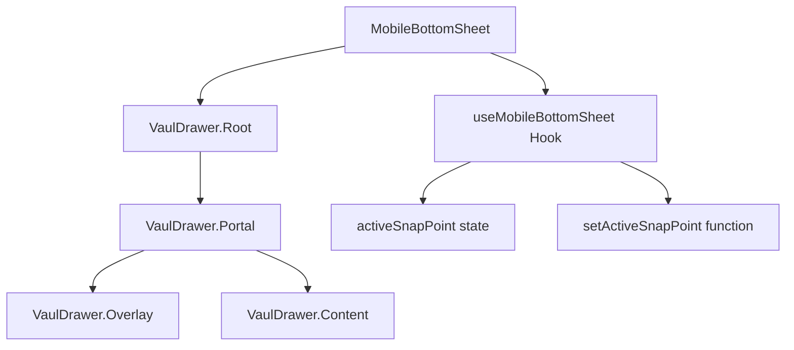
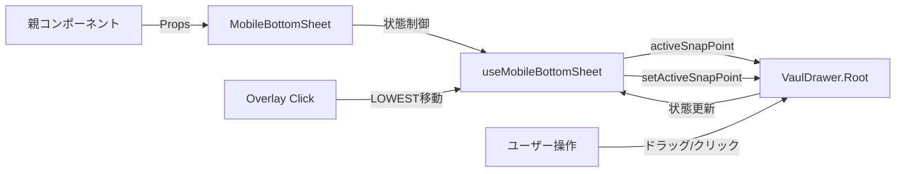

# MobileBottomSheet 設計書

> **作成日**: 2024-07-14  
> **更新日**: 2025-09-10  
> **バージョン**: 2.0.0  
> **作成者**: Claude Code

[<< 画面設計書に戻る](../../../docs/screenDesigns/)

モバイル環境における画面下部からのスライドアップ式UIコンテナコンポーネント。Vaulライブラリベースでスナップポイント機能による3段階の高さ調整機能を提供します。

## 📋 目次

- [概要](#概要)
- [アーキテクチャ](#アーキテクチャ)
- [技術仕様](#技術仕様)
- [使用方法](#使用方法)
- [設計思想](#設計思想)
- [パフォーマンス](#パフォーマンス)
- [アクセシビリティ](#アクセシビリティ)
- [開発・保守](#開発保守)

## 概要

### 目的・役割

MobileBottomSheetは、モバイル端末での画面下部からスライドアップするUIコンテナを提供するコンポーネントです。Vaulライブラリをベースとしたシンプルで軽量な実装により、直感的なボトムシートインターフェースを実現します。

### 主要機能

- **3段階のスナップポイント**: LOWEST（6%）/ HALF（50%）/ EXPANDED（90%）状態への切り替え
- **ドラッグ操作**: Vaulライブラリによる滑らかなドラッグ＆スナップ操作
- **非モーダル設計**: 背景インタラクション維持による使いやすさの向上
- **RemoveScrollとの協調**: スクロール制御の最適化による安定性の確保
- **アクセシビリティ**: ARIA属性とキーボード操作サポート

## アーキテクチャ

### コンポーネント構成

- **MobileBottomSheet**: VaulDrawer.Rootをラップしたメインコンポーネント
- **useMobileBottomSheet**: スナップポイント状態管理を提供するカスタムフック
- **VaulDrawer.Overlay**: 背景オーバーレイ（クリックでLOWESTに移動）
- **VaulDrawer.Content**: ドロワーのメインコンテンツエリア

### コンポーネント構成図



### データフロー図



### ファイル構造

```
src/components/layouts/MobileBottomSheet/
├── README.md                              # このファイル
├── index.ts                               # エクスポート統合
├── components/
│   └── MobileBottomSheet.tsx              # Vaulドロワーラッパー
├── hooks/
│   └── useMobileBottomSheet.ts            # スナップポイント状態管理
├── constants/
│   └── index.ts                           # SNAP_POINTS定義
└── __stories__/
    └── MobileBottomSheet.stories.tsx      # Storybookテスト
```

### 依存関係

#### 内部依存

- `@/shared/types` - 共通型定義 (ClassNameProps)
- `@/lib/utils` - cn関数 (tailwind-merge)

#### 外部依存

- `react` - Reactフレームワーク
- `vaul` - Drawer/BottomSheetライブラリ
- `tailwind-merge` - Tailwindクラス最適化

## 技術仕様

### Props仕様

#### MobileBottomSheet

```typescript
interface MobileBottomSheetProps extends ClassNameProps {
  /** アクティブなスナップポイント */
  activeSnapPoint: number | string | null;

  /** スナップポイント設定関数 */
  setActiveSnapPoint: (point: number | string | null) => void;

  /** カスタムクラス名 */
  className?: string;
}
```

### 状態管理

#### useMobileBottomSheetフック

```typescript
interface UseMobileBottomSheetReturn {
  /** 現在のアクティブスナップポイント */
  activeSnapPoint: number | string | null;

  /** スナップポイント設定関数 */
  setActiveSnapPoint: (point: number | string | null) => void;
}
```

### Vaul設定

```typescript
// VaulDrawer.Rootの主要プロパティ
const VAUL_CONFIG = {
  shouldScaleBackground: false, // 背景スケール効果無効
  dismissible: false, // オーバーレイクリックで閉じない
  modal: false, // 背景インタラクションを有効に
  defaultOpen: true, // 初期状態で開いておく
  snapPoints: [SNAP_POINTS.LOWEST, SNAP_POINTS.HALF, SNAP_POINTS.EXPANDED],
  closeThreshold: 0.35, // RemoveScrollとの組み合わせで適切な閾値に調整
  scrollLockTimeout: 50, // RemoveScrollとの協調のため最小限の遅延
  preventScrollRestoration: true, // RemoveScrollとの組み合わせで安定化
};
```

### 定数定義

```typescript
export const SNAP_POINTS = {
  LOWEST: 0.06, // 最小表示（6%）
  HALF: 0.5, // 半分表示（50%）
  EXPANDED: 0.9, // 全開表示（90%）
} as const;
```

## 使用方法

### 基本的な使用

```tsx
import { MobileBottomSheet, useMobileBottomSheet } from '@/components/layouts/MobileBottomSheet';

function MobileApp() {
  const { activeSnapPoint, setActiveSnapPoint } = useMobileBottomSheet();

  return (
    <div className="relative h-screen">
      {/* メインコンテンツ */}
      <div className="flex-1">{/* アプリのメインコンテンツ */}</div>

      {/* モバイル用BottomSheet */}
      <MobileBottomSheet
        activeSnapPoint={activeSnapPoint}
        setActiveSnapPoint={setActiveSnapPoint}
      />
    </div>
  );
}
```

### Provider パターンでの使用

```tsx
import { MobileTwoColumnProvider } from '@/components/layouts/MobileTwoColumnLayout';

function MobileLayout() {
  return <MobileTwoColumnProvider topPanel={<Canvas />} bottomPanel={<InformationPanel />} />;
}
```

## 設計思想

### 1. 単一責任原則

MobileBottomSheetは「モバイル環境でのボトムシート表示制御」という単一の責任を持ちます。複雑な状態管理やコンテンツの詳細は外部に委譲し、シンプルな設計を維持します。

### 2. 軽量化

以前の複雑な実装から大幅に簡素化し、必要最小限の機能のみを提供。Vaulライブラリの機能を最大限活用することで、カスタムロジックを最小限に抑えました。

### 3. RemoveScrollとの協調

スクロール制御ライブラリとの競合を避けるため、手動によるDOM操作は行わず、Vaulとの設定値調整により安定性を確保。

### 4. 非モーダル設計

背景インタラクションを維持し、ユーザビリティを向上。オーバーレイクリックでの最小化により直感的な操作体験を提供。

## パフォーマンス

### 最適化手法

- **軽量な状態管理**: 必要最小限のstate（activeSnapPoint）のみを管理
- **Vaulライブラリ活用**: 高パフォーマンスなアニメーション処理をライブラリに委譲
- **設定値の最適化**: RemoveScrollとの協調による安定したスクロール制御

### レンダリング最適化

```typescript
// スナップポイント定数の一元管理
export const SNAP_POINTS = {
  LOWEST: 0.06,
  HALF: 0.5,
  EXPANDED: 0.9,
} as const;

// シンプルな状態管理
const [activeSnapPoint, setActiveSnapPoint] = useState<number | string | null>(SNAP_POINTS.LOWEST);
```

## アクセシビリティ

### WCAG準拠レベル

**レベル AA** に準拠

### 実装済み機能

- **キーボードナビゲーション**: Vaulライブラリによる標準サポート
- **スクリーンリーダー対応**: 適切なARIA属性の設定
- **非モーダル設計**: 背景コンテンツへのアクセス維持

### ARIA属性

| 属性         | 値             | 用途                         |
| ------------ | -------------- | ---------------------------- |
| `role`       | Vaulが自動設定 | ダイアログとしての役割を示す |
| `aria-modal` | `false`        | 非モーダルダイアログを示す   |

## 開発・保守

### 今後の拡張予定

#### 短期

- [ ] カスタムスナップポイントの設定機能
- [ ] アニメーション設定のカスタマイズ機能

#### 長期

- [ ] 複数ボトムシートの管理機能
- [ ] ジェスチャー操作の拡張

### 関連ドキュメント

- [要件定義書](../../../docs/01.requirements.md)
- [画面設計書](../../../docs/02.screenDesign.md)
- [開発規約](../../../docs/03.developmentAgreement.md)
- [MobileTwoColumnLayout設計書](../MobileTwoColumnLayout/README.md)
- [Storybook](http://localhost:6006/?path=/story/components-mobilebottomsheet)

### 用語集

| 用語             | 定義                                     |
| ---------------- | ---------------------------------------- |
| ボトムシート     | 画面下部からスライドアップするUIパターン |
| スナップポイント | ドラッグ操作で停止する位置               |
| RemoveScroll     | スクロール制御を行うライブラリ           |
| Vaul             | React用のDrawer/BottomSheetライブラリ    |

---

> 📝 **Note**: この設計書は [開発規約](../../../docs/03.developmentAgreement.md) に従って作成されています。  
> 🔄 **Update**: 機能追加・変更時はこの設計書も合わせて更新してください。  
> 🤝 **Collaboration**: 不明な点があれば開発チームまでお問い合わせください。
