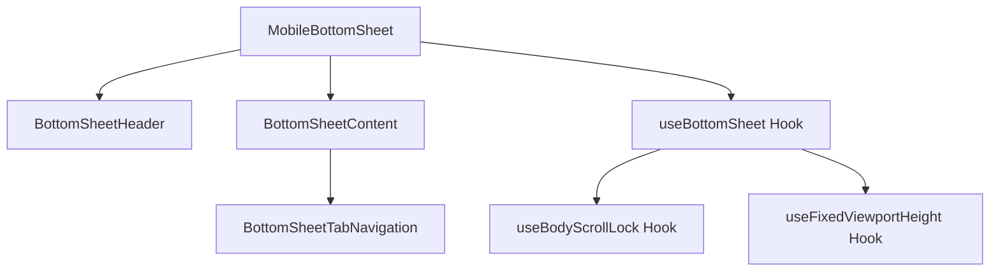
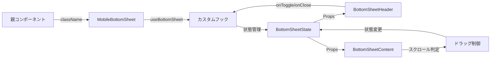

# MobileBottomSheet 設計書

> **作成日**: 2024-07-14  
> **更新日**: 2024-07-14  
> **バージョン**: 1.0.0  
> **作成者**: Claude Code

[<< 画面設計書に戻る](../../../docs/screenDesigns/)

モバイル環境における画面下部からのスライドアップ式UIコンテナコンポーネント。ドラッグ操作による3段階の高さ調整と、内部コンテンツのスクロール競合回避機能を提供します。

## 📋 目次

- [概要](#概要)
- [アーキテクチャ](#アーキテクチャ)
- [技術仕様](#技術仕様)
- [使用方法](#使用方法)
- [設計思想](#設計思想)
- [パフォーマンス](#パフォーマンス)
- [アクセシビリティ](#アクセシビリティ)
- [開発・保守](#開発保守)

## 概要

### 目的・役割

MobileBottomSheetは、モバイル端末での画面下部からスライドアップするUIコンテナを提供するコンポーネントです。限られたモバイル画面スペースを効率的に活用し、ユーザーが直感的に操作できるボトムシートインターフェースを実現します。

### 主要機能

- **3段階の高さ調整**: collapsed（折りたたみ）/ half（半開き）/ expanded（全開）状態への切り替え
- **ドラッグ操作**: 指やマウスでのドラッグによる自然な操作感
- **スクロール競合回避**: 内部コンテンツのスクロールとシートの移動を適切に判定・制御
- **アニメーション**: Framer Motionによるスムーズなトランジション効果
- **キーボードサポート**: Escapeキーでの閉じる操作とフォーカス管理
- **アクセシビリティ**: ARIA属性による支援技術対応

## アーキテクチャ

### コンポーネント構成

- **MobileBottomSheet**: メインコンポーネント。全体の制御とアニメーションを担当
- **BottomSheetHeader**: ハンドル、タイトル、閉じるボタンを含むヘッダー部分
- **BottomSheetContent**: タブナビゲーションとコンテンツエリアを管理
- **BottomSheetTabNavigation**: タブ切り替えUI

### コンポーネント構成図



### データフロー図



### ファイル構造

```
src/components/layouts/MobileBottomSheet/
├── README.md                           # このファイル
├── components/
│   ├── MobileBottomSheet.tsx          # メインコンポーネント
│   ├── BottomSheetHeader.tsx          # ヘッダー部分
│   ├── BottomSheetContent.tsx         # コンテンツエリア
│   └── BottomSheetTabNavigation.tsx   # タブナビゲーション
├── hooks/
│   └── useBottomSheet.ts              # 状態管理とロジック
├── constants/
│   └── index.ts                       # 設定定数
├── types/
│   └── index.ts                       # 型定義
└── __stories__/
    └── MobileBottomSheet.stories.tsx  # Storybookテスト
```

### 依存関係

#### 内部依存

- `@/shared/hooks/useBodyScrollLock` - 背景スクロール制御
- `@/shared/hooks/useFixedViewportHeight` - 固定ビューポート高さ取得
- `@/shared/utils/scrollUtils` - スクロール要素判定ユーティリティ
- `@/shared/types` - 共通型定義

#### 外部依存

- `react` - Reactフレームワーク
- `motion` - アニメーションライブラリ (Framer Motion)
- `tailwind-merge` - Tailwindクラス最適化

## 技術仕様

### Props仕様

#### MobileBottomSheet

```typescript
interface MobileBottomSheetProps extends ClassNameProps {
  /** カスタムクラス名 */
  className?: string;
}
```

#### BottomSheetHeader

```typescript
interface BottomSheetHeaderProps {
  /** トグル操作のハンドラー */
  onToggle: () => void;

  /** 閉じる操作のハンドラー */
  onClose: () => void;
}
```

#### BottomSheetContent

```typescript
interface BottomSheetContentProps {
  /** コンテンツの表示状態 */
  contentVisible: boolean;

  /** 全開状態フラグ */
  isExpanded: boolean;

  /** ヘッダーエリアの高さ */
  headerHeight: number;
}
```

### 状態管理

#### BottomSheetState型

```typescript
type BottomSheetState = 'collapsed' | 'half' | 'expanded';
```

#### useBottomSheetフック

```typescript
interface UseBottomSheetReturn {
  // 状態プロパティ
  sheetRef: RefObject<HTMLDivElement>;
  bottomSheetState: BottomSheetState;
  isExpanded: boolean;
  isHalf: boolean;
  isCollapsed: boolean;
  y: number;
  sheetHeight: number;
  dragConstraints: { top: number; bottom: number };

  // アクション
  toggleBottomSheet: () => void;
  collapseBottomSheet: () => void;
  handleDragStart: (event: MouseEvent | TouchEvent | PointerEvent, info: PanInfo) => void;
  handleDragEnd: (_: unknown, info: PanInfo) => void;
}
```

### 定数設定

```typescript
const SHEET_CONFIG = {
  vh: 0.85, // ビューポート高さに対する割合
  expandedTopMarginPx: 60, // 全開時の上部マージン
  halfOpenRatio: 0.5, // 半開き時の高さ比率
  collapsedVisiblePx: 60, // 折りたたみ時の可視領域
  velocityThreshold: 500, // 高速スワイプ判定の閾値
};
```

## 使用方法

### 基本的な使用

```tsx
import { MobileBottomSheet } from '@/components/layouts/MobileBottomSheet';

function App() {
  return (
    <div className="min-h-screen bg-gray-100">
      {/* メインコンテンツ */}
      <main className="p-4">
        <h1>メインコンテンツ</h1>
      </main>

      {/* ボトムシート */}
      <MobileBottomSheet />
    </div>
  );
}
```

### カスタマイズ例

```tsx
import { MobileBottomSheet } from '@/components/layouts/MobileBottomSheet';

function CustomExample() {
  return (
    <div className="relative">
      {/* 他のコンテンツ */}

      {/* カスタムスタイルのボトムシート */}
      <MobileBottomSheet className="custom-bottom-sheet shadow-2xl" />
    </div>
  );
}
```

## 設計思想

### 1. 単一責任原則

MobileBottomSheetは「モバイル環境でのボトムシート表示」という単一の責任を持ちます。コンテンツの詳細な表示ロジックは子コンポーネントに委譲し、自身は状態管理とアニメーション制御に専念します。

### 2. 再利用性

- クラス名による外部スタイル制御
- 内部コンテンツの柔軟な構成
- 設定値の外部化による動作カスタマイズ

### 3. 保守性

- カスタムフックによるロジック分離
- TypeScriptによる型安全性
- 明確なコンポーネント階層構造

### 4. モバイルファースト設計

- タッチ操作を前提とした直感的なUI
- 画面サイズに応じた適応的なレイアウト
- パフォーマンスを考慮した最適化

### 5. アクセシビリティ

- キーボード操作への対応
- スクリーンリーダーサポート
- フォーカス管理の実装

## パフォーマンス

### 最適化手法

- **`React.memo`**: BottomSheetHeader、BottomSheetContentで不要な再レンダリングを防止
- **`useCallback`**: イベントハンドラーの参照安定化
- **`useMemo`**: スナップポイント計算のメモ化
- **Framer Motion**: GPUアクセラレーションを活用したアニメーション

### レンダリング最適化

```typescript
// スナップポイントの計算をメモ化
const { snapPoints, sheetHeight } = useMemo(() => {
  const sheetHeight = windowHeight * SHEET_CONFIG.vh;
  return {
    sheetHeight,
    snapPoints: {
      expanded: SHEET_CONFIG.expandedTopMarginPx,
      half: sheetHeight * SHEET_CONFIG.halfOpenRatio,
      collapsed: sheetHeight - SHEET_CONFIG.collapsedVisiblePx,
    },
  };
}, [windowHeight]);
```

## アクセシビリティ

### WCAG準拠レベル

**レベル AA** に準拠

### 実装済み機能

- **キーボードナビゲーション**: Escapeキーによる閉じる操作
- **スクリーンリーダー対応**: 適切なARIA属性の設定
- **フォーカス管理**: 展開時の自動フォーカス移動
- **非モーダル設計**: 背景コンテンツへのアクセス維持

### ARIA属性

| 属性              | 値                   | 用途                         |
| ----------------- | -------------------- | ---------------------------- |
| `role`            | `dialog`             | ダイアログとしての役割を示す |
| `aria-modal`      | `false`              | 非モーダルダイアログを示す   |
| `aria-labelledby` | `bottom-sheet-title` | タイトル要素との関連付け     |

### キーボード操作

| キー     | 動作                       |
| -------- | -------------------------- |
| `Escape` | ボトムシートを閉じる       |
| `Tab`    | 内部要素間のフォーカス移動 |

## 開発・保守

### 今後の拡張予定

#### 短期

- [ ] カスタムコンテンツスロットの追加
- [ ] アニメーション設定のカスタマイズ機能
- [ ] 横向き表示時の最適化

#### 長期

- [ ] 複数ボトムシートの管理機能
- [ ] ジェスチャー操作の拡張
- [ ] テーマシステムとの統合

### 関連ドキュメント

- [要件定義書](../../../docs/01.requirements.md)
- [画面設計書](../../../docs/02.screenDesign.md)
- [開発規約](../../../docs/03.developmentAgreement.md)
- [Storybook](http://localhost:6006/?path=/story/components-mobilebottomsheet)

### 用語集

| 用語             | 定義                                     |
| ---------------- | ---------------------------------------- |
| ボトムシート     | 画面下部からスライドアップするUIパターン |
| スナップポイント | ドラッグ操作で停止する位置               |
| ドラッグ制約     | ドラッグ可能な範囲の制限                 |
| ベロシティ       | ドラッグ操作の速度                       |
| ビューポート     | ブラウザの表示領域                       |

---

> 📝 **Note**: この設計書は [開発規約](../../../docs/03.developmentAgreement.md) に従って作成されています。  
> 🔄 **Update**: 機能追加・変更時はこの設計書も合わせて更新してください。  
> 🤝 **Collaboration**: 不明な点があれば開発チームまでお問い合わせください。
