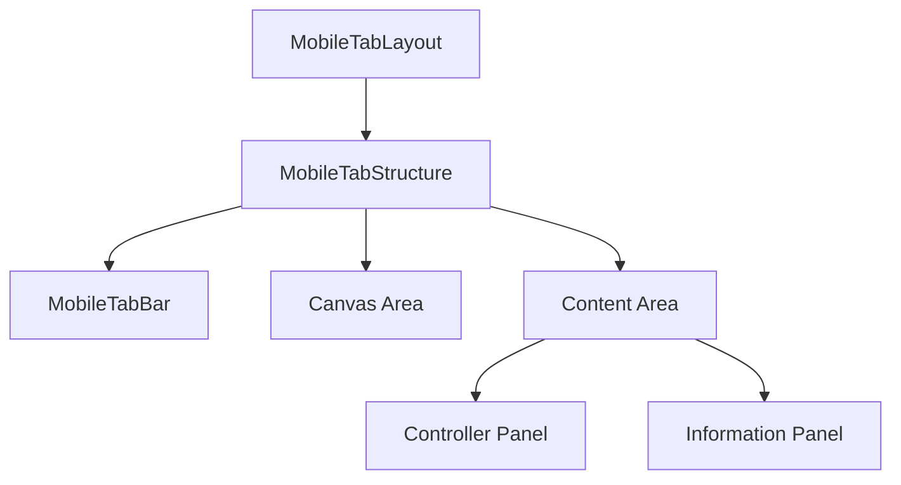
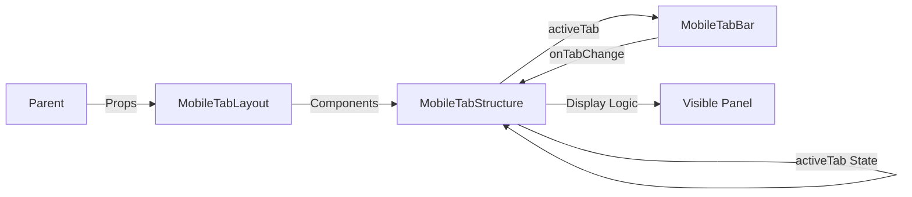

# MobileTabLayout 設計書

> **作成日**: 2025-12-04  
> **更新日**: 2025-12-04  
> **バージョン**: 1.0.0  
> **作成者**: Antigravity

[<< 画面設計書に戻る](../../../docs/screenDesigns/)

モバイル環境におけるタブ切り替え式レイアウトコンポーネント。Canvas（五度圏）を上部に固定し、下部のタブでControllerとInformationパネルを切り替えるインターフェースを提供します。

## 📋 目次

- [概要](#概要)
- [アーキテクチャ](#アーキテクチャ)
- [技術仕様](#技術仕様)
- [使用方法](#使用方法)
- [機能詳細](#機能詳細)
- [設計思想](#設計思想)

## 概要

### 目的・役割

MobileTabLayoutは、モバイル端末の限られた画面スペースを有効活用するためのレイアウトコンポーネントです。従来のボトムシート方式からタブ切り替え方式に移行することで、Controller（操作盤）とInformation（情報表示）へのアクセス性を向上させ、かつメインのCanvas（五度圏）を常に参照可能な状態に保つことを目的としています。

### 主要機能

- **タブ切り替え**: ControllerとInformationの2つのパネルをワンタップで切り替え
- **Canvas常時表示**: スクロール連動により、初期表示ではCanvasを表示し、コンテンツ閲覧時は自然にスクロールアウト
- **レスポンシブ対応**: モバイルビューポート（md未満）専用の最適化されたレイアウト
- **視覚的フィードバック**: 現在のアクティブタブのハイライト表示

## アーキテクチャ

### コンポーネント構成

- **MobileTabLayout**: 実際のパネル（Canvas, Controller, Information）を注入するコンポジットコンポーネント
- **MobileTabStructure**: レイアウト構造とタブ状態管理を担当するプレゼンテーションコンポーネント
- **MobileTabBar**: 下部ナビゲーションバー

### コンポーネント構成図



### データフロー図



### ファイル構造

```
src/components/layouts/MobileTabLayout/
├── README.md                    # このファイル
├── index.ts                     # エクスポート用ファイル
└── components/
    ├── MobileTabLayout.tsx      # メインコンポーネント（Composition）
    ├── MobileTabStructure.tsx   # 構造・状態管理
    └── MobileTabBar.tsx         # タブバーUI
```

### 依存関係

#### 内部依存

- `@/components/layouts/Canvas` - 五度圏表示
- `@/components/layouts/ThreeColumnLayout` - Controller/Informationパネル
- `@/shared/types` - 型定義
- `@/lib/utils` - cn関数

#### 外部依存

- `react` - UIライブラリ
- `lucide-react` - アイコン
- `tailwind-merge` - クラス名結合

## 技術仕様

### Props仕様

#### MobileTabLayout

```typescript
interface MobileTabLayoutProps extends ClassNameProps {
  // 追加のPropsなし（内部で各パネルを合成）
}
```

#### MobileTabStructure

```typescript
interface MobileTabStructureProps extends ClassNameProps {
  /** 上部に表示するCanvasコンテンツ */
  canvas: React.ReactNode;
  /** Controllerタブで表示するコンテンツ */
  controller: React.ReactNode;
  /** Informationタブで表示するコンテンツ */
  information: React.ReactNode;
}
```

### 状態管理

#### ローカル状態

```typescript
// アクティブなタブの状態管理
const [activeTab, setActiveTab] = useState<'controller' | 'information'>('controller');
```

## 使用方法

### 基本的な使用

```tsx
import { MobileTabLayout } from '@/components/layouts/MobileTabLayout';

export default function Page() {
  return (
    <>
      {/* デスクトップ用レイアウト */}
      <ThreeColumnLayout className="hidden md:flex ..." />

      {/* モバイル用レイアウト */}
      <MobileTabLayout className="h-dvh md:hidden" />
    </>
  );
}
```

## 機能詳細

### スクロール挙動

- **シングルスクロールコンテナ**: ページ全体が1つのスクロールコンテナとして機能します。
- **Canvasの挙動**: コンテンツを下にスクロールすると、Canvas部分は自然に上にスクロールアウトし、コンテンツ領域が画面全体に広がります。
- **タブバーの挙動**: 画面下部に固定（Sticky/Fixed）され、常にアクセス可能です。

### タブ切り替え

- **Controllerタブ**: 音楽理論の操作パネルを表示。
- **Informationタブ**: 選択された要素の詳細情報を表示。
- **状態保持**: タブを切り替えても、各パネルの内部状態（入力値など）は保持されます（DOMの表示/非表示切り替えのみ）。

## 設計思想

### 1. コンポジションパターン (Composition Pattern)

`MobileTabLayout`（具体）と`MobileTabStructure`（抽象）を分離することで、レイアウトの構造とコンテンツの依存関係を切り離しています。これにより、将来的に表示内容が変わっても構造部分は再利用可能です。

### 2. 自然なスクロール体験

以前のボトムシートや分割スクロール方式では、画面の狭いモバイル端末で「どこがスクロールするか」が分かりにくい問題がありました。本コンポーネントでは、Web標準に近い「ページ全体がスクロールする」挙動を採用し、ユーザーのメンタルモデルに合わせました。

### 3. アクセシビリティとユーザビリティ

- タブバーを親指の届きやすい画面下部に配置（Fittsの法則）。
- アイコンとラベルを併記し、機能の識別性を向上。
- 適切なコントラスト比とタップ領域の確保。

## 関連ドキュメント

- [要件定義書](../../../docs/00.project/0001.requirements.md)
- [画面設計書](../../../docs/00.project/0002.screenDesign.md)
- [開発規約](../../../docs/20.development/2002.development-principles.md)

---

> 📝 **Note**: この設計書は [開発規約](../../../docs/20.development/2002.development-principles.md) に従って作成されています。  
> 🔄 **Update**: 機能追加・変更時はこの設計書も合わせて更新してください。  
> 🤝 **Collaboration**: 不明な点があれば開発チームまでお問い合わせください。
