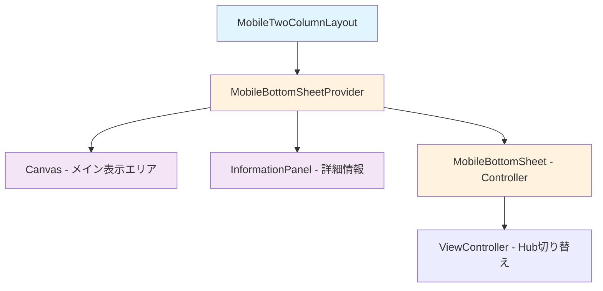
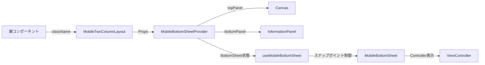

# MobileTwoColumnLayout 設計書

> **作成日**: 2025-09-02  
> **更新日**: 2025-09-02  
> **バージョン**: 1.0.0  
> **作成者**: Claude Code

[<< 画面設計書に戻る](../../../../docs/screenDesigns/01.hub.md)

モバイル端末向けの2分割レイアウトコンポーネント。縦方向にCanvas（メイン表示エリア）とInformationPanel（詳細情報）を配置し、BottomSheetでController機能を提供する。

## 📋 目次

- [概要](#概要)
- [アーキテクチャ](#アーキテクチャ)
- [技術仕様](#技術仕様)
- [使用方法](#使用方法)
- [設計思想](#設計思想)
- [パフォーマンス](#パフォーマンス)
- [アクセシビリティ](#アクセシビリティ)
- [開発・保守](#開発保守)

## 概要

### 目的・役割

モバイル端末の縦画面に最適化された2分割レイアウトを提供し、限られた画面スペースで効率的にコンテンツを表示する。Server ComponentとClient Componentの境界を最適化し、SSRによる高速な初期表示とインタラクティブな操作体験を両立する。

### 主要機能

- **2分割レイアウト**: Canvas（上部）とInformationPanel（下部）の縦型配置
- **BottomSheet連携**: Controller機能をBottomSheetで提供、画面スペースの最適利用
- **SSR最適化**: Composition Patternによる Server/Client Component 分離
- **レスポンシブ対応**: モバイル端末の画面サイズに応じた適応的レイアウト

## アーキテクチャ

### コンポーネント構成

**MobileTwoColumnLayout**（Server Component）がメインコンポーネントとして機能し、**MobileBottomSheetProvider**（Client Component）でラップすることで、インタラクティブ機能を提供。コンテンツ部分はServer Componentのまま維持し、SSRの恩恵を最大化する。

### コンポーネント構成図



### データフロー図



### ファイル構造

```
src/components/layouts/MobileTwoColumnLayout/
├── README.md                                 # この設計書
├── components/                               # コンポーネント群
│   ├── MobileTwoColumnLayout.tsx            # メインコンポーネント
│   └── MobileBottomSheetProvider.tsx        # プロバイダーコンポーネント
└── index.ts                                  # エクスポート統合
```

### 依存関係

#### 内部依存

- `@/components/layouts/Canvas` - メイン表示エリア（五度圏・クロマチック円）
- `@/components/layouts/ThreeColumnLayout/components/InformationPanel` - 詳細情報表示パネル
- `@/components/layouts/MobileBottomSheet` - モバイル用BottomSheetUI
- `@/shared/types` - 共通型定義（ClassNameProps）

#### 外部依存

- `react` - Reactフレームワーク
- `tailwind-merge` - Tailwindクラス最適化ユーティリティ

## 技術仕様

### Props仕様

#### MobileTwoColumnLayout

```typescript
interface MobileTwoColumnLayoutProps extends ClassNameProps {
  /** カスタムクラス名 */
  className?: string;
}

// 注意：MobileTwoColumnLayoutは実際にはpropsを受け取らず、
// 内部で固定的にCanvasコンポーネントとInformationPanelを使用します
```

#### MobileTwoColumnProvider

```typescript
interface MobileTwoColumnProviderProps extends ClassNameProps {
  /** 上部パネルコンテンツ - メイン表示エリア (Canvas) */
  topPanel: React.ReactNode;

  /** 下部パネルコンテンツ - 詳細情報表示 (InformationPanel) */
  bottomPanel: React.ReactNode;

  /** カスタムクラス名 */
  className?: string;
}
```

### 状態管理

#### ローカル状態 (useMobileBottomSheet)

MobileTwoColumnProviderは、MobileBottomSheetパッケージの`useMobileBottomSheet`フックを使用してBottomSheetの状態を管理します。

```typescript
// @/components/layouts/MobileBottomSheet からインポート
interface UseMobileBottomSheetReturn {
  // BottomSheetのスナップポイント状態
  activeSnapPoint: number | string | null;

  // スナップポイント設定関数
  setActiveSnapPoint: (point: number | string | null) => void;
}
```

### レイアウト仕様

#### 画面構成

| エリア           | 高さ                   | 説明                           |
| ---------------- | ---------------------- | ------------------------------ |
| Canvas           | `min-h-[300px]`        | メイン表示エリア、固定最小高さ |
| InformationPanel | `flex-1 min-h-[200px]` | 残り高さを使用、スクロール可能 |
| BottomSheet      | 可変                   | スナップポイントによる高さ制御 |

## 使用方法

### 基本的な使用

```tsx
import { MobileTwoColumnLayout } from '@/components/layouts/MobileTwoColumnLayout';

function MobileApp() {
  return (
    <div className="h-screen">
      {/* MobileTwoColumnLayoutは内部でCanvasとInformationPanelを固定で使用 */}
      <MobileTwoColumnLayout className="bg-background" />
    </div>
  );
}
```

### カスタマイズ例

```tsx
import { MobileTwoColumnLayout } from '@/components/layouts/MobileTwoColumnLayout';

function CustomMobileLayout() {
  return (
    <div className="min-h-screen bg-gradient-to-b from-blue-50 to-white">
      <MobileTwoColumnLayout className="mx-auto max-w-md shadow-lg" />
    </div>
  );
}
```

### Provider パターンでの直接使用

```tsx
import { MobileTwoColumnProvider } from '@/components/layouts/MobileTwoColumnLayout';
import { Canvas } from '@/components/layouts/Canvas';
import { InformationPanel } from '@/components/layouts/ThreeColumnLayout/components/InformationPanel';

function CustomProviderExample() {
  return (
    <MobileTwoColumnProvider
      className="custom-layout"
      topPanel={<Canvas />}
      bottomPanel={<InformationPanel />}
    />
  );
}
```

## 設計思想

### 1. 単一責任原則

MobileTwoColumnLayoutは「モバイル向け2分割レイアウト」という単一の責任を持つ。レイアウト構造の定義のみに集中し、各パネルの具体的なコンテンツは依存注入により外部から提供される。

### 2. Composition Pattern

Server ComponentとClient Componentの境界を最適化するため、Composition Patternを採用。コンテンツ部分（Canvas、InformationPanel）はServer Componentとしてサーバーサイドで事前レンダリングされ、インタラクション部分（BottomSheet制御）のみClient Componentとして動作する。

### 3. モバイルファースト設計

モバイル端末の制約（画面サイズ、タッチ操作、パフォーマンス）を考慮した設計。BottomSheetによる階層的UI、スナップポイントによる直感的な操作、背景スクロール制御による快適なUXを実現。

### 4. SSR最適化

初期表示時はServer Componentによる高速レンダリングを活用し、ユーザーの操作開始後にClient Componentが段階的に機能を提供。これにより、First Contentful Paint（FCP）とTime to Interactive（TTI）の両方を最適化。

### 5. 保守性重視

明確な責任分離と型安全性により、機能追加や変更時の影響範囲を限定。各コンポーネントは独立してテスト可能で、デバッグが容易な構造。

## パフォーマンス

### SSR活用

- Server Componentによる事前レンダリング
- Hydrationの最小化（Client Componentは状態管理のみ）
- 初期表示の高速化

### メモリ効率

- 必要時のみBottomSheet状態を管理
- 背景スクロール制御による無駄なレンダリング防止
- useCallbackによるイベントハンドラーの最適化

## アクセシビリティ

### ARIA属性

```typescript
// レイアウトコンテナ
<div aria-label="モバイル2分割レイアウト">

// 各パネルの役割明示
topPanel: Canvas（メイン表示エリア）
bottomPanel: InformationPanel（詳細情報）
```

### キーボード操作

- BottomSheetのキーボードナビゲーション対応
- フォーカス管理の最適化
- タッチとキーボード操作の両立

## 開発・保守

### テスト戦略

- Server Componentのレンダリングテスト
- Client Componentの状態管理テスト
- BottomSheet操作のインテグレーションテスト

### デバッグ支援

- 明確なコンポーネント境界による問題の特定容易性
- 開発者ツールでの状態確認
- エラーバウンダリーによる適切なエラーハンドリング

## 関連ドキュメント

- [要件定義書](../../../../docs/01.requirements.md)
- [画面設計書](../../../../docs/screenDesigns/01.hub.md)
- [開発規約](../../../../docs/03.developmentAgreement.md)
- [MobileBottomSheet設計書](../MobileBottomSheet/README.md)
- [Canvas設計書](../Canvas/README.md)

## 用語集

| 用語                | 定義                                                                |
| ------------------- | ------------------------------------------------------------------- |
| Composition Pattern | 親コンポーネントが子コンポーネントをpropsとして受け取る設計パターン |
| Server Component    | サーバーサイドでレンダリングされるReactコンポーネント               |
| Client Component    | クライアントサイドでレンダリングされるReactコンポーネント           |
| BottomSheet         | 画面下部から上にスライドして表示されるUIパターン                    |
| スナップポイント    | BottomSheetが固定される位置の設定値                                 |

---

> 📝 **Note**: この設計書は [開発規約](../../../../docs/03.developmentAgreement.md) に従って作成されています。  
> 🔄 **Update**: 機能追加・変更時はこの設計書も合わせて更新してください。  
> 🤝 **Collaboration**: 不明な点があれば開発チームまでお問い合わせください。
