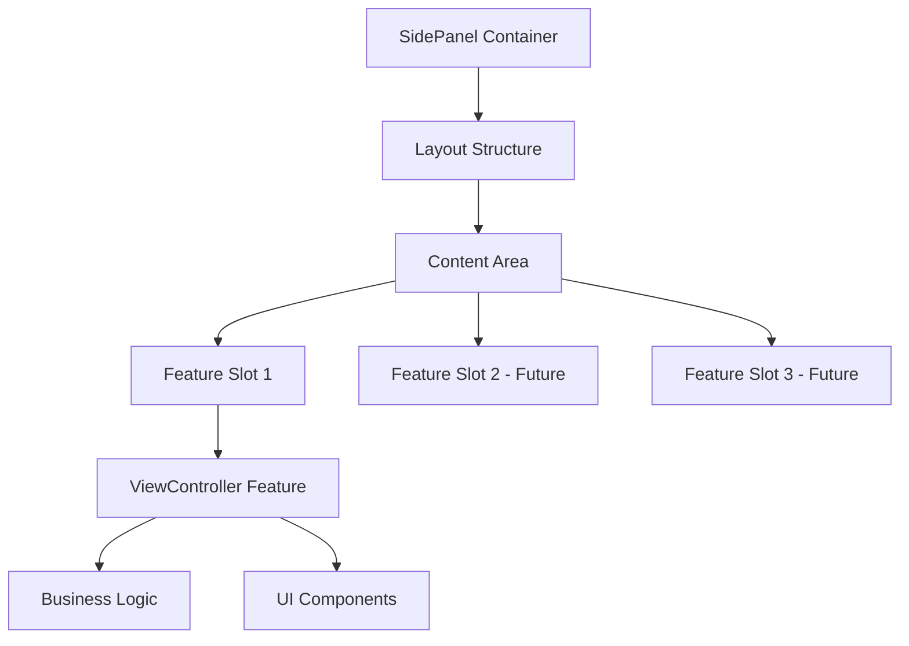
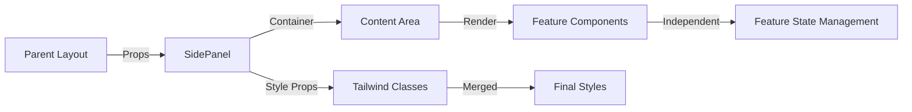

# SidePanel UI Container 設計書

> **作成日**: 2025-07-12  
> **更新日**: 2025-07-12  
> **バージョン**: 1.0.0  
> **作成者**: Claude Code

[<< Hub画面設計書に戻る](../../../../docs/screenDesigns/01.hub.md)

Hub画面の左側に配置されるレイアウト用UIコンテナ。Featureコンポーネントを格納・配置するためのレスポンシブ対応サイドパネルレイアウトを提供します。

## 📋 目次

- [概要](#概要)
- [アーキテクチャ](#アーキテクチャ)
- [技術仕様](#技術仕様)
- [使用方法](#使用方法)
- [設計思想](#設計思想)
- [パフォーマンス](#パフォーマンス)
- [アクセシビリティ](#アクセシビリティ)
- [開発・保守](#開発保守)

## 概要

### 目的・役割

SidePanelはHub画面における左側レイアウトエリアを管理する純粋なUIコンテナです。機能的なコンポーネント（Feature）を適切に配置・表示するためのレイアウト構造とスタイリングを提供し、レスポンシブ対応や基本的なアクセシビリティ構造を担います。

### 主要機能

- **レイアウト管理**: 左側固定幅のサイドパネルレイアウト
- **コンテンツ格納**: Featureコンポーネントの配置エリア提供
- **レスポンシブ対応**: 画面サイズに応じた表示制御（将来実装予定）
- **スタイリング統合**: Tailwind CSSによる一貫したデザインシステム
- **アクセシビリティ基盤**: セマンティックHTML構造とlandmark role

## アーキテクチャ

### コンポーネント構成

SidePanelは単純なレイアウトコンテナとして設計されており、内部に任意のFeatureコンポーネントを配置できます。現在はViewController Featureを含んでいますが、将来的に他のFeatureも追加可能な拡張性を持ちます。

### コンポーネント構成図



### データフロー図



### ファイル構造

```
src/components/layouts/SidePanel/
├── README.md                     # このファイル
├── index.ts                      # エクスポート統合
├── components/                   # UIコンテナコンポーネント
│   └── SidePanel.tsx            # メインコンテナ
└── __stories__/                 # Storybookストーリー
    └── SidePanel.stories.tsx    # レイアウトストーリー
```

### 依存関係

#### 内部依存

なし（純粋なレイアウトコンテナのため）

#### 外部依存

- `react` - Reactフレームワーク
- `tailwind-merge` - Tailwindクラス最適化

## 技術仕様

### Props仕様

#### SidePanel

```typescript
interface SidePanelProps {
  /** パネルの表示状態（将来のレスポンシブ対応用） */
  isVisible?: boolean;

  /** 追加のCSSクラス名 */
  className?: string;

  /** 子要素（Featureコンポーネント） */
  children?: React.ReactNode;
}
```

### 状態管理

SidePanelはStatelessコンポーネントとして設計されており、独自の状態は持ちません。レイアウトに関連する表示制御のみを担当します。

### レイアウト仕様

#### デスクトップ

- **幅**: 320px（固定）
- **高さ**: 100vh（フルハイト）
- **位置**: 左側固定
- **スクロール**: 内容がオーバーフローした場合に縦スクロール

#### モバイル（将来実装）

- **レイアウト**: ボトムシート形式
- **表示制御**: isVisibleプロパティによる切り替え

## 使用方法

### 基本的な使用

```tsx
import { SidePanel } from '@/components/layouts/SidePanel';
import { ViewController } from '@/features/view-controller';

function HubPage() {
  return (
    <div className="flex h-screen">
      <SidePanel>
        <ViewController />
      </SidePanel>
      <div className="flex-1">{/* メインコンテンツエリア */}</div>
    </div>
  );
}
```

### カスタマイズ例

```tsx
import { SidePanel } from '@/components/layouts/SidePanel';
import { ViewController } from '@/features/view-controller';

function CustomHubPage() {
  return (
    <div className="flex h-screen">
      {/* カスタムスタイル適用 */}
      <SidePanel className="border-r-2 border-gray-300 shadow-lg">
        <ViewController title="ビューコントローラー" />
        {/* 将来的に他のFeatureも追加可能 */}
      </SidePanel>

      {/* 非表示状態（将来のレスポンシブ対応） */}
      <SidePanel isVisible={false}>
        <ViewController />
      </SidePanel>
    </div>
  );
}
```

### レイアウト統合例

```tsx
import { SidePanel } from '@/components/layouts/SidePanel';
import { Canvas } from '@/components/layouts/Canvas';
import { GlobalHeader } from '@/components/layouts/GlobalHeader';

function FullHubLayout() {
  return (
    <div className="flex h-screen flex-col">
      <GlobalHeader />
      <div className="flex flex-1">
        <SidePanel>{/* Featureコンポーネントを配置 */}</SidePanel>
        <Canvas />
      </div>
    </div>
  );
}
```

## 設計思想

### 1. 単一責任原則

SidePanelは「レイアウトコンテナ」という単一の責任のみを持ちます。機能的なロジックは一切含まず、純粋にFeatureコンポーネントの配置と基本的なスタイリングに集中しています。

### 2. 再利用性

汎用的なレイアウトコンテナとして設計されており、様々なFeatureコンポーネントを格納できます。プロパティベースのカスタマイズにより、異なる用途でも再利用可能です。

### 3. 保守性

- 最小限のプロパティと依存関係
- 明確な責任範囲による変更影響の限定
- 型安全性による実装ミスの防止

### 4. 拡張性

- Featureコンポーネントの追加・削除が容易
- 将来のレスポンシブ対応に備えた設計
- スタイリングのカスタマイズ対応

### 5. アクセシビリティ

- セマンティックなHTML構造
- 適切なlandmark roleの提供
- Featureコンポーネントのアクセシビリティをサポート

## パフォーマンス

### 最適化手法

- **Server Component**: 状態を持たないため、Server Componentとして実装
- **軽量実装**: 最小限のDOM構造とスタイル
- **効率的なクラス結合**: tailwind-mergeによる最適化

### レンダリング特性

- 静的なレイアウト構造のため、再レンダリング頻度は最小
- 子コンポーネント（Feature）の状態変更による影響を受けない
- CSSによるレイアウト最適化

## アクセシビリティ

### WCAG準拠レベル

**レベル AA** に準拠

### 実装済み機能

- **セマンティックHTML**: `<aside>`要素による適切な構造化
- **Landmark role**: `role="complementary"`による補助コンテンツの識別
- **論理的な文書構造**: 適切な見出し階層とコンテンツ順序

### ARIA属性

| 属性         | 値                | 用途                 |
| ------------ | ----------------- | -------------------- |
| `role`       | `"complementary"` | 補助的なランドマーク |
| `aria-label` | `"サイドパネル"`  | パネル全体の説明     |

### スクリーンリーダー対応

- 明確なlandmark構造による効率的なナビゲーション
- 内包するFeatureコンポーネントのアクセシビリティ機能をサポート

## 開発・保守

### 実装ガイドライン

1. **Pure UI Container**: 機能的なロジックは含めない
2. **Props最小化**: 必要最小限のプロパティのみ提供
3. **スタイル分離**: Tailwind CSSによる一貫したスタイリング
4. **型安全性**: TypeScriptによる厳密な型定義

### 今後の拡張予定

#### 短期

- [ ] レスポンシブ対応（モバイル用ボトムシート）
- [ ] アニメーション効果（開閉時のトランジション）
- [ ] テーマ対応（ライト/ダークモード）

#### 長期

- [ ] 複数パネル対応（タブ切り替え）
- [ ] サイズ調整機能（リサイザブル）
- [ ] 位置カスタマイズ（左右切り替え）

### テスト方針

- **レイアウトテスト**: 適切なDOM構造の検証
- **スタイルテスト**: CSS クラスの適用確認
- **アクセシビリティテスト**: ARIA属性とセマンティック構造の検証

### 関連ドキュメント

- [要件定義書](../../../../docs/01.requirements.md)
- [Hub画面設計書](../../../../docs/screenDesigns/01.hub.md)
- [開発規約](../../../../docs/03.developmentAgreement.md)
- [レイアウトシステム概要](../README.md)
- [Storybook](http://localhost:6006/?path=/story/layouts-sidepanel)

### 用語集

| 用語             | 定義                                                         |
| ---------------- | ------------------------------------------------------------ |
| UI Container     | レイアウトと配置のみを担当する純粋なコンテナコンポーネント   |
| Feature          | 具体的な機能を提供するビジネスロジック付きコンポーネント     |
| Layout Component | アプリケーションの構造を定義するレイアウト専用コンポーネント |
| Landmark         | スクリーンリーダーでナビゲーション可能な構造的要素           |

---

> 📝 **Note**: この設計書は [開発規約](../../../../docs/03.developmentAgreement.md) に従って作成されています。  
> 🔄 **Update**: レイアウト変更時はこの設計書も合わせて更新してください。  
> 🤝 **Collaboration**: 不明な点があれば開発チームまでお問い合わせください。
