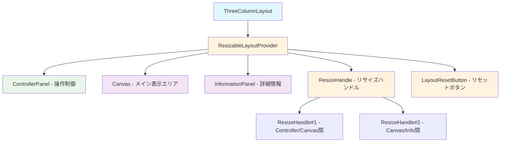
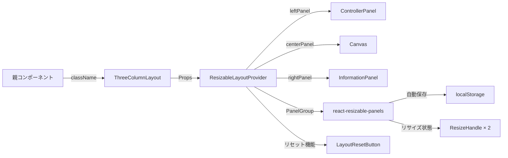

# ThreeColumnLayout 設計書

> **作成日**: 2025-09-02  
> **更新日**: 2025-09-02  
> **バージョン**: 1.0.0  
> **作成者**: Claude Code

[<< 画面設計書に戻る](../../../../docs/screenDesigns/01.hub.md)

デスクトップ端末向けの3分割レイアウトコンポーネント。横方向にControllerPanel（操作制御）、Canvas（メイン表示エリア）、InformationPanel（詳細情報）を配置し、react-resizable-panelsによるリサイザブル機能を提供する。

## 📋 目次

- [概要](#概要)
- [アーキテクチャ](#アーキテクチャ)
- [技術仕様](#技術仕様)
- [使用方法](#使用方法)
- [設計思想](#設計思想)
- [パフォーマンス](#パフォーマンス)
- [アクセシビリティ](#アクセシビリティ)
- [開発・保守](#開発保守)

## 概要

### 目的・役割

デスクトップ端末の横画面に最適化された3分割レイアウトを提供し、広い画面スペースを活用した効率的なワークフローを実現する。Server ComponentとClient Componentの境界を最適化し、SSRによる高速な初期表示とリサイザブル機能による柔軟な操作体験を両立する。

### 主要機能

- **3分割レイアウト**: ControllerPanel（左）、Canvas（中央）、InformationPanel（右）の横型配置
- **リサイザブル機能**: react-resizable-panelsによる動的なパネルサイズ調整
- **レイアウト永続化**: ユーザーのパネルサイズ設定を自動保存・復元
- **SSR最適化**: Composition Patternによる Server/Client Component 分離
- **リセット機能**: ワンクリックでデフォルトレイアウトに復元

## アーキテクチャ

### コンポーネント構成

**ThreeColumnLayout**（Server Component）がメインコンポーネントとして機能し、**ResizableLayoutProvider**（Client Component）でラップすることで、リサイザブル機能を提供。コンテンツ部分はServer Componentのまま維持し、SSRの恩恵を最大化する。

### コンポーネント構成図



### データフロー図



### ファイル構造

```
src/components/layouts/ThreeColumnLayout/
├── README.md                                 # この設計書
├── components/                               # コンポーネント群
│   ├── ThreeColumnLayout.tsx                # メインコンポーネント
│   ├── ResizableLayoutProvider.tsx          # プロバイダーコンポーネント
│   ├── ControllerPanel.tsx                  # 左パネル（操作制御）
│   ├── InformationPanel.tsx                 # 右パネル（詳細情報）
│   ├── ResizeHandle.tsx                     # リサイズハンドル
│   └── LayoutResetButton.tsx                # レイアウトリセットボタン
└── index.ts                                  # エクスポート統合
```

### 依存関係

#### 内部依存

- `@/components/layouts/Canvas` - メイン表示エリア（五度圏・クロマチック円）
- `@/features/view-controller` - Hub切り替えコントローラー
- `@/features/information-panel` - 選択要素・レイヤー概念表示
- `@/shared/types` - 共通型定義（ClassNameProps）
- `@/stores/layoutStore` - レイアウト状態管理

#### 外部依存

- `react` - Reactフレームワーク
- `react-resizable-panels` - リサイザブルパネルライブラリ
- `tailwind-merge` - Tailwindクラス最適化ユーティリティ

## 技術仕様

### Props仕様

#### ThreeColumnLayout

```typescript
interface ThreeColumnLayoutProps extends ClassNameProps {
  /** カスタムクラス名 */
  className?: string;
}
```

#### ResizableLayoutProvider

```typescript
interface ResizableLayoutProviderProps extends ClassNameProps {
  /** 左パネルコンテンツ - 操作制御 (ControllerPanel) */
  leftPanel: React.ReactNode;

  /** 中央パネルコンテンツ - メイン表示エリア (Canvas) */
  centerPanel: React.ReactNode;

  /** 右パネルコンテンツ - 詳細情報表示 (InformationPanel) */
  rightPanel: React.ReactNode;

  /** カスタムクラス名 */
  className?: string;
}
```

### リサイザブル設定

#### パネル仕様

| パネル           | デフォルトサイズ | 最小サイズ | 最小幅 | 説明             |
| ---------------- | ---------------- | ---------- | ------ | ---------------- |
| ControllerPanel  | 25%              | 15%        | 200px  | 操作制御エリア   |
| Canvas           | 50%              | 30%        | 300px  | メイン表示エリア |
| InformationPanel | 25%              | 15%        | 200px  | 詳細情報エリア   |

#### 永続化設定

```typescript
// react-resizable-panels設定
<PanelGroup
  direction="horizontal"
  autoSaveId="three-column-layout"  // localStorage key
>
```

### API仕様

#### 公開メソッド

| メソッド名    | 引数 | 戻り値 | 説明                                 |
| ------------- | ---- | ------ | ------------------------------------ |
| `resetLayout` | なし | `void` | レイアウトをデフォルト状態にリセット |

#### イベント

| イベント名 | ペイロード            | 説明                       |
| ---------- | --------------------- | -------------------------- |
| `onResize` | `{ sizes: number[] }` | パネルサイズ変更時に発火   |
| `onReset`  | なし                  | レイアウトリセット時に発火 |

## 使用方法

### 基本的な使用

```tsx
import { ThreeColumnLayout } from '@/components/layouts/ThreeColumnLayout';

function DesktopApp() {
  return (
    <div className="h-screen">
      <ThreeColumnLayout className="bg-background" />
    </div>
  );
}
```

### カスタマイズ例

```tsx
import { ThreeColumnLayout } from '@/components/layouts/ThreeColumnLayout';

function CustomDesktopLayout() {
  return (
    <div className="min-h-screen bg-gradient-to-r from-blue-50 to-purple-50">
      <ThreeColumnLayout className="mx-auto max-w-7xl overflow-hidden rounded-lg shadow-xl" />
    </div>
  );
}
```

## 設計思想

### 1. 単一責任原則

ThreeColumnLayoutは「デスクトップ向け3分割リサイザブルレイアウト」という単一の責任を持つ。レイアウト構造とリサイズ機能の提供のみに集中し、各パネルの具体的なコンテンツは依存注入により外部から提供される。

### 2. Composition Pattern

Server ComponentとClient Componentの境界を最適化するため、Composition Patternを採用。コンテンツ部分（ControllerPanel、Canvas、InformationPanel）はServer Componentとしてサーバーサイドで事前レンダリングされ、リサイザブル機能のみClient Componentとして動作する。

### 3. デスクトップファースト設計

デスクトップ端末の利点（広い画面、マウス操作、マルチタスク）を活用した設計。複数の情報を同時表示し、ユーザーが自由にレイアウトをカスタマイズできる柔軟性を提供。

### 4. ユーザー体験重視

レイアウト設定の永続化により、ユーザーの作業環境を維持。リセット機能による簡単な初期化、直感的なリサイズ操作による快適なワークフローを実現。

### 5. パフォーマンス最適化

react-resizable-panelsの効率的な実装により、スムーズなリサイズ操作を実現。不要な再レンダリングを防止し、大量のコンテンツを含む場合でも高いパフォーマンスを維持。

## パフォーマンス

### SSR活用

- Server Componentによる事前レンダリング
- Hydrationの最小化（Client Componentはリサイズ機能のみ）
- 初期表示の高速化

### リサイズ最適化

- react-resizable-panelsの効率的な実装
- 必要最小限の再レンダリング
- GPUアクセラレーション対応のCSS Transform使用

### メモリ効率

- パネルサイズ状態のlocalStorage永続化
- 不要なイベントリスナーの自動クリーンアップ
- 適切なメモ化によるレンダリング最適化

## アクセシビリティ

### ARIA属性

```typescript
// レイアウトコンテナ
<div aria-label="デスクトップ用3分割レイアウト">

// リサイズハンドル
<ResizeHandle aria-label="パネルサイズ調整" />

// リセットボタン
<LayoutResetButton aria-label="レイアウトをデフォルトに戻す" />
```

### キーボード操作

- リサイズハンドルのキーボード操作対応
- フォーカス管理の最適化
- タブ順序の論理的な設計

### 読み上げ支援

- パネルの役割明示
- リサイズ操作の状況通知
- 適切なランドマーク設定

## 開発・保守

### テスト戦略

- Server Componentのレンダリングテスト
- リサイザブル機能のインタラクションテスト
- レイアウト永続化のE2Eテスト
- アクセシビリティテスト

### デバッグ支援

- React DevToolsでのコンポーネント構造確認
- localStorage状態の開発者ツール確認
- パネルサイズのリアルタイム表示

### 拡張性

- 新しいパネルの追加容易性
- カスタムリサイズ制約の設定可能性
- テーマシステムとの連携

## 関連ドキュメント

- [要件定義書](../../../../docs/01.requirements.md)
- [画面設計書](../../../../docs/screenDesigns/01.hub.md)
- [開発規約](../../../../docs/03.developmentAgreement.md)
- [Canvas設計書](../Canvas/README.md)
- [react-resizable-panels Documentation](https://github.com/bvaughn/react-resizable-panels)

## 用語集

| 用語                | 定義                                                                |
| ------------------- | ------------------------------------------------------------------- |
| Composition Pattern | 親コンポーネントが子コンポーネントをpropsとして受け取る設計パターン |
| Server Component    | サーバーサイドでレンダリングされるReactコンポーネント               |
| Client Component    | クライアントサイドでレンダリングされるReactコンポーネント           |
| リサイザブル        | ユーザーがドラッグ操作でサイズを動的に変更できる機能                |
| PanelGroup          | react-resizable-panelsの最上位コンテナコンポーネント                |
| ResizeHandle        | パネル間のリサイズ操作を行うハンドルコンポーネント                  |
| autoSaveId          | レイアウト状態をlocalStorageに保存する際のキー識別子                |

---

> 📝 **Note**: この設計書は [開発規約](../../../../docs/03.developmentAgreement.md) に従って作成されています。  
> 🔄 **Update**: 機能追加・変更時はこの設計書も合わせて更新してください。  
> 🤝 **Collaboration**: 不明な点があれば開発チームまでお問い合わせください。
