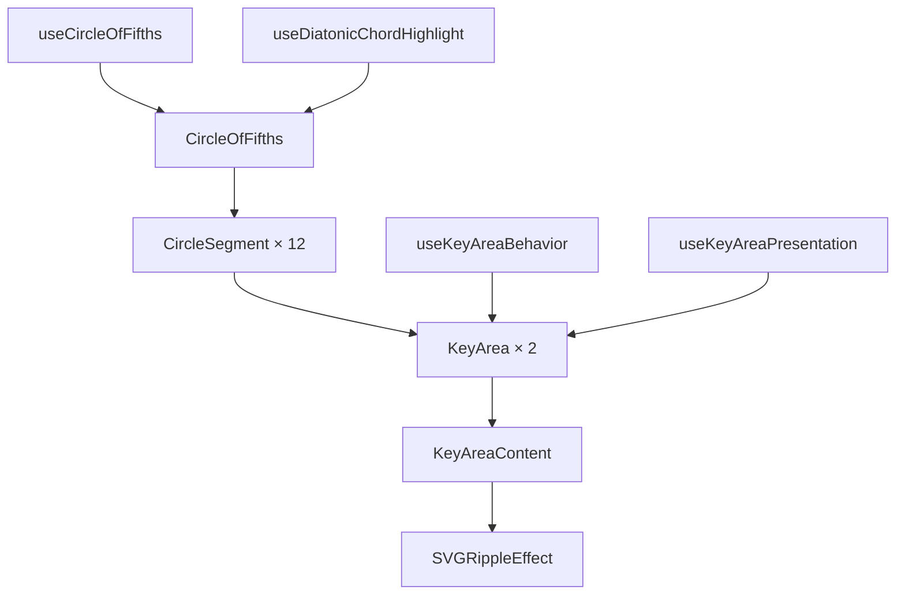
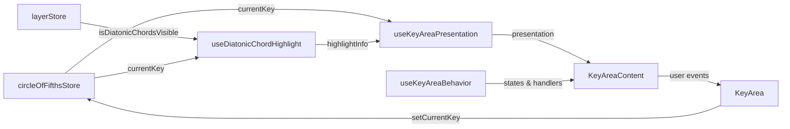

# 五度圏コンポーネント設計書

> **作成日**: 2024-12-01
> **更新日**: 2025-01-20
> **バージョン**: 2.0.0
> **作成者**: Music Theory App Team

[<< 画面設計書に戻る](../../../docs/00.project/screenDesigns/0003.hub.md)

音楽理論の五度圏を視覚的に表現する高度なインタラクティブReactコンポーネントです。

## 📋 目次

- [概要](#概要)
- [アーキテクチャ](#アーキテクチャ)
- [技術仕様](#技術仕様)
- [使用方法](#使用方法)
- [機能詳細](#機能詳細)
- [設計思想](#設計思想)

## 概要

### 目的・役割

五度圏（Circle of Fifths）は音楽理論の基礎概念を視覚的に理解するためのインタラクティブツールです。調性関係、ダイアトニックコード、音楽的な関連性を直感的に探索できるビジュアライゼーションを提供します。

### 主要機能

- **24個のクリック可能なキー**: メジャーキーとマイナーキーを個別に選択可能
- **ダイアトニックコードハイライト**: 選択されたキーのダイアトニックコードを視覚的に表示
- **リアルタイム音声再生**: Tone.jsによるキーの音声フィードバック
- **アニメーション効果**: Framer Motionによるスムーズなトランジション
- **レスポンシブデザイン**: 様々な画面サイズに対応
- **アクセシビリティ対応**: ARIA属性とキーボードナビゲーション

## アーキテクチャ

### コンポーネント構成

統合されたKeyAreaアーキテクチャにより、関心の分離とパフォーマンス最適化を実現しています。

### コンポーネント構成図



### データフロー図



### ファイル構造

```
src/features/circle-of-fifths/
├── README.md                      # このファイル
├── index.ts                       # エクスポート統合
├── types.ts                       # ローカル型定義
├── components/                    # コンポーネント
│   ├── CircleOfFifths.tsx         # メインコンポーネント
│   ├── CircleSegment.tsx          # セグメントコンポーネント
│   └── KeyArea/                   # KeyAreaモジュール
│       ├── index.ts               # エクスポート
│       ├── KeyArea.tsx            # オーケストレーター
│       ├── KeyAreaContent.tsx     # 統合描画コンポーネント
│       └── SVGRippleEffect.tsx    # リップルエフェクト
├── hooks/                         # カスタムフック
│   ├── useCircleOfFifths.ts       # メインフック
│   ├── useAudio.ts                # 音声機能
│   ├── useDiatonicChordHighlight.ts # ダイアトニックハイライト（Layer Controller機能）
│   └── keyArea/                   # KeyArea専用フック
│       ├── useKeyAreaBehavior.ts  # 行動統合フック
│       ├── useKeyAreaPresentation.ts # プレゼンテーション統合フック
│       ├── useKeyInteraction.ts   # インタラクション管理
│       ├── useKeyState.ts         # 状態管理
│       ├── useLongPress.ts        # 長押し検知
│       └── useRippleEffect.ts     # リップル効果
├── constants/                     # 定数定義
│   └── index.ts                   # レイアウト・アニメーション定数
├── utils/                         # ユーティリティ関数
│   ├── index.ts                   # 統合エクスポート
│   ├── geometry.ts                # 幾何学計算
│   ├── pathGeneration.ts          # SVGパス生成
│   ├── validation.ts              # バリデーション
│   ├── classNames.ts              # CSS クラス名生成
│   └── test/                      # ユーティリティテスト
├── __stories__/                   # Storybookストーリー
│   └── CircleOfFifths.stories.tsx
└── hooks/test/                    # フックテスト
    ├── useAudio.test.ts
    ├── useDiatonicChordHighlight.test.ts
    └── keyArea/
        └── useKeyArea.test.ts
```

### 依存関係

#### 内部依存

- `@/stores/circleOfFifthsStore` - 五度圏専用Zustand状態管理ストア
- `@/stores/layerStore` - Layer Controller機能との連携（ダイアトニックハイライト）
- `@/domain/music-theory` - 音楽理論ドメインロジック
- `@/shared/types/graphics` - 共通グラフィック型定義
- `@/features/layer-controller` - ダイアトニックコード表示制御
- `@/features/information-panel` - 情報パネル連携

#### 外部依存

- `react` ^19.0.0 - Reactフレームワーク
- `next` ^15.0.0 - Next.jsフレームワーク
- `motion` ^12.0.0 - Framer Motionアニメーション
- `zustand` ^5.0.0 - 軽量状態管理
- `tone` ^15.0.0 - Web Audio音声ライブラリ
- `clsx` - クラス名結合ユーティリティ
- `tailwind-merge` - Tailwindクラス最適化

## 技術仕様

### Props仕様

#### CircleOfFifths（メインコンポーネント）

```typescript
interface CircleOfFifthsProps {
  /** カスタムクラス名 */
  className?: string;
}
```

#### KeyArea（キーエリアコンポーネント）

```typescript
interface KeyAreaProps {
  /** キー情報 */
  key: KeyDTO;
  /** セグメント情報 */
  segment: CircleSegment;
}
```

#### KeyAreaContent（統合描画コンポーネント）

```typescript
interface KeyAreaContentProps {
  /** キー名（表示用） */
  keyName: string;
  /** SVGパス */
  path: string;
  /** テキスト位置 */
  textPosition: Point;
  /** テキスト回転角度 */
  textRotation: number;
  /** キーエリアの状態（選択・ホバー・クラス名） */
  states: KeyAreaStates;
  /** プレゼンテーション情報（ハイライト・色・レイアウト） */
  presentation: KeyAreaPresentationInfo;
  /** リップルエフェクトの状態 */
  ripple: {
    isRippleActive: boolean;
    resetRipple: () => void;
  };
}
```

### 状態管理

#### グローバル状態 (Zustand)

```typescript
interface CircleOfFifthsStore {
  /** 現在選択されているキー */
  currentKey: Key | null;

  /** アクション: キー選択 */
  setCurrentKey: (key: Key | null) => void;

  /** アクション: 状態リセット */
  reset: () => void;
}
```

#### ローカル状態

各KeyAreaは以下のローカル状態を管理：

```typescript
// useKeyState
interface KeyAreaLocalState {
  isSelected: boolean;
  isHovered: boolean;
  fillClassName: string;
  textClassName: string;
}

// useRippleEffect
interface RippleState {
  isRippleActive: boolean;
  resetRipple: () => void;
}
```

### フック仕様

#### useKeyAreaBehavior

```typescript
interface UseKeyAreaBehaviorReturn {
  states: KeyAreaStates;
  handlers: KeyAreaHandlers;
  ripple: RippleEffectState;
}
```

#### useKeyAreaPresentation

```typescript
interface UseKeyAreaPresentationReturn {
  shouldHighlight: boolean;
  romanNumeral: string | null;
  keyAreaColor: string;
  currentKeyColor: string;
  layout: KeyAreaLayout;
}
```

## 使用方法

基本的な統合は既に完了しており、追加の設定は不要です。

```tsx
import { CircleOfFifths } from '@/features/circle-of-fifths';

function App() {
  return (
    <div className="app">
      <CircleOfFifths />
    </div>
  );
}
```

## 機能詳細

### KeyArea統合アーキテクチャ

新しいKeyAreaアーキテクチャは以下の特徴を持ちます：

- **統合されたレンダリング**: KeyAreaContentコンポーネントで視覚・インタラクション要素を一括描画
- **責任分離フック**: useKeyAreaBehavior（行動）とuseKeyAreaPresentation（表示）で関心の分離
- **パフォーマンス最適化**: 依存性注入によるストア重複購読の排除
- **Props爆発の解決**: 複雑なプロパティを統合インターフェースに集約

### ダイアトニックコードハイライト（Layer Controller連携）

Layer Controllerからの指示に基づき、選択されたキーのダイアトニックコード（7つのコード）を視覚的にハイライト表示：

- **外部制御**: `@/features/layer-controller`からの表示制御
- **動的色変更**: 現在のキーに基づく色での枠線表示
- **ローマ数字表記**: 各ダイアトニックコードのローマ数字を表示
- **アニメーション効果**: スムーズなフェードイン・アウト

### リップルエフェクト

ユーザーインタラクションに対する視覚的フィードバック：

- **クリック検知**: タップ・クリック時のリップル効果
- **色連動**: キーの色と連動したリップル色
- **パフォーマンス**: React.memo最適化による効率的な再レンダリング

### 音声機能

Tone.jsによるリアルタイム音声フィードバック：

- **キー再生**: 各キーに対応する音声の再生
- **非同期ロード**: 音声エンジンの遅延初期化
- **エラーハンドリング**: 音声機能利用不可時の適切な処理

## 設計思想

このコンポーネントの設計は、[開発原則](../../../docs/20.development/2002.development-principles.md)に基づいて実装されています。

### 1. 責任分離とモジュラー設計

- **単一責任の原則**: 各コンポーネント・フックは明確な責任を持つ
- **関心の分離**: 行動（Behavior）と表示（Presentation）を分離
- **依存性注入**: ストア購読の最適化によるパフォーマンス向上

### 2. パフォーマンス最適化

- **React.memo**: 不要な再レンダリング防止
- **useMemo**: 複雑な計算結果のメモ化
- **useCallback**: イベントハンドラーの最適化
- **依存性管理**: 適切な依存配列による効率的な更新

### 3. 型安全性とテスタビリティ

- **TypeScript**: 完全な型安全性とコンパイル時エラー検出
- **フック分離**: 単体テスト可能な設計
- **モックフレンドリー**: テスト時の状態制御が容易

### 4. 開発効率と保守性

- **統合アーキテクチャ**: Props爆発の解決による開発効率向上
- **明確なインターフェース**: 統合された型定義による理解しやすさ
- **段階的改善**: 既存機能を維持しながらのアーキテクチャ改善

### 5. ユーザー体験

- **アクセシビリティ**: ARIA属性とセマンティックHTML
- **視覚的フィードバック**: リップル効果とアニメーション
- **音声フィードバック**: Tone.jsによる聴覚的体験
- **レスポンシブ**: 様々なデバイスサイズに対応

## 関連ドキュメント

- [要件定義書](../../../docs/00.project/0001.requirements.md)
- [Hub画面設計書](../../../docs/00.project/screenDesigns/0003.hub.md)
- [開発原則](../../../docs/20.development/2002.development-principles.md)
- [アーキテクチャガイド](../../../docs/20.development/2004.architecture.md)
- [テストガイドライン](../../../docs/30.quality/3001.testing.md)
- [音楽理論ガイドブック](../../../docs/10.domain/1002.music-theory-guidebook.md)
- [ダイアトニックコード統合外枠ハイライト調査](../../../docs/70.knowledge/diatonic-chord-highlight-border-research.md)

## 用語集

| 用語                 | 定義                                                     |
| -------------------- | -------------------------------------------------------- |
| 五度圏               | 音楽理論における調性関係を円形で表現した図               |
| ダイアトニックコード | 特定のキーの音階内で構成される7つの基本和音              |
| KeyArea              | 五度圏上の個別のキー（メジャー・マイナー）を表す領域     |
| CircleSegment        | 五度圏の12分割された各セグメント                         |
| Props爆発            | コンポーネントのプロパティが過度に増加する設計上の問題   |
| 依存性注入           | 外部からの依存関係の提供によるコンポーネント結合度の低減 |

---

> 📝 **Note**: この設計書は [開発規約](../../../docs/20.development/2001.basic-coding.md) に従って作成されています。
> 🔄 **Update**: 機能追加・変更時はこの設計書も合わせて更新してください。
> 🤝 **Collaboration**: 不明な点があれば開発チームまでお問い合わせください。
