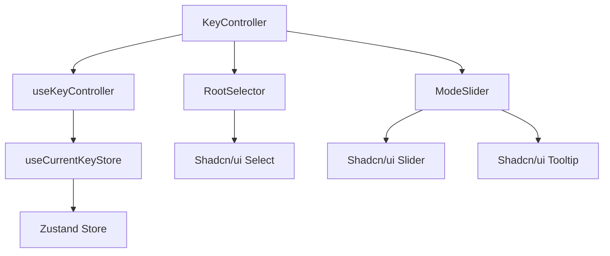
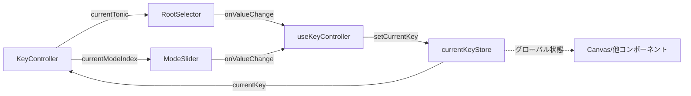

# Key Controller 設計書

> **作成日**: 2025-10-04
> **更新日**: 2025-10-04
> **バージョン**: 1.0.0
> **作成者**: Claude Code

[<< コントローラーパネル設計書に戻る](../../../docs/00.project/screenDesigns/hub/0003-4.controller-panel.md)

アプリケーションの音楽的文脈（キー/モード）を設定するコントローラーコンポーネント。Tonic（主音）とMode（旋法）を、素早くかつ直感的に選択するためのインターフェースを提供する。

## 📋 目次

- [概要](#概要)
- [アーキテクチャ](#アーキテクチャ)
- [技術仕様](#技術仕様)
- [使用方法](#使用方法)
- [機能詳細](#機能詳細)
- [設計思想](#設計思想)

## 概要

### 目的・役割

Key Controllerは、Hub画面のコントロールパネル（C-2）に配置され、アプリケーション全体の音楽的文脈の基準点を設定する重要な役割を担う。

- **Root（主音）の選択**: 12のピッチクラスから、音楽的文脈の中心となる主音を選択
- **Mode（旋法）の選択**: 7つのメジャーモード（Lydian, Ionian...）を調号特性に基づいて選択
- **グローバル状態の更新**: 選択された組み合わせから、`Key`または`ModalContext`インスタンスを生成し、アプリケーション全体の音楽的文脈を更新

### 主要機能

- **Root Selector**: 12音のドロップダウンメニューによる主音の検索・選択
- **Mode Slider**: 調号の特性（#系/♭系）を視覚化したスライダーによるモード選択
- **リアルタイムフィードバック**: 選択変更時に即座にCanvas上の表示が更新される
- **Current Display**: 現在のキー/モードの組み合わせをテキストで表示

## アーキテクチャ

### コンポーネント構成

このコンポーネントは、以下の3つの子コンポーネントで構成される：

1. **KeyController（メイン）**: 子コンポーネントのレイアウトとオーケストレーション
2. **RootSelector**: 12音のドロップダウンメニュー（Shadcn/ui Select）
3. **ModeSlider**: 7つのモードをスライダーで選択（Shadcn/ui Slider + カスタムUI）

### コンポーネント構成図



### データフロー図



### ファイル構造

```
src/features/key-controller/
├── README.md                         # このファイル
├── index.ts                          # エクスポート用ファイル
├── components/                       # UIコンポーネント
│   ├── KeyController.tsx             # メインコンポーネント
│   ├── RootSelector.tsx              # Root選択ドロップダウン
│   └── ModeSlider.tsx                # Mode選択スライダー
├── hooks/                            # カスタムフック
│   ├── useKeyController.ts           # ビジネスロジック集約
│   └── test/
│       └── useKeyController.test.ts  # フックのテスト
└── __stories__/                      # Storybook
    └── KeyController.stories.tsx     # インタラクティブデモ
```

### 依存関係

#### 内部依存

- `@/domain/common` - `PitchClass`, `ScalePattern`（音楽理論ドメインモデル）
- `@/domain/modal-context` - `ModalContext`（モーダルな音楽的文脈）
- `@/domain/key` - `Key`（調性ベースの音楽的文脈）
- `@/stores/currentKeyStore` - グローバルな音楽的文脈の状態管理
- `@/shared/types` - `ClassNameProps`（共通型定義）

#### 外部依存

- `react` - Reactフレームワーク
- `tailwind-merge` - Tailwindクラス最適化
- `@/components/ui/select` - Shadcn/ui Selectコンポーネント
- `@/components/ui/slider` - Shadcn/ui Sliderコンポーネント
- `@/components/ui/tooltip` - Shadcn/ui Tooltipコンポーネント

## 技術仕様

### Props仕様

#### KeyController（メインコンポーネント）

```typescript
interface KeyControllerProps extends ClassNameProps {
  /** コンポーネントのタイトル */
  title?: string;
}
```

| プロパティ  | 型       | 必須 | デフォルト | 説明                             |
| ----------- | -------- | ---- | ---------- | -------------------------------- |
| `title`     | `string` | ❌   | `'Key'`    | コンポーネントのタイトルテキスト |
| `className` | `string` | ❌   | -          | カスタムクラス名                 |

#### RootSelector

```typescript
interface RootSelectorProps {
  /** 現在選択されているRoot（Tonic） */
  value: PitchClass;
  /** Root変更時のコールバック */
  onValueChange: (pitchClass: PitchClass) => void;
  /** カスタムクラス名 */
  className?: string;
}
```

#### ModeSlider

```typescript
interface ModeSliderProps {
  /** 現在選択されているモードのインデックス (0-6) */
  value: number;
  /** モード変更時のコールバック */
  onValueChange: (modeIndex: number) => void;
  /** カスタムクラス名 */
  className?: string;
}
```

### 状態管理

#### グローバル状態 (Zustand)

```typescript
interface CurrentKeyStore {
  // 状態プロパティ
  currentKey: IMusicalContext; // Key または ModalContext

  // アクション
  setCurrentKey: (key: IMusicalContext) => void;
}
```

#### ローカル状態

`useKeyController`フックが以下の派生状態を計算：

```typescript
const {
  currentKey, // Storeから取得した現在のキー
  currentTonic, // 現在のTonic（PitchClass）
  currentModeIndex, // 現在のモードインデックス（0-6）
  handleRootChange, // Root変更ハンドラー
  handleModeChange, // Mode変更ハンドラー
} = useKeyController();
```

### API仕様

#### 公開メソッド

| メソッド名         | 引数                      | 戻り値 | 説明                                 |
| ------------------ | ------------------------- | ------ | ------------------------------------ |
| `handleRootChange` | `newTonic: PitchClass`    | `void` | 主音を変更し、グローバル状態を更新   |
| `handleModeChange` | `modeIndex: number (0-6)` | `void` | モードを変更し、グローバル状態を更新 |

#### イベント

| イベント名         | ペイロード                   | 説明                                    |
| ------------------ | ---------------------------- | --------------------------------------- |
| `handleRootChange` | `{ pitchClass: PitchClass }` | Root変更時に発火（内部的にStoreを更新） |
| `handleModeChange` | `{ modeIndex: number }`      | Mode変更時に発火（内部的にStoreを更新） |

## 使用方法

基本的には、Hub画面のController Panelに配置されることを想定しているが、独立したコンポーネントとしても使用可能。

```tsx
import { KeyController } from '@/features/key-controller';

function ControllerPanel() {
  return (
    <div className="space-y-6">
      <KeyController title="Musical Context" className="w-full" />
      {/* 他のコントローラー */}
    </div>
  );
}
```

## 機能詳細

### 機能の動作

#### 初期状態

- アプリケーション起動時、`currentKeyStore`の初期値（`Key.major(PitchClass.C)` = C Major）が表示される
- Root Selectorには "C" が選択された状態
- Mode Sliderは1番目（Ionian）の位置
- Current Displayには "C Major" が表示

#### Root変更時の動作

1. **ドロップダウンから新しいRoot（例: G）を選択**
2. `RootSelector`が`handleRootChange(PitchClass.G)`を呼び出し
3. `useKeyController`が現在のモードパターンを維持したまま新しいKeyを生成
   - Ionian（Major）の場合: `Key.major(PitchClass.G)` → "G Major"
   - Aeolian（Minor）の場合: `Key.minor(PitchClass.G)` → "G Minor"
   - その他のモード（例: Dorian）の場合: `new ModalContext(PitchClass.G, ScalePattern.Dorian)` → "G Dorian"
4. `setCurrentKey`でグローバル状態を更新
5. Canvas上の表示がリアルタイムで更新される

#### Mode変更時の動作

1. **Sliderを左右にドラッグ（例: Mixolydian = index 2）**
2. ドラッグ中はツールチップで"Mixolydian"と表示
3. リリース時に`ModeSlider`が`handleModeChange(2)`を呼び出し
4. `useKeyController`が現在のRootを維持したまま新しいKeyを生成
   - `new ModalContext(currentTonic, ScalePattern.Mixolydian)` → "C Mixolydian"
5. `setCurrentKey`でグローバル状態を更新
6. Canvas、Current Display、スライダー下のラベルが更新される

#### インタラクティブなフィードバック

- **視覚的フィードバック**:

  - Mode Sliderの背景グラデーション（黄色→紫）が調号特性（#系→♭系）を表現
  - 選択中のモード名ラベルが太字で強調表示
  - Canvas上の構成音ハイライトがリアルタイムで変化

- **聴覚的フィードバック**:
  - モード変更時、自動的に新しいスケールの構成音が順次再生される（実装予定）

#### 影響範囲

- **Canvas**: 現在のキー/モードに基づいて、スケール構成音、ダイアトニックコードなどを再描画
- **Information Panel**: 現在のキー/モードに関する詳細情報を表示
- **Layer Controller**: ダイアトニックコードなど、キー依存のレイヤーを更新

## 設計思想

### SOLID原則の適用

- **単一責任原則（SRP）**:

  - `KeyController`: UIレイアウトのみに集中
  - `useKeyController`: ビジネスロジック（状態管理、ドメインモデル生成）に集中
  - `RootSelector` / `ModeSlider`: 各自の入力UIのみに集中

- **開放/閉鎖原則（OCP）**:

  - 新しいモードの追加は`ScalePattern.MAJOR_MODES_BY_BRIGHTNESS`の拡張のみで対応可能
  - 新しいUIスタイルの追加はコンポーネントの継承/ラップで対応可能

- **依存性逆転原則（DIP）**:
  - `useKeyController`は具体的なStore実装ではなく、抽象化されたインターフェース（`useCurrentKeyStore`）に依存
  - ドメインモデル（`Key`, `ModalContext`）への依存により、音楽理論ロジックが分離

### UX設計の考慮事項

#### 検索性と連続性の両立

- **Root音 = ドロップダウン**: 12個の選択肢から目的の音を素早く見つける「検索性」を重視
- **Mode = スライダー**: 調号の特性（#多 ↔ ♭多）という連続的な尺度で並んでいるため、その変化を直感的に体感できるスライダーが最適

#### 客観的事実の優先

- **調号特性の明示**: "#" / "♭" のラベルで、各モードが持つ調号の客観的事実を表現
- **解釈の排除**: "明るい" / "暗い" といった主観的・解釈的表現は使用しない
- **理論的正確性**: `ScalePattern.MAJOR_MODES_BY_BRIGHTNESS`の順序（Lydian→Locrian）は、音楽理論における調号の数（#7→♭7）に基づく

#### アクセシビリティ

- **ツールチップ**: ホバー時にモード名を表示し、視認性を向上
- **クリック可能なラベル**: スライダー下のモード名ラベルをクリックすることでも選択可能
- **キーボード操作**: Shadcn/ui SelectとSliderはキーボード操作に対応（Tab, Enter, Arrow Keys）

#### パフォーマンス

- **メモ化**: `useKeyController`内で`useMemo`と`useCallback`を使用し、不要な再計算・再レンダリングを防止
- **最小限の状態**: グローバルStoreには`currentKey`のみを保持し、`currentTonic`と`currentModeIndex`は派生状態として計算

### 将来の拡張性

- **カスタムスケール対応**: `ScalePattern`を拡張することで、ハーモニックマイナー、メロディックマイナーなどのスケールにも対応可能
- **プリセット機能**: よく使うキー/モードの組み合わせを保存・呼び出し
- **MIDI入力**: MIDI鍵盤からの入力でRootを設定
- **音声再生の制御**: モード変更時の自動再生のON/OFF、再生速度の調整

## 関連ドキュメント

- [要件定義書](../../../docs/00.project/0001.requirements.md)
- [Hub画面設計書](../../../docs/00.project/0002.screenDesign.md)
- [コントローラーパネル設計書](../../../docs/00.project/screenDesigns/hub/0003-4.controller-panel.md)
- [開発原則・思想](../../../docs/20.development/2002.development-principles.md)
- [フロントエンド設計](../../../docs/20.development/2003.frontend-design.md)
- [ドメインシステム](../../../docs/10.domain/1001.domainSystem.md)
- [Storybook](http://localhost:6006/?path=/story/features-keycontroller--default)

## 用語集

| 用語                      | 定義                                                                         |
| ------------------------- | ---------------------------------------------------------------------------- |
| Root / Tonic              | 音楽的文脈の中心となる主音（12のピッチクラスのいずれか）                     |
| Mode / 旋法               | スケールの構成パターン（Ionian, Dorian...）                                  |
| 調号特性                  | スケールがシャープ（#）とフラット（♭）のどちらの性質を持つかを示す客観的指標 |
| ModalContext              | Key以外のモーダルな音楽的文脈を表すドメインモデル                            |
| IMusicalContext           | すべての音楽的文脈（Key, ModalContext）に共通するインターフェース            |
| MAJOR_MODES_BY_BRIGHTNESS | 7つのメジャーモードを調号の数（#多→♭多）で並べた配列                         |
| PitchClass                | 12平均律における音高クラス（C, C#/Db, D...）を表すドメインモデル             |

---

> 📝 **Note**: この設計書は [開発規約](../../../docs/20.development/2001.basic-coding.md) に従って作成されています。
> 🔄 **Update**: 機能追加・変更時はこの設計書も合わせて更新してください。
> 🤝 **Collaboration**: 不明な点があれば開発チームまでお問い合わせください。
