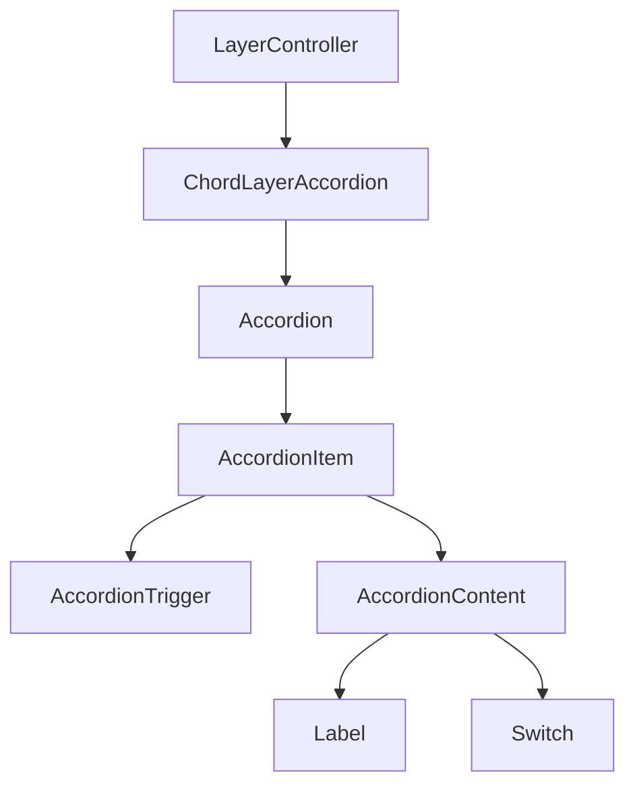
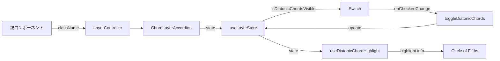
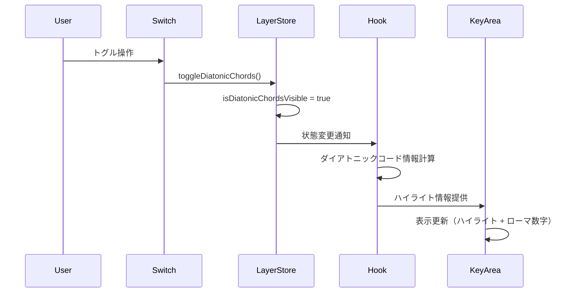

# LayerController Feature

> **作成日**: 2025-01-18
> **更新日**: 2025-01-18
> **バージョン**: 1.0.0
> **作成者**: AI Assistant

音楽理論の各要素（スケール、コード、関係性）の表示・非表示を制御するレイヤーコントローラー機能。ユーザーが必要な情報のみを選択的に表示できるインターフェースを提供する。

## 📋 目次

- [概要](#概要)
- [アーキテクチャ](#アーキテクチャ)
- [技術仕様](#技術仕様)
- [使用方法](#使用方法)
- [機能詳細](#機能詳細)
- [設計思想](#設計思想)
- [開発・保守](#開発保守)

## 概要

### 目的・役割

LayerController機能は、音楽理論アプリケーションにおける情報の階層的表示制御を担う。複雑な音楽理論概念を段階的に学習できるよう、必要な情報のみを選択的に表示・非表示する機能を提供する。

### 主要機能

- **レイヤー管理**: 音楽理論の各要素の表示状態を制御
- **ダイアトニックコード制御**: ダイアトニックコードの表示・非表示切り替え
- **アコーディオンUI**: 折りたたみ可能なレイヤー設定パネル

## アーキテクチャ

### コンポーネント構成

- **LayerController**: メインコンテナコンポーネント（レイヤー管理の統括）
- **ChordLayerAccordion**: コード関連レイヤーの制御UI（アコーディオン形式）

### コンポーネント構成図



### データフロー図



### ファイル構造

```
src/features/layer-controller/
├── README.md                           # このファイル
├── index.ts                           # エクスポート用ファイル
└── components/                        # コンポーネント
    ├── LayerController.tsx            # メインコンテナ
    └── ChordLayerAccordion.tsx        # コードレイヤー制御
```

### 依存関係

#### 内部依存

- `@/components/ui/accordion` - アコーディオンUI
- `@/components/ui/label` - ラベルコンポーネント
- `@/components/ui/switch` - スイッチコンポーネント
- `@/stores/layerStore` - レイヤー状態管理
- `@/types/common` - 共通型定義

#### 外部依存

- `react` - Reactフレームワーク
- `zustand` - 状態管理ライブラリ
- `clsx` - クラス名結合ユーティリティ

## 技術仕様

### Props仕様

#### LayerController

```typescript
import { ClassNameProps } from '@/types/common';

interface LayerControllerProps extends ClassNameProps {
  /** カスタムクラス名 */
  className?: string;
}
```

#### ChordLayerAccordion

```typescript
interface ChordLayerAccordionProps {
  // Propsなし（内部状態のみ使用）
}
```

### 状態管理

#### グローバル状態 (Zustand)

```typescript
interface LayerState {
  /** ダイアトニックコードの表示状態 */
  isDiatonicChordsVisible: boolean;
}

interface LayerActions {
  /** ダイアトニックコード表示の切り替え */
  toggleDiatonicChords: () => void;
}
```

### API仕様

#### 公開メソッド

| メソッド名             | 引数 | 戻り値 | 説明                                     |
| ---------------------- | ---- | ------ | ---------------------------------------- |
| `toggleDiatonicChords` | なし | void   | ダイアトニックコードの表示状態を切り替え |

#### イベント

| イベント名        | ペイロード         | 説明                       |
| ----------------- | ------------------ | -------------------------- |
| `onCheckedChange` | `checked: boolean` | スイッチの状態変更時に発火 |

## 使用方法

### 基本的な使用

```tsx
import { LayerController } from '@/features/layer-controller';

function App() {
  return (
    <div>
      <LayerController className="w-full" />
    </div>
  );
}
```

### カスタマイズ例

```tsx
import { LayerController } from '@/features/layer-controller';

function CustomLayout() {
  return (
    <div className="sidebar">
      <LayerController className="border-r p-4" />
    </div>
  );
}
```

### 個別コンポーネント使用

```tsx
import { ChordLayerAccordion } from '@/features/layer-controller';

function ChordSettings() {
  return (
    <div className="settings-panel">
      <ChordLayerAccordion />
    </div>
  );
}
```

## 機能詳細

### ダイアトニックコード表示機能

#### トグルOFF時（初期状態）

- 五度圏上のキーエリアは通常表示
- ダイアトニックコード情報は表示されない
- `useDiatonicChordHighlight`フックが空のMapを返す

#### トグルON時

- **ハイライト表示**: 現在のキーのダイアトニックコードが五度圏上でハイライト表示される
- **ローマ数字表示**: 各ダイアトニックコードにローマ数字（I, ii, iii, IV, V, vi, vii°）が表示される
- **視覚的強調**: ダイアトニックコードに該当するキーエリアが視覚的に区別される

#### 実装詳細

```typescript
// トグルONの場合の動作例
const diatonicChordInfo = currentKey.getDiatonicChordsInfo();
// => [
//   { chord: C-major, romanDegreeName: "I" },
//   { chord: D-minor, romanDegreeName: "ii" },
//   { chord: E-minor, romanDegreeName: "iii" },
//   // ... 他のダイアトニックコード
// ]
```

#### 影響範囲

- **Circle of Fifths**: `src/features/circle-of-fifths/hooks/useDiatonicChordHighlight.ts`
  - `isDiatonicChordsVisible`の状態に基づいてハイライト情報を計算
  - 各KeyAreaコンポーネントにハイライト情報とローマ数字を提供
- **KeyArea Component**: `src/features/circle-of-fifths/components/KeyArea.tsx`
  - ハイライト状態に応じた視覚的表現の変更
  - ローマ数字の表示・非表示

### 状態連動フロー



## 設計思想

### 1. 単一責任原則

LayerController機能は「音楽理論要素の表示制御」という単一の責任を持つ。各コンポーネントも明確に役割を分離している：

- LayerController: レイヤー管理のコンテナ
- ChordLayerAccordion: コード関連設定のUI

### 2. 再利用性

- コンポーネントは独立して使用可能
- 状態管理はZustandで集約し、どこからでもアクセス可能
- ClassNamePropsにより柔軟なスタイリングをサポート

### 3. 保守性

- 機能ごとにディレクトリを分離
- 型安全性を重視したTypeScript実装
- 明確なエクスポート構造

### 4. 拡張性

- 新しいレイヤー種別の追加が容易
- アコーディオン構造により複数レイヤーの管理に対応
- 状態管理の構造は追加機能に対して柔軟

### 5. ユーザビリティ

- 直感的なスイッチUIによる操作
- アコーディオンによる段階的な情報開示
- レスポンシブデザインに対応

## 開発・保守

### 新しいレイヤーの追加手順

1. `src/stores/layerStore.ts`に状態とアクションを追加
2. 必要に応じて新しいAccordionコンポーネントを作成
3. `LayerController.tsx`に新しいコンポーネントを追加
4. `index.ts`でエクスポート
5. 関連するフック（`useDiatonicChordHighlight`など）を更新

### テスト対象

- レイヤー状態の切り替え動作
- UIコンポーネントの表示・非表示
- アコーディオンの展開・折りたたみ
- ダイアトニックコードハイライトの表示・非表示
- ローマ数字表記の表示・非表示

### 関連ドキュメント

- [要件定義書](../../docs/00.project/0001.requirements.md)
- [フロントエンド設計](../../docs/20.development/2003.frontend-design.md)
- [状態管理アーキテクチャ](../../docs/20.development/2004.architecture.md)
- [Circle of Fifths Feature](../circle-of-fifths/README.md)

---

> 📝 **Note**: この設計書は開発規約に従って作成されています。
> 🔄 **Update**: 機能追加・変更時はこの設計書も合わせて更新してください。
> 🤝 **Collaboration**: 不明な点があれば開発チームまでお問い合わせください。
