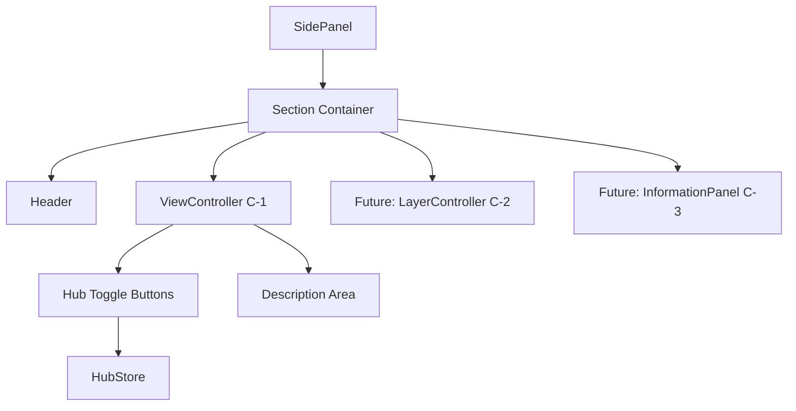
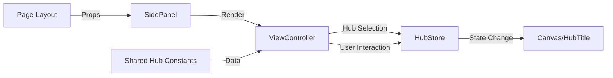

# Side Panel 設計書

> **作成日**: 2025-07-06  
> **更新日**: 2025-07-06  
> **バージョン**: 1.0.0  
> **作成者**: Claude Code

[<< Hub画面設計書に戻る](../../../docs/screenDesigns/01.hub.md)

Hub画面の左側に配置されるサイドパネル機能。音楽理論の表示制御と情報提示を行うコントロールパネルとして機能し、将来的にはLayerController、InformationPanelを含む統合的なUI管理システムとなる予定です。

## 📋 目次

- [概要](#概要)
- [アーキテクチャ](#アーキテクチャ)
- [技術仕様](#技術仕様)
- [使用方法](#使用方法)
- [設計思想](#設計思想)
- [パフォーマンス](#パフォーマンス)
- [アクセシビリティ](#アクセシビリティ)
- [開発・保守](#開発保守)

## 概要

### 目的・役割

Hub画面において音楽理論の可視化をコントロールする統合インターフェースとして設計されています。ユーザーが音楽理論の「世界観（レンズ）」を選択し、将来的には表示レイヤーの制御や詳細情報の表示を一元管理する役割を担います。

### 主要機能

- **ViewController (C-1)**: Hub種類（五度圏 ⇔ クロマチックサークル）の切り替え
- **統合セクション**: 全コンポーネントを統一されたセクション内に配置
- **レスポンシブ対応**: PC版のみ実装済み、モバイル対応は将来実装予定
- **ダークテーマ**: アプリケーション全体のダークテーマに統合

## アーキテクチャ

### コンポーネント構成

**SidePanel**はメインコンテナとして機能し、内部に統一されたセクションを持ちます。現在はViewController（C-1）のみを含みますが、将来的にLayerController（C-2）、InformationPanel（C-3）が追加される設計となっています。

### コンポーネント構成図



### データフロー図



### ファイル構造

```
src/features/side-panel/
├── README.md                     # このファイル
├── index.ts                      # エクスポート統合
├── types.ts                      # 型定義
├── components/                   # UIコンポーネント
│   ├── SidePanel.tsx            # メインコンテナ
│   └── ViewController.tsx       # Hub切り替えUI
├── hooks/                       # カスタムフック（将来使用）
└── __stories__/                 # Storybookストーリー
    ├── SidePanel.stories.tsx
    └── ViewController.stories.tsx
```

### 依存関係

#### 内部依存

- `@/shared/constants/hubs` - Hub共通データ構造とユーティリティ関数
- `@/shared/types` - 共通型定義（HubType, HubInfo, ClassNameProps）
- `@/stores/hubStore` - Hub状態管理（Zustand）

#### 外部依存

- `react` - Reactフレームワーク
- `tailwind-merge` - Tailwindクラス最適化
- `zustand` - 状態管理ライブラリ

## 技術仕様

### Props仕様

#### SidePanel

```typescript
interface SidePanelProps extends ClassNameProps {
  /** パネルの表示状態 */
  isVisible?: boolean;
}
```

#### ViewController

```typescript
interface ViewControllerProps extends ClassNameProps {
  /** コンポーネントの見出し */
  title?: string;
}
```

### 状態管理

#### グローバル状態 (Zustand)

```typescript
interface HubState {
  /** 現在のHub種類 */
  hubType: HubType;
  /** Hub種類を設定する */
  setHubType: (hubType: HubType) => void;
}
```

### 共通データ構造

```typescript
interface HubInfo {
  /** 日本語名 */
  nameJa: string;
  /** 英語名 */
  nameEn: string;
  /** 説明文 */
  description: string;
  /** UI表示用短縮名（オプション） */
  shortName?: string;
}
```

### API仕様

#### 公開メソッド

| 関数名                | 引数               | 戻り値                               | 説明                           |
| --------------------- | ------------------ | ------------------------------------ | ------------------------------ |
| `getHubDisplayNameEn` | `hubType: HubType` | `string`                             | Hub英語名を取得                |
| `getHubOptions`       | なし               | `Array<{value, label, description}>` | ViewController用オプション配列 |

#### イベント

| イベント名        | ペイロード             | 説明          |
| ----------------- | ---------------------- | ------------- |
| `onHubTypeChange` | `{ hubType: HubType }` | Hub種類変更時 |

## 使用方法

### 基本的な使用

```tsx
import { SidePanel } from '@/features/side-panel';

function HubPage() {
  return (
    <div className="flex h-screen">
      <div className="flex-1">
        <SidePanel />
      </div>
      <div className="flex-1">{/* Canvas など */}</div>
    </div>
  );
}
```

### カスタマイズ例

```tsx
import { SidePanel, ViewController } from '@/features/side-panel';

function CustomHubPage() {
  return (
    <div className="flex h-screen">
      {/* 非表示状態 */}
      <SidePanel isVisible={false} />

      {/* カスタムスタイル */}
      <SidePanel className="border-l-4 border-blue-500" />

      {/* ViewController 単体使用 */}
      <ViewController title="ビューの選択" />
    </div>
  );
}
```

## 設計思想

### 1. 単一責任原則

SidePanelは「Hub画面のコントロールUI管理」という単一の責任を持ちます。表示制御、状態管理との連携、将来の拡張性を考慮した統合コンテナとして機能します。

### 2. 再利用性

ViewControllerは独立したコンポーネントとして設計され、SidePanel以外でも使用可能です。共通データ構造の活用により、他の画面でのHub切り替えUIとしても利用できます。

### 3. 保守性

- Hub情報の一元管理により、データ変更時の影響を最小化
- 統一されたセクション構造により、将来のコンポーネント追加が容易
- 型安全性により、TypeScriptによる静的チェックが効果的

### 4. パフォーマンス

- Client Componentを必要最小限に抑制
- `twMerge`による効率的なクラス名管理
- 状態変更時の必要最小限な再レンダリング

### 5. アクセシビリティ

- セマンティックHTML構造の採用
- 適切なARIA属性による支援技術対応
- キーボードナビゲーション完全対応

## パフォーマンス

### 最適化手法

- **Client Component最小化**: 状態管理が必要な部分のみをClient Component化
- **メモ化**: Hub定数データの効率的な活用
- **レイジーローディング**: 将来のC-2、C-3実装時の動的インポート対応準備

## アクセシビリティ

### WCAG準拠レベル

**レベル AA** に準拠

### 実装済み機能

- **キーボードナビゲーション**: Tab、Enter、Spaceキーでの操作
- **スクリーンリーダー対応**: `role="radiogroup"`、`aria-checked`等の適切な設定
- **フォーカス管理**: 視覚的なフォーカスリング表示
- **ダークテーマ対応**: 高コントラスト比の実現

### ARIA属性

| 属性               | 値                 | 用途                           |
| ------------------ | ------------------ | ------------------------------ |
| `aria-label`       | "サイドパネル"     | パネル全体の説明               |
| `aria-labelledby`  | "side-panel-title" | セクションタイトルとの関連付け |
| `aria-checked`     | `true/false`       | Hub選択状態                    |
| `aria-describedby` | "hub-description"  | Hub説明との関連付け            |

### キーボード操作

| キー          | 動作                     |
| ------------- | ------------------------ |
| `Tab`         | 次の要素にフォーカス移動 |
| `Shift + Tab` | 前の要素にフォーカス移動 |
| `Enter/Space` | Hub種類の切り替え        |

## 開発・保守

### 今後の拡張予定

#### 短期

- [ ] LayerController (C-2) の実装
- [ ] InformationPanel (C-3) の実装
- [ ] モバイル対応（ボトムシート形式）

#### 長期

- [ ] アニメーション効果の追加
- [ ] キーボードショートカット対応
- [ ] 多言語対応

### 関連ドキュメント

- [要件定義書](../../../docs/01.requirements.md)
- [Hub画面設計書](../../../docs/screenDesigns/01.hub.md)
- [開発規約](../../../docs/03.developmentAgreement.md)
- [Hub共通データ構造](../../../src/shared/constants/hubs.ts)
- [Storybook](http://localhost:6006/?path=/story/components-sidepanel)

### 用語集

| 用語             | 定義                                                                           |
| ---------------- | ------------------------------------------------------------------------------ |
| Hub              | 音楽理論を分析するための「世界観（レンズ）」（五度圏、クロマチックサークル等） |
| ViewController   | Hub種類を切り替えるUIコンポーネント（C-1）                                     |
| LayerController  | 表示レイヤーを制御するUIコンポーネント（C-2、将来実装）                        |
| InformationPanel | 選択要素の詳細情報を表示するコンポーネント（C-3、将来実装）                    |

---

> 📝 **Note**: この設計書は [開発規約](../../../docs/03.developmentAgreement.md) に従って作成されています。  
> 🔄 **Update**: 機能追加・変更時はこの設計書も合わせて更新してください。  
> 🤝 **Collaboration**: 不明な点があれば開発チームまでお問い合わせください。
