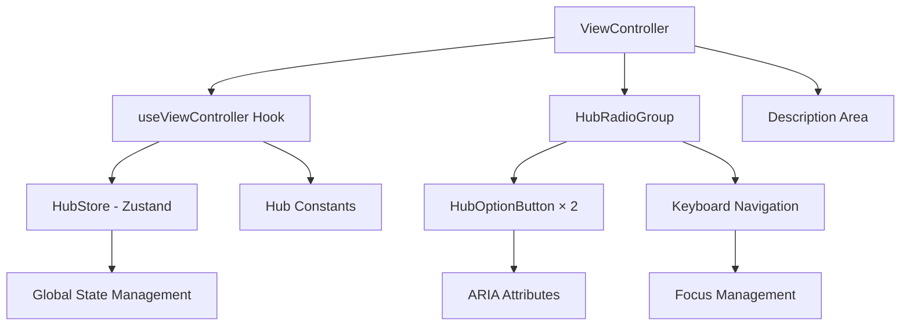
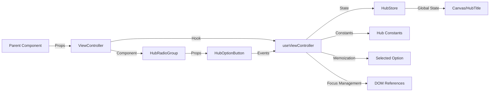

# View Controller Feature 設計書

> **作成日**: 2025-07-12  
> **更新日**: 2025-07-12  
> **バージョン**: 1.0.0  
> **作成者**: Claude Code

[<< Hub画面設計書に戻る](../../../docs/screenDesigns/01.hub.md)

音楽理論アプリにおけるHub切り替え機能。ユーザーが音楽を分析するための「世界観（レンズ）」を選択するためのコントロールインターフェースを提供します。

## 📋 目次

- [概要](#概要)
- [アーキテクチャ](#アーキテクチャ)
- [技術仕様](#技術仕様)
- [使用方法](#使用方法)
- [設計思想](#設計思想)
- [パフォーマンス](#パフォーマンス)
- [アクセシビリティ](#アクセシビリティ)
- [開発・保守](#開発保守)

## 概要

### 目的・役割

View Controllerは音楽理論の可視化において、ユーザーがどの「世界観（レンズ）」で音楽を分析するかを選択する機能を提供します。五度圏とクロマチックサークルという異なる音楽理論的アプローチを切り替えることで、同じ音楽データを異なる視点から分析できます。

### 主要機能

- **Hub種類切り替え**: 五度圏 ⇔ クロマチックサークルの選択
- **動的説明表示**: 選択されたHubの詳細説明を表示
- **キーボードナビゲーション**: 完全なキーボード操作対応
- **状態管理統合**: グローバル状態（Zustand）との連携
- **アクセシビリティ**: WCAG AA準拠のインクルーシブ設計

## アーキテクチャ

### コンポーネント構成

View Controller Featureは「ビジネスロジックとUIの分離」原則に基づいて設計されており、カスタムフック（useViewController）がビジネスロジックを担当し、各UIコンポーネントが明確な責任を持ちます。

### コンポーネント構成図



### データフロー図



### ファイル構造

```
src/features/view-controller/
├── README.md                         # このファイル
├── index.ts                          # エクスポート統合
├── components/                       # UIコンポーネント
│   ├── ViewController.tsx           # メインコンポーネント
│   ├── HubRadioGroup.tsx            # ラジオグループコンテナ
│   └── HubOptionButton.tsx          # 個別オプションボタン
├── hooks/                            # カスタムフック
│   ├── useViewController.ts         # ビジネスロジック
│   └── test/                        # フックテスト
│       └── useViewController.test.ts # 包括的単体テスト
└── __stories__/                      # Storybookストーリー
    └── ViewController.stories.tsx   # コンポーネントストーリー
```

### 依存関係

#### 内部依存

- `@/stores/hubStore` - グローバル状態管理（Zustand）
- `@/shared/constants/hubs` - Hub共通データとユーティリティ
- `@/shared/types` - 共通型定義（HubType）

#### 外部依存

- `react` - Reactフレームワーク（useState, useCallback, useMemo, useRef）
- `tailwind-merge` - Tailwindクラス最適化
- `clsx` - 条件付きクラス名結合

## 技術仕様

### Props仕様

#### ViewController

```typescript
interface ViewControllerProps {
  /** コンポーネントの見出し（デフォルト: 'View Controller'） */
  title?: string;

  /** 追加のCSSクラス名 */
  className?: string;
}
```

#### HubRadioGroup

```typescript
interface HubRadioGroupProps {
  /** Hub オプション配列 */
  hubOptions: HubOption[];

  /** 現在選択されているHub */
  selectedHub: HubType;

  /** Hub変更ハンドラー */
  onHubChange: (hubType: HubType) => void;

  /** キーボードイベントハンドラー */
  onKeyDown: (event: React.KeyboardEvent<HTMLDivElement>) => void;
}
```

#### HubOptionButton

```typescript
interface HubOptionButtonProps {
  /** Hub オプションの値 */
  value: HubType;

  /** ボタンのラベル */
  label: string;

  /** 選択状態 */
  isSelected: boolean;

  /** クリックハンドラー */
  onClick: (value: HubType) => void;

  /** ARIA describedby 属性用のID */
  describedById: string;

  /** タブインデックス（roving tabindex パターン用） */
  tabIndex: number;
}
```

### 状態管理

#### ローカル状態 (useViewController)

```typescript
// フック内部状態
const radioGroupRef = useRef<HTMLDivElement>(null);

// メモ化されたデータ
const hubOptions = useMemo(() => getHubOptions(), []);
const selectedOption = useMemo(
  () => hubOptions.find(option => option.value === hubType),
  [hubOptions, hubType]
);

// メモ化されたハンドラー
const handleHubTypeChange = useCallback(
  (newHubType: HubType) => setHubType(newHubType),
  [setHubType]
);
```

#### グローバル状態 (Zustand)

```typescript
interface HubState {
  /** 現在のHub種類 */
  hubType: HubType;

  /** Hub種類を設定する */
  setHubType: (hubType: HubType) => void;
}
```

### データ構造

#### HubOption

```typescript
interface HubOption {
  value: HubType;
  label: string;
  description: string;
}

// 実際のデータ例
const hubOptions = [
  {
    value: 'circle-of-fifths',
    label: '五度圏',
    description: '五度関係で配置された調の輪',
  },
  {
    value: 'chromatic-circle',
    label: 'クロマチック',
    description: '半音階で配置された音の輪',
  },
];
```

### API仕様

#### 公開フック

| フック名            | 戻り値               | 説明                           |
| ------------------- | -------------------- | ------------------------------ |
| `useViewController` | `ViewControllerHook` | ViewControllerビジネスロジック |

#### ViewControllerHook戻り値

| プロパティ            | 型                                               | 説明                         |
| --------------------- | ------------------------------------------------ | ---------------------------- |
| `hubType`             | `HubType`                                        | 現在選択されているHub種類    |
| `hubOptions`          | `HubOption[]`                                    | 選択可能なHub配列            |
| `selectedOption`      | `HubOption \| undefined`                         | 現在選択されているオプション |
| `radioGroupRef`       | `RefObject<HTMLDivElement>`                      | ラジオグループDOM参照        |
| `handleHubTypeChange` | `(hubType: HubType) => void`                     | Hub変更ハンドラー            |
| `handleKeyDown`       | `(event: KeyboardEvent<HTMLDivElement>) => void` | キーボードナビゲーション     |

#### イベント

| イベント名        | ペイロード                 | 説明                     |
| ----------------- | -------------------------- | ------------------------ |
| `onHubTypeChange` | `{ hubType: HubType }`     | Hub種類変更時            |
| `onKeyDown`       | `{ event: KeyboardEvent }` | キーボードナビゲーション |

## 使用方法

### 基本的な使用

```tsx
import { ViewController } from '@/features/view-controller';

function SidePanel() {
  return (
    <div className="p-4">
      <ViewController />
    </div>
  );
}
```

### カスタマイズ例

```tsx
import { ViewController } from '@/features/view-controller';

function CustomSidePanel() {
  return (
    <div className="space-y-6">
      <ViewController title="ビューの選択" className="rounded-lg border p-4" />
    </div>
  );
}
```

### 個別コンポーネントの使用

```tsx
import { HubRadioGroup, HubOptionButton, useViewController } from '@/features/view-controller';

function CustomViewSelector() {
  const { hubType, hubOptions, handleHubTypeChange, handleKeyDown } = useViewController();

  return (
    <HubRadioGroup
      hubOptions={hubOptions}
      selectedHub={hubType}
      onHubChange={handleHubTypeChange}
      onKeyDown={handleKeyDown}
    />
  );
}
```

## 設計思想

### 1. 単一責任原則

View Controller Featureは「Hub切り替えの機能」という単一の責任を持ちます。状態管理、UI表現、アクセシビリティ対応を統合しつつ、他の機能との結合度を最小限に抑えています。

### 2. 再利用性

各コンポーネントは独立性を保ち、SidePanel以外での使用も可能です。useViewControllerフックにより、ビジネスロジックを他のUIコンポーネントでも活用できます。

### 3. 保守性

- 型安全性によるバグの早期発見
- ビジネスロジックとUIの分離による変更影響の局所化
- 包括的なテストカバレッジ（469行のテストコード）
- 明確なインターフェース定義

### 4. パフォーマンス

- メモ化による不要な再計算の防止
- 関数参照の安定化による子コンポーネント再レンダリング抑制
- 効率的なDOM参照管理

### 5. アクセシビリティ

- WCAG AA準拠のインクルーシブ設計
- キーボードナビゲーション完全対応
- スクリーンリーダー最適化
- フォーカス管理とroving tabindexパターン

## パフォーマンス

### 最適化手法

- **`useMemo`**: hubOptionsとselectedOptionの計算結果メモ化
- **`useCallback`**: イベントハンドラーの関数参照安定化
- **効率的なDOM操作**: useRefによる直接DOM参照
- **最小限の再レンダリング**: 状態変更時の影響範囲を局所化

### メモリ使用量

- 軽量なデータ構造（HubOption配列は2要素のみ）
- 不要な中間オブジェクト生成の回避
- 適切なイベントハンドラークリーンアップ

## アクセシビリティ

### WCAG準拠レベル

**レベル AA** に準拠

### 実装済み機能

- **キーボードナビゲーション**: Arrow keys、Home、Endキーでの完全操作
- **roving tabindexパターン**: 効率的なフォーカス管理
- **スクリーンリーダー対応**: 適切なARIA属性とセマンティックHTML
- **フォーカス管理**: 視覚的なフォーカスリングと状態表示
- **色覚障害対応**: 色以外の視覚的手がかりの提供

### ARIA属性

| 属性               | 値                        | 用途                         |
| ------------------ | ------------------------- | ---------------------------- |
| `role`             | `"radiogroup"`            | ラジオグループの識別         |
| `aria-labelledby`  | `"view-controller-title"` | グループタイトルとの関連付け |
| `role`             | `"radio"`                 | 個別ラジオボタンの識別       |
| `aria-checked`     | `true/false`              | 選択状態の表現               |
| `aria-describedby` | `"hub-description"`       | 説明文との関連付け           |

### キーボード操作

| キー              | 動作                               |
| ----------------- | ---------------------------------- |
| `Tab`             | 次のコンポーネントにフォーカス移動 |
| `Shift + Tab`     | 前のコンポーネントにフォーカス移動 |
| `ArrowLeft/Up`    | 前のオプションに移動（循環）       |
| `ArrowRight/Down` | 次のオプションに移動（循環）       |
| `Home`            | 最初のオプションに移動             |
| `End`             | 最後のオプションに移動             |
| `Enter/Space`     | オプションの選択                   |

## 開発・保守

### テストカバレッジ

- **単体テスト**: 469行の包括的テスト（useViewController.test.ts）
- **境界値テスト**: 全ての入力パターンと例外ケース
- **アクセシビリティテスト**: キーボードナビゲーションとフォーカス管理
- **パフォーマンステスト**: メモ化とコールバック最適化の検証

### 今後の拡張予定

#### 短期

- [ ] アニメーション効果の追加（Framer Motion統合）
- [ ] キーボードショートカット対応
- [ ] ツールチップ表示機能

#### 長期

- [ ] 新しいHub種類の追加対応
- [ ] カスタムHub作成機能
- [ ] 多言語対応（i18n）

### 関連ドキュメント

- [要件定義書](../../../docs/01.requirements.md)
- [Hub画面設計書](../../../docs/screenDesigns/01.hub.md)
- [開発規約](../../../docs/03.developmentAgreement.md)
- [Hub共通データ仕様](../../../src/shared/constants/hubs.ts)
- [状態管理仕様](../../../src/stores/hubStore.ts)
- [Storybook](http://localhost:6006/?path=/story/features-view-controller)

### 用語集

| 用語                 | 定義                                                                       |
| -------------------- | -------------------------------------------------------------------------- |
| Hub                  | 音楽理論を分析するための「世界観（レンズ）」                               |
| 五度圏               | 五度関係で配置された調の輪、音楽理論の基本的な視覚化手法                   |
| クロマチックサークル | 半音階で配置された音の輪、12音の等間隔配置による視覚化                     |
| roving tabindex      | 動的にtabindexを変更してフォーカス移動を効率化するアクセシビリティパターン |
| ビジネスロジック     | UIから分離された、機能の核となる処理やルール                               |

---

> 📝 **Note**: この設計書は [開発規約](../../../docs/03.developmentAgreement.md) に従って作成されています。  
> 🔄 **Update**: 機能追加・変更時はこの設計書も合わせて更新してください。  
> 🤝 **Collaboration**: 不明な点があれば開発チームまでお問い合わせください。
